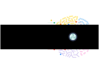

 <div style="background-color: white; display: inline-block; padding: 10px; border-radius: 5px;">
  
</div>

# PhenoTypic: A Python Framework for Bio-Image Analysis


A modular image processing framework developed at the NSF Ex-FAB BioFoundry.

---

*Documentation* @ https://exfab.github.io/PhenoTypic/

## Overview

PhenoTypic provides a modular toolkit designed to simplify and accelerate the development of reusable bio-image analysis
pipelines.
Its structured architecture allows researchers and developers to seamlessly integrate custom computer vision modules,
avoiding
the need to build entirely new packages from scratch. Additionally, PhenoTypic supports incorporating components from
other existing image analysis tools into a cohesive, unified ecosystem.

## Installation

### Pip

```
pip install phenotypic
```

Note: may not always be the most up-to-date version. Install from repo when latest update is needed

### Manual Installation

```  
git clone https://github.com/exfab/PhenoTypic.git
cd PhenoTypic
pip install -e .
```  

### Dev Installation

```  
git clone https://github.com/exfab/PhenoTypic.git
cd PhenoTypic
pip install -e ".[dev]"
```  

# Modules

- `phenotypic.analysis`: analyzes the data from phenotypic in various ways such as growth modeling or statistical
  filtering
- `phenotypic.correction`: different methods to improve the data quality of an image such as rotation to improve
  gridding
- `phenotypic.data`: sample images to experiment your workflow with
- `phenotypic.detection`: a suite of operations to automaticall detect objects in your images
- `phenotypic.enhance`: preprocessing tools that alter a copy of your image and can improve the results of the
  detection algorithms
- `phenotypic.grid`: modules that rely on grid and object information to function
- `phenotypic.measure`: the various measurements
- `phenotypic.objedit`: different tools to edit the detected objects such as morphology, relabeling, joining, or
  removing
- `phenotypic.prefab`: various premade image processing pipelines that are in use at ExFAB

# Sponsors

## ExFAB NSF BioFoundry

## National Science Foundation
