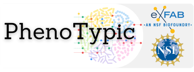

<div style="background-color: white; display: inline-block; padding: 10px; border-radius: 0px;">
  
</div>

# PhenoTypic: A Python Framework for Bio-Image Analysis


[](https://github.com/exfab/PhenoTypic/actions/workflows/gui-checks.yml)
[](https://github.com/exfab/PhenoTypic/actions/workflows/docs.yml)
[](https://pypi.org/project/phenotypic/)
[](https://pypi.org/project/phenotypic/)
[](https://github.com/exfab/PhenoTypic/blob/main/LICENSE)
[](https://github.com/exfab/PhenoTypic/releases)
[](https://github.com/exfab/PhenoTypic/pulls)

A modular image processing framework developed at the NSF Ex-FAB BioFoundry, focused on
arrayed colony phenotyping on solid media.

---

### Links:

[](https://exfab.github.io/PhenoTypic/)

[](https://exfab.engineering.ucsb.edu/)

## Overview

PhenoTypic provides a modular toolkit designed to simplify and accelerate the
development of reusable bio-image analysis
pipelines. PhenoTypic provides bio-image analysis tools built-in, but has a streamlined
development method
to integrate new tools.

# Installation

## uv (recommended)

**See more** on
<u>[installing uv](https://docs.astral.sh/uv/getting-started/installation/)</u>

**Regular Install** (recommended when deploying on a cluster)

```bash
uv add phenotypic
```

**Interactive / GUI Install** (Plotly dashboards, Jupyter, Dash hub)

```bash
uv add phenotypic --extra gui
```

**napari Desktop Viewer Install** (for `image.*.napari()`, point picker, sweep viewer)

```bash
uv add phenotypic --extra napari
```

## Pip

**Regular Install**

```bash
pip install phenotypic
```

**Interactive / GUI Install**

```bash
pip install "phenotypic[gui]"
```

**napari Desktop Viewer Install**

```bash
pip install "phenotypic[napari]"
```

Note: may not always be the latest version. Install from repo when latest update is
needed

## Manual Installation (For latest updates)

```
git clone https://github.com/exfab/PhenoTypic.git
cd PhenoTypic
uv sync
```

## Dev Installation

For extending PhenoTypic.

```
git clone https://github.com/exfab/PhenoTypic.git
cd PhenoTypic
uv sync --group dev --all-extras
```

## GPU-Accelerated Detection (SAM2, micro-sam)

PhenoTypic ships optional deep-learning detectors backed by Meta's
[Segment Anything Model 2](https://github.com/facebookresearch/sam2) and
[micro-sam](https://github.com/computational-cell-analytics/micro-sam).

See [GPU Detection Setup](https://exfab.github.io/PhenoTypic/experimental/how_to/pages/gpu_detection_setup.html)
for model downloads and SLURM deployment instructions.

## Optional Installation

To extract metadata from raw images, PhenoTypic uses the `PyExifTool` module. This
requires an external software called
ExifTool. You can install ExifTool here: https://exiftool.org/install.html. If you don't
use it, some metadata from raw
files may not be able to be imported. Read more
here: https://pypi.org/project/PyExifTool/#pyexiftool-dependencies

# Run the CLI

Process a directory of plate images through a saved pipeline:

```bash
uv run python -m phenotypic --pipeline pipeline.json --input ./images --output-dir ./out
```

Add `--process-only {rgb|gray|detect_mat|objmap}` for an apply-only export run that
writes a single image layer per input (mirroring the input tree) and skips the
measurement/analysis suite — handy for previewing detection or enhanced layers.

# Launch the GUI

The unified GUI hub bundles the pipeline builder, results viewer, and run console
under one URL. Two equivalent entry points:

```bash
# Console script (preferred)
uv run phenotypic-gui --root ./images --port 8050

# Module entry (works in environments without the console script on PATH)
uv run python -m phenotypic.gui --root ./images --port 8050
```

`--root` freezes the sandbox the GUI's file browser is allowed to see (defaults to
the current working directory). `--host 127.0.0.1` (the default) keeps the server
loopback-only — pair with SSH port forwarding for remote workstations:

```bash
ssh -L 8050:localhost:8050 user@cluster
```

Open `http://localhost:8050/` in your browser. The
[GUI hub guide](docs/source/how_to/pages/gui_hub.md) walks through the file
browser, builder, run console, and results viewer.

Note: `phenotypic gui` (no hyphen, as a subcommand) is **not supported**. Use
`phenotypic-gui` or `python -m phenotypic.gui`.

# Hyperparameter Tuning

Search an `ImagePipeline`'s parameters to maximize a scorer with the tuning engine:

```bash
uv run python -m phenotypic.tune run spec.json -i ./plates -o ./out
```

Grid and random search work out of the box; the Optuna samplers
(`tpe`/`cmaes`/`gp`/`nsga2`) need the `tune` extra. See the
[tuning how-to](docs/source/how_to/pages/tuning.md) for an end-to-end walkthrough.

# Module Overview

| Module                  | Description                                                                                                                                                                                                              |
|-------------------------|--------------------------------------------------------------------------------------------------------------------------------------------------------------------------------------------------------------------------|
| `phenotypic.analysis`   | Tools for downstream analysis of the data from phenotypic in various ways such as growth modeling or statistical filtering                                                                                               |
| `phenotypic.correction` | Different methods to improve the data quality of an image such as rotation to improve grid finding                                                                                                                       |
| `phenotypic.data`       | Sample images to experiment your workflow with                                                                                                                                                                           |
| `phenotypic.detect`     | A suite of operations to automatically detect objects in your images                                                                                                                                                     |
| `phenotypic.enhance`    | Preprocessing tools that alter a copy of your image and can improve the results of the detection algorithms                                                                                                              |
| `phenotypic.grid`       | Modules that rely on grid and object information to function                                                                                                                                                             |
| `phenotypic.measure`    | The various measurements PhenoTypic is capable of extracting from objects                                                                                                                                                |
| `phenotypic.detect.nn`  | GPU-accelerated detectors (SAM2, micro-sam) with checkpoint management — see [setup guide](https://exfab.github.io/PhenoTypic/how_to/pages/gpu_detection_setup.html)                                                     |
| `phenotypic.refine`     | Different tools to edit the detected objects such as morphology, relabeling, joining, or removing                                                                                                                        |
| `phenotypic.prefab`     | Various premade image processing pipelines that are in use at ExFAB                                                                                                                                                      |
| `phenotypic.tune`       | Hyperparameter-tuning engine: grid/random search plus Optuna samplers (behind the `tune` extra), pluggable scorers, robust held-out evaluation, distributed search over HPCC SLURM/Postgres, and a `/tune/` GUI co-pilot |

# Sponsors

<div style="background-color: white; display: inline-block; padding: 10px; border-radius: 5px;">
  
</div>
