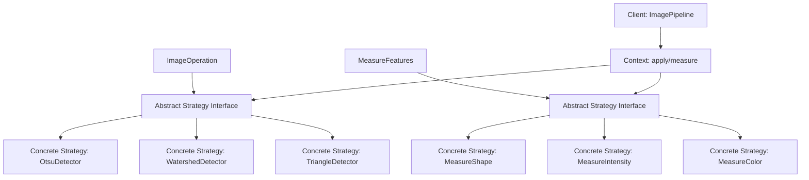
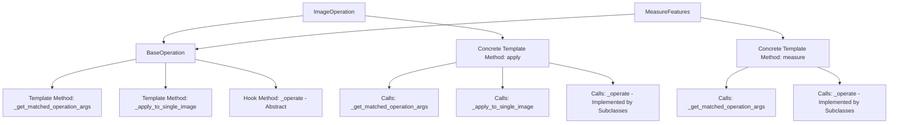
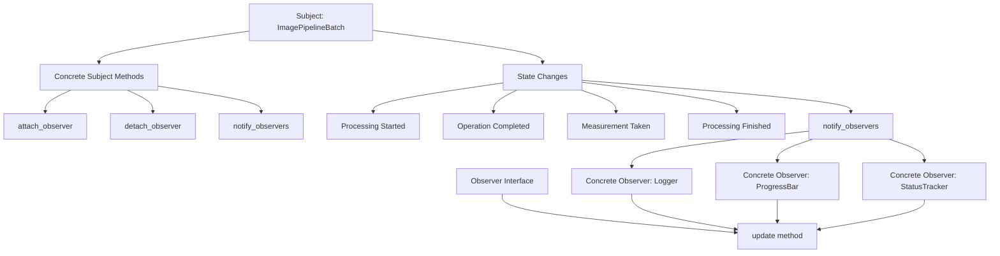
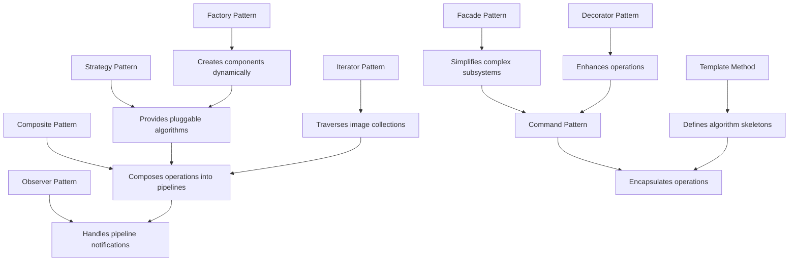

# PhenoTypic Design Patterns & Architecture

## Overview

PhenoTypic implements a modular bio-image processing framework using several established design patterns. This document
outlines the key design patterns used throughout the codebase with Mermaid diagrams illustrating their implementation
and relationships.

---

## 1. Strategy Pattern - Pluggable Operations & Measurements

The Strategy pattern is extensively used for operations and measurements, allowing users to swap algorithms dynamically
without changing the core processing logic.



### Code Implementation

```python
# Abstract Strategy Interface
class ImageOperation(BaseOperation):
    def apply(self, image: Image, inplace=False) -> Image:
        # Template method with integrity checks
        matched_args = self._get_matched_operation_args()
        return self._apply_to_single_image(
                operation=self._operate,
                inplace=inplace,
                matched_args=matched_args
        )

    @staticmethod
    def _operate(image: Image) -> Image:
        # Concrete strategy implements this
        raise InterfaceError


# Concrete Strategy
class OtsuDetector(ThresholdDetector):
    def _operate(self, image: Image) -> Image:
        threshold = threshold_otsu(image.enh_gray)
        image.objmask[:] = image.enh_gray[:] >= threshold
        return image


# Context usage
pipeline = ImagePipeline(ops=[OtsuDetector()], meas=[MeasureShape()])
result = pipeline.apply_and_measure(image)
```

---

## 2. Template Method Pattern - Abstract Base Classes

The Template Method pattern is used extensively in abstract base classes to define the skeleton of algorithms while
allowing subclasses to customize specific steps.



### Code Implementation

```python
class BaseOperation:
    def _get_matched_operation_args(self):
        """Template method step - extracts matching parameters"""
        sig = inspect.signature(self._operate)
        bound_args = sig.bind(self, **self.__dict__)
        return bound_args.arguments

class ImageOperation(BaseOperation):
    def apply(self, image: Image, inplace=False) -> Image:
        """Template method - defines algorithm skeleton"""
        try:
            matched_args = self._get_matched_operation_args()  # Step 1
            image = self._apply_to_single_image(              # Step 2
                operation=self._operate,
                inplace=inplace,
                matched_args=matched_args,
            )
            return image
        except Exception as e:
            raise RuntimeError(f'Operation failed: {e}') from e

    @staticmethod
    def _operate(image: Image) -> Image:  # Hook method
        """Override in subclasses"""
        return image

class ConcreteOperation(ImageOperation):
    @staticmethod
    def _operate(image: Image) -> Image:
        """Concrete implementation of the hook"""
        # Custom processing logic here
        return image
```

---

## 3. Composite Pattern - Pipeline Composition

The pipeline system uses the Composite pattern to treat individual operations and composite pipelines uniformly.

```mermaid
graph TD
    A[Component Interface] --> B[ImageOperation]
    A --> C[Composite: ImagePipeline]
    C --> D[Children: List of Operations]
    D --> E[Operation 1: OtsuDetector]
    D --> F[Operation 2: GaussianBlur]
    D --> G[Operation 3: MeasureShape]
    H[Client Code] --> I[Uniform Interface]
    I --> J[Single Operation: pipeline.apply(op, image)]
I --> K[Composite Pipeline: pipeline.apply(ops_list, image)]

C --> L[Composite Methods]
L --> M[add_operation]
L --> N[remove_operation]
L --> O[apply_all]
```

### Code Implementation

```python
class ImagePipeline(ImagePipelineCore):
    """Composite that manages collection of operations"""

    def __init__(self, ops=None, meas=None):
        super().__init__(ops, meas)
        self._operations = ops or []
        self._measurements = meas or []

    def apply(self, image: Union[Image, ImageSet], inplace=False) -> Union[Image, None]:
        """Apply all operations in sequence"""
        for operation in self._operations:
            image = operation.apply(image, inplace=inplace)
        return image

    def measure(self, image: Union[Image, ImageSet]) -> pd.DataFrame:
        """Apply all measurements"""
        results = []
        for measurement in self._measurements:
            result = measurement.measure(image)
            results.append(result)
        return pd.concat(results, axis=0) if results else pd.DataFrame()

    def apply_and_measure(self, image, inplace=False):
        """Composite operation combining apply and measure"""
        processed_image = self.apply(image, inplace=inplace)
        measurements = self.measure(processed_image)
        return measurements
```

---

## 4. Observer Pattern - Pipeline Progress & Status

The pipeline system uses the Observer pattern to notify interested parties about processing progress and status changes.



### Code Implementation

```python
class PipelineObserver:
    """Observer interface"""
    def update(self, pipeline, event_type, data):
        """Called when pipeline state changes"""
        pass

class LoggerObserver(PipelineObserver):
    """Concrete observer for logging"""
    def update(self, pipeline, event_type, data):
        if event_type == "operation_started":
            logger.info(f"Starting operation: {data['operation_name']}")
        elif event_type == "operation_completed":
            logger.info(f"Completed operation: {data['operation_name']}")

class ImagePipelineBatch(ImagePipelineCore):
    """Subject that manages observers"""

    def __init__(self):
        self._observers = []

    def attach_observer(self, observer):
        self._observers.append(observer)

    def detach_observer(self, observer):
        self._observers.remove(observer)

    def _notify_observers(self, event_type, data):
        for observer in self._observers:
            observer.update(self, event_type, data)

    def apply(self, image, inplace=False):
        self._notify_observers("processing_started", {"image": image.name})
        try:
            result = super().apply(image, inplace)
            self._notify_observers("processing_completed", {"image": image.name})
            return result
        except Exception as e:
            self._notify_observers("processing_error", {"error": str(e)})
            raise
```

---

## 5. Facade Pattern - Core Image Classes

The core Image classes use the Facade pattern to provide a simplified interface to complex image processing subsystems.

```mermaid
graph TD
    A[Facade: Image] --> B[Subsystem: ImageIOHandler]
    A --> C[Subsystem: ImageColorHandler]
    A --> D[Subsystem: ImageGridHandler]
    A --> E[Subsystem: ImageObjectsHandler]

    B --> F[Handles I/O Operations]
    B --> G[Supports multiple formats]
    B --> H[HDF5, RAW, standard images]

    C --> I[Color space conversions]
    C --> J[Illuminant corrections]
    C --> K[Color profile management]

    D --> L[Grid detection algorithms]
    D --> M[Grid-based operations]
    D --> N[Sub-image extraction]

    E --> O[Object detection]
    E --> P[Object measurement]
    E --> Q[Object manipulation]

    R[Client Code] --> S[Simple Interface]
    S --> T[image.show()]
    S --> U[image.apply(operation)]
    S --> V[image.measure(features)]
```

### Code Implementation

```python
class Image(ImageIOHandler):
    """
    Facade class providing unified interface to image processing subsystems
    """

    def __init__(self, input_image=None, **kwargs):
        # Initialize all subsystems through inheritance
        super().__init__(input_image, **kwargs)

    # Facade methods - simple interface to complex subsystems
    def show(self):
        """Simple method hides complexity of display logic"""
        return self._display_image()

    def apply(self, operation, inplace=False):
        """Simple method hides operation application complexity"""
        return operation.apply(self, inplace)

    def measure(self, measurement):
        """Simple method hides measurement complexity"""
        return measurement.measure(self)

    # Complex subsystems are inherited and composed
    # ImageIOHandler: handles loading/saving
    # ImageColorHandler: handles color spaces
    # ImageGridHandler: handles grid operations
    # ImageObjectsHandler: handles object detection/measurement
```

---

## 6. Command Pattern - Operation Encapsulation

Operations and measurements are implemented using the Command pattern, encapsulating requests as objects.

```mermaid
graph TD
    A[Command Interface] --> B[ImageOperation]
    A --> C[execute method]

    D[Concrete Command: OtsuDetector] --> A
    E[Concrete Command: MeasureShape] --> A

    F[Invoker: ImagePipeline] --> G[store_commands]
    F --> H[execute_commands]
    F --> I[undo_commands]

    J[Client] --> K[Create Commands]
    K --> D
    K --> E

    J --> L[Configure Invoker]
    L --> M[pipeline = ImagePipeline(ops=[commands])]

    J --> N[Execute Commands]
    N --> O[pipeline.apply_and_measure(image)]
```

### Code Implementation

```python
# Command Interface
class Command:
    def execute(self, image):
        pass

    def undo(self, image):
        pass


# Concrete Command
class OtsuDetector(ImageOperation):
    def __init__(self, ignore_zeros=True):
        self.ignore_zeros = ignore_zeros
        self._previous_mask = None

    def execute(self, image):
        """Execute the command"""
        self._previous_mask = image.objmask.copy()
        threshold = threshold_otsu(
                image.enh_gray[image.enh_gray != 0] if self.ignore_zeros
                else image.enh_gray
        )
        image.objmask[:] = image.enh_gray[:] >= threshold
        return image

    def undo(self, image):
        """Undo the command"""
        if self._previous_mask is not None:
            image.objmask[:] = self._previous_mask
        return image


# Invoker
class ImagePipeline:
    def __init__(self, operations=None):
        self.operations = operations or []
        self.executed_commands = []

    def execute(self, image):
        """Execute all commands"""
        for operation in self.operations:
            result = operation.execute(image)
            self.executed_commands.append(operation)
        return result

    def undo_last(self, image):
        """Undo last command"""
        if self.executed_commands:
            last_command = self.executed_commands.pop()
            return last_command.undo(image)
        return image
```

---

## 7. Factory Pattern - Component Creation

The framework uses factory patterns for creating different types of components dynamically.

```mermaid
graph TD
    A[Abstract Factory] --> B[OperationFactory]
    A --> C[MeasurementFactory]
    A --> D[GridFinderFactory]

    B --> E[Create Operation]
    E --> F[create_otsu_detector]
    E --> G[create_watershed_detector]
    E --> H[create_triangle_detector]

    C --> I[Create Measurement]
    I --> J[create_shape_measurer]
    I --> K[create_intensity_measurer]
    I --> L[create_color_measurer]

    D --> M[Create Grid Finder]
    M --> N[create_optimal_center_finder]
    M --> O[create_corner_based_finder]

    P[Factory Registry] --> Q[operation_types]
    P --> R[measurement_types]
    P --> S[grid_finder_types]

    T[Client Code] --> U[Request Component]
    U --> V[factory.create('otsu_detector', **params)]
    U --> W[factory.create('measure_shape', **params)]
```

### Code Implementation

```python
class OperationFactory:
    """Factory for creating image operations"""

    _registry = {}

    @classmethod
    def register(cls, name, operation_class):
        cls._registry[name] = operation_class

    @classmethod
    def create(cls, name, **kwargs):
        operation_class = cls._registry.get(name)
        if not operation_class:
            raise ValueError(f"Unknown operation: {name}")
        return operation_class(**kwargs)

    @classmethod
    def get_available_operations(cls):
        return list(cls._registry.keys())


# Registration
OperationFactory.register('otsu', OtsuDetector)
OperationFactory.register('watershed', WatershedDetector)
OperationFactory.register('gaussian', GaussianBlur)

# Usage
factory = OperationFactory()
detector = factory.create('otsu', ignore_zeros=True)
smoother = factory.create('gaussian', sigma=2.0)

pipeline = ImagePipeline(ops=[detector, smoother])
```

---

## 8. Decorator Pattern - Operation Enhancement

The framework uses decorators for enhancing operations with additional behavior like logging, timing, and validation.

```mermaid
graph TD
    A[Component Interface] --> B[ImageOperation]

    C[Decorator Base] --> A
    C --> D[operation: ImageOperation]

    E[Concrete Decorator: LoggingDecorator] --> C
    F[Concrete Decorator: TimingDecorator] --> C
    G[Concrete Decorator: ValidationDecorator] --> C

    H[Client Code] --> I[Create Base Operation]
    I --> J[operation = OtsuDetector()]

    H --> K[Apply Decorators]
    K --> L[decorated_op = LoggingDecorator(operation)]
    K --> M[decorated_op = TimingDecorator(decorated_op)]

    H --> N[Use Decorated Operation]
    N --> O[pipeline.apply(decorated_op, image)]
```

### Code Implementation

```python
# Decorator Base Class
class OperationDecorator(ImageOperation):
    def __init__(self, operation):
        self._operation = operation

    def apply(self, image, inplace=False):
        # Delegate to wrapped operation
        return self._operation.apply(image, inplace)

# Concrete Decorators
class LoggingDecorator(OperationDecorator):
    def apply(self, image, inplace=False):
        logger.info(f"Applying {self._operation.__class__.__name__} to {image.name}")
        start_time = time.time()

        result = self._operation.apply(image, inplace)

        end_time = time.time()
        logger.info(f"Completed {self._operation.__class__.__name__} in {end_time - start_time:.2f}s")
        return result

class TimingDecorator(OperationDecorator):
    def apply(self, image, inplace=False):
        start_time = time.time()
        result = self._operation.apply(image, inplace)
        end_time = time.time()

        # Store timing information
        if not hasattr(result, '_operation_times'):
            result._operation_times = []
        result._operation_times.append({
            'operation': self._operation.__class__.__name__,
            'duration': end_time - start_time
        })

        return result

# Usage
operation = OtsuDetector()
decorated_operation = LoggingDecorator(TimingDecorator(operation))

result = decorated_operation.apply(image)
print(f"Operation times: {result._operation_times}")
```

---

## 9. Iterator Pattern - Image Collections

The ImageSet and pipeline systems use iterators for traversing collections of images.

```mermaid
graph TD
    A[Iterator Interface] --> B[has_next]
    A --> C[next]

    D[Concrete Iterator: ImageSetIterator] --> A
    D --> E[image_set: ImageSet]

    F[Aggregate Interface] --> G[create_iterator]

    H[Concrete Aggregate: ImageSet] --> F
    H --> I[images: List of Image]

    J[Client Code] --> K[Get Iterator]
    K --> L[iterator = image_set.create_iterator()]

    J --> M[Traverse Collection]
    M --> N[while iterator.has_next():]
    M --> O[    image = iterator.next()]
    M --> P[    process_image(image)]

    Q[Pipeline Integration] --> R[for image in image_set:]
    Q --> S[    pipeline.apply_and_measure(image)]
```

### Code Implementation

```python
class ImageIterator:
    """Iterator interface"""
    def __init__(self, image_set):
        self._image_set = image_set
        self._index = 0

    def has_next(self):
        return self._index < len(self._image_set.images)

    def next(self):
        if not self.has_next():
            raise StopIteration
        image = self._image_set.images[self._index]
        self._index += 1
        return image

class ImageSet:
    """Iterable collection of images"""

    def __init__(self, images=None):
        self.images = images or []

    def __iter__(self):
        return ImageIterator(self)

    def __getitem__(self, index):
        return self.images[index]

    def __len__(self):
        return len(self.images)

    def add_image(self, image):
        self.images.append(image)

# Usage
image_set = ImageSet([image1, image2, image3])

# Iterator pattern usage
iterator = iter(image_set)
while iterator.has_next():
    image = iterator.next()
    pipeline.apply_and_measure(image)

# Pythonic iteration (uses iterator protocol)
for image in image_set:
    result = pipeline.apply_and_measure(image)
    results.append(result)
```

---

## Design Pattern Interactions

The patterns work together to create a cohesive architecture:



### Key Interactions:

1. **Strategy + Template Method**: Strategies implement template method hooks
2. **Composite + Observer**: Pipeline notifies observers of composite operations
3. **Facade + Command**: Facade simplifies command execution
4. **Factory + Strategy**: Factory creates different strategy implementations
5. **Decorator + Command**: Decorators enhance command execution
6. **Iterator + Composite**: Iterators traverse composite image collections

---

## Summary

PhenoTypic demonstrates sophisticated use of design patterns to create a flexible, extensible bio-image processing
framework:

- **Strategy Pattern** enables pluggable operations and measurements
- **Template Method** provides consistent operation frameworks
- **Composite Pattern** allows pipeline composition
- **Observer Pattern** handles progress tracking and notifications
- **Facade Pattern** simplifies complex image processing subsystems
- **Command Pattern** encapsulates operations for undo/redo capabilities
- **Factory Pattern** enables dynamic component creation
- **Decorator Pattern** adds cross-cutting concerns like logging and timing
- **Iterator Pattern** provides flexible collection traversal

This combination of patterns results in a framework that is both powerful for advanced users and accessible to
entry-level data scientists, while maintaining clean, maintainable code architecture.
