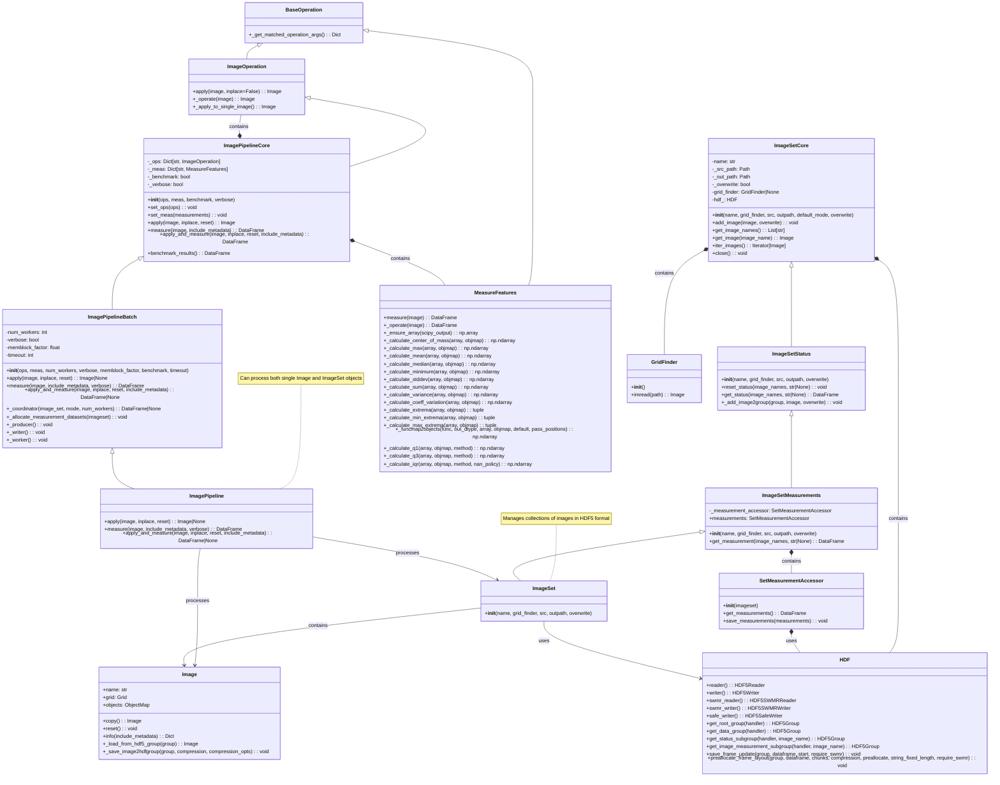
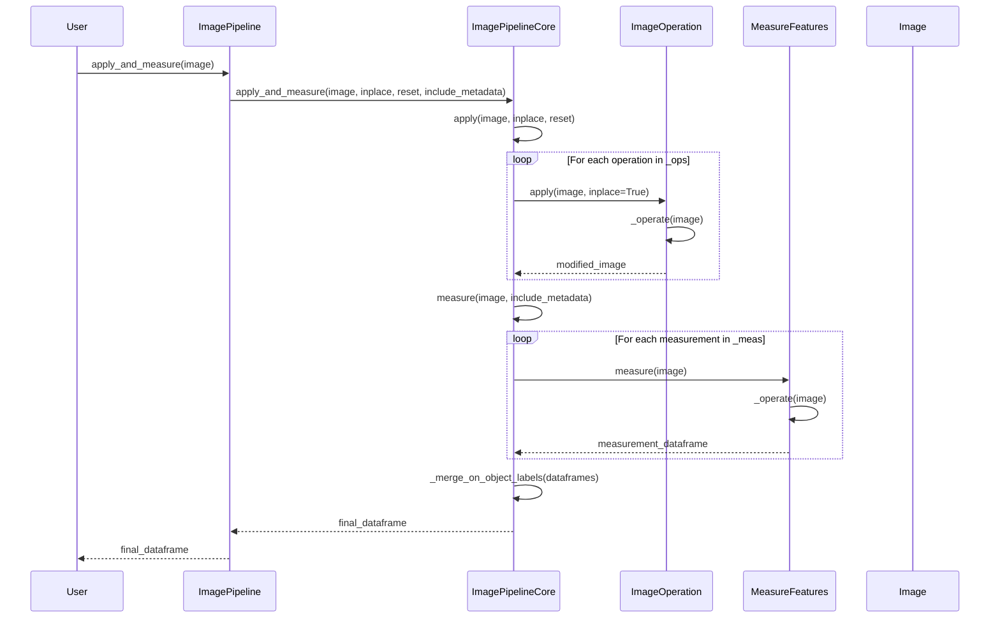
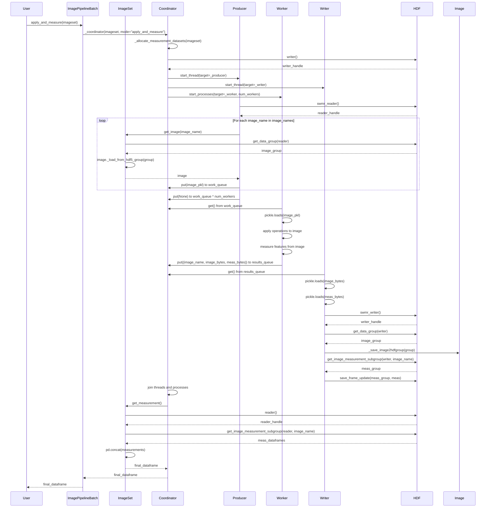
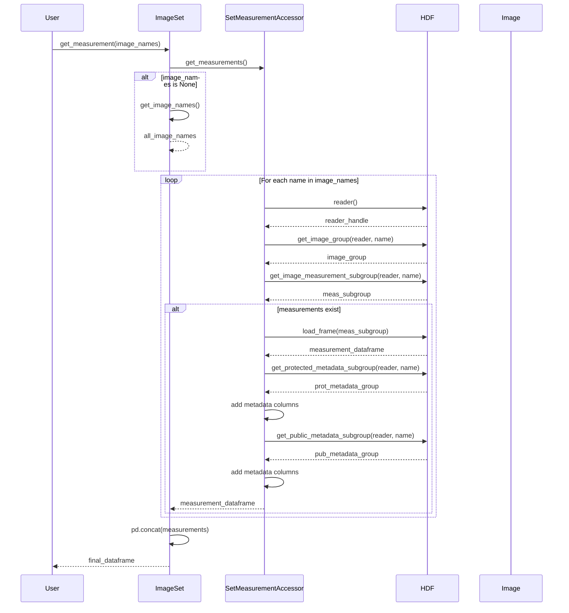

# ImagePipeline and ImageSet UML & Interaction Diagrams

This document contains comprehensive UML and interaction diagrams for the `ImagePipeline` and `ImageSet` classes in the
PhenoTypic framework.

## UML Class Diagram

## Single Image Processing Interaction Diagram

## ImageSet Parallel Processing Interaction Diagram

## ImageSet Measurement Retrieval Interaction Diagram

## Key Design Patterns Illustrated

### 1. **Template Method Pattern**

- `ImagePipelineCore` defines the skeleton of the algorithm in `apply_and_measure()`
- Subclasses like `ImagePipelineBatch` implement specific steps like `_coordinator()`

### 2. **Strategy Pattern**

- `ImageOperation` and `MeasureFeatures` define interfaces for interchangeable algorithms
- Concrete implementations can be swapped at runtime

### 3. **Producer-Consumer Pattern**

- `ImagePipelineBatch` uses multiple threads/processes:
    - **Producer**: Loads images from HDF5 and queues them for processing
    - **Consumers (Workers)**: Process images in parallel
    - **Writer**: Saves results back to HDF5

### 4. **Composite Pattern**

- `ImageSet` acts as a container for multiple `Image` objects
- Both single images and image sets can be processed uniformly by pipelines

### 5. **Adapter Pattern**

- `SetMeasurementAccessor` adapts HDF5 operations to a measurement-specific interface

### 6. **Factory Method Pattern**

- `ImageSet.get_image()` creates appropriate `Image` or `GridImage` objects based on `grid_finder`

## Performance Considerations

1. **Memory Management**: Uses memory block factors to prevent OOM errors
2. **HDF5 SWMR**: Single Writer Multiple Reader mode for concurrent access
3. **Multiprocessing**: Cross-platform spawn context for parallel processing
4. **Threading**: Separate threads for producer, writer, and coordinator
5. **Lazy Loading**: Images are loaded from HDF5 only when needed

## Error Handling

- Graceful handling of processing failures
- Status tracking for each image (processed/measured)
- Logging at multiple levels (debug, info, error)
- Exception propagation with context information

## Cross-Platform Compatibility

- Uses `multiprocessing.get_context('spawn')` for Windows/Linux/Mac compatibility
- Path handling with `pathlib.Path`
- File extension detection for various image formats
- Temporary file management for different operating systems
