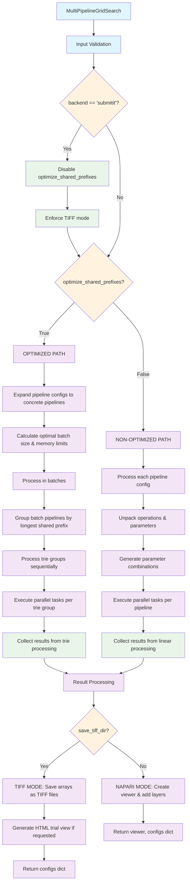

# MultiPipelineGridSearch Data Flow

```mermaid
flowchart TD
    %% Input Section
    A[MultiPipelineGridSearch] --> B[Input Validation]
    B --> C{backend == 'submitit'?}

    %% Submitit Special Handling
    C -->|Yes| D[Disable optimize_shared_prefixes]
    D --> E[Enforce TIFF mode]
    E --> F{optimize_shared_prefixes?}

    C -->|No| F

    %% Main Processing Paths
    F -->|True| G[OPTIMIZED PATH]
    F -->|False| H[NON-OPTIMIZED PATH]

    %% Optimized Path
    G --> I[Expand pipeline configs to concrete pipelines]
    I --> J[Calculate optimal batch size & memory limits]
    J --> K[Process in batches]

    K --> L[Group batch pipelines by longest shared prefix]
    L --> M[Process trie groups sequentially]

    M --> N[Execute parallel tasks per trie group]
    N --> O[Collect results from trie processing]

    %% Non-Optimized Path
    H --> P[Process each pipeline config]
    P --> Q[Unpack operations & parameters]
    Q --> R[Generate parameter combinations]
    R --> S[Execute parallel tasks per pipeline]
    S --> T[Collect results from linear processing]

    %% Common Result Processing
    O --> U[Result Processing]
    T --> U

    U --> V{save_tiff_dir?}
    V -->|Yes| W[TIFF MODE: Save arrays as TIFF files]
    V -->|No| X[NAPARI MODE: Create viewer & add layers]

    W --> Y[Generate HTML trial view if requested]
    Y --> Z[Return configs dict]

    X --> AA[Return viewer, configs dict]

    %% Styling
    classDef inputClass fill:#e1f5fe
    classDef decisionClass fill:#fff3e0
    classDef processClass fill:#f3e5f5
    classDef outputClass fill:#e8f5e8

    class A,B inputClass
    class C,F,V decisionClass
    class G,H,I,J,K,L,M,N,P,Q,R,S,U,W,X,Y,Z,AA processClass
    class D,E,O,T outputClass
```

