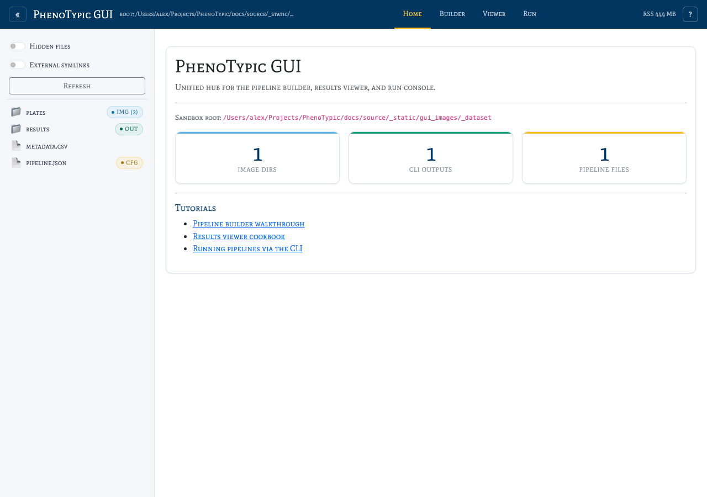

# Setup

Generate a small synthetic plate dataset and launch the hub against it. After
this page you will have a sandbox with three 8 × 12 yeast plates, a metadata
CSV, and a pipeline JSON, all visible in the GUI's file browser.

## Generate the dataset

Run the following snippet from any working directory. It writes the synthetic
plates, metadata, and pipeline alongside a `results/` slot that the rest of
the walkthrough will fill in.

```python
from pathlib import Path
import imageio.v3 as iio
from phenotypic.data import make_synthetic_plate

root = Path("gui_tutorial_dataset")
plates = root / "plates"
plates.mkdir(parents=True, exist_ok=True)

for i, seed in enumerate((1, 2, 3), start=1):
    arr = make_synthetic_plate(
        nrows=8, ncols=12,
        plate_h=1024, plate_w=1536,
        seed=seed,
    )
    iio.imwrite(plates / f"plate_{i:03d}.tif", arr)

(root / "metadata.csv").write_text(
    "Metadata_ImageName,Metadata_StrainID,Metadata_MatingType,"
    "Metadata_Media,Metadata_RunDate,Metadata_PlateNum,"
    "Metadata_Replicate,Grid_RowNum,Grid_ColNum\n"
    "plate_001.tif,SYN_001,a,YPD,2026-05-01,1,1,8,12\n"
    "plate_002.tif,SYN_002,A,YPD,2026-05-01,2,1,8,12\n"
    "plate_003.tif,SYN_003,a,SGAL,2026-05-01,3,1,8,12\n",
    encoding="utf-8",
)

(root / "pipeline.json").write_text("""{
  "version": "0.1.0",
  "name": "gui_tutorial",
  "desc": "Synthetic yeast tutorial pipeline",
  "reset": false,
  "pipe_cfgs": {
    "GaussianBlur": {"class": "GaussianBlur", "params": {"sigma": 2}},
    "OtsuDetector": {"class": "OtsuDetector", "params": {"ignore_zeros": true}}
  },
  "meas": {
    "MeasureShape": {"class": "MeasureShape", "params": {}},
    "MeasureSize": {"class": "MeasureSize", "params": {}}
  },
  "post": {},
  "nrows": 8,
  "ncols": 12
}""", encoding="utf-8")
```

The metadata schema mirrors the `Metadata_*` prefix convention from real
PhenoTypic projects so the CSV is a valid input to `phenotypic --metadata`
(an inner-join on `master_measurements.csv` after the run finishes). Strain
IDs, mating types, and media values are synthetic placeholders — pick the
columns that match your own experiment when adapting the snippet.

After the snippet runs, the directory layout is:

```text
gui_tutorial_dataset/
├── plates/
│   ├── plate_001.tif
│   ├── plate_002.tif
│   └── plate_003.tif
├── metadata.csv
└── pipeline.json
```

## Launch the hub

Point the hub's `--root` at the dataset directory:

```bash
uv run phenotypic-gui --root gui_tutorial_dataset --port 8050
```

The startup banner prints the local URL and an SSH-tunnel command sized to
the bound port (handy if you launched the hub on a remote workstation).
Open the URL in your browser:



The landing page shows:

- **Top bar** — a `«` chevron that hides the file explorer (covered on
  the [next page](02_file_explorer.md)), the `PhenoTypic GUI` title, the
  sandbox-root chip, the `Home` / `Builder` / `Viewer` / `Run` tabs, and
  on the right an RSS readout plus a `?` help button.
- **Sidebar** — the sandbox tree. Each entry carries capability badges
  computed by the classifier (`img`, `cfg`, `out`); see the next page for
  details.
- **Capability summary** — three counter cards summarise how many image
  directories, CLI outputs, and pipeline files the sandbox contains.

You are ready to drive the rest of the walkthrough. Next: [File
Explorer](02_file_explorer.md).
