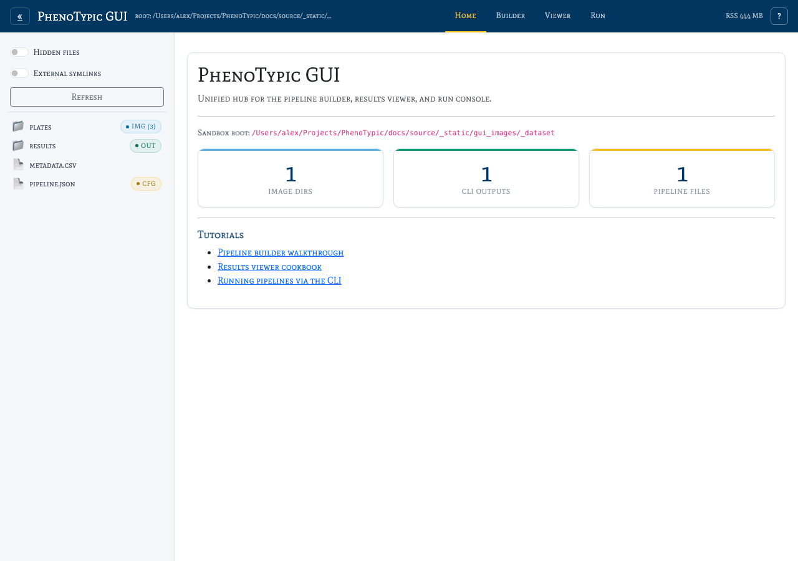
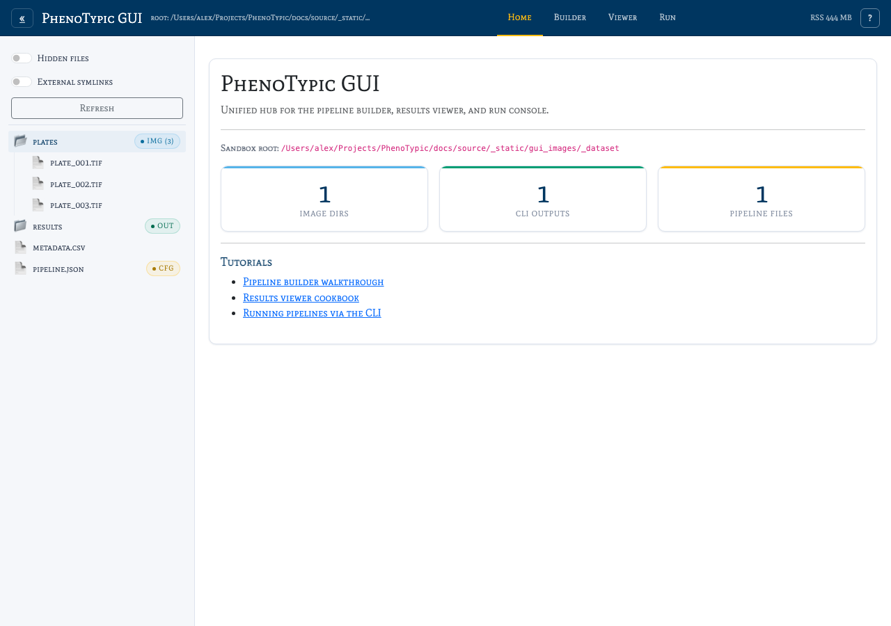
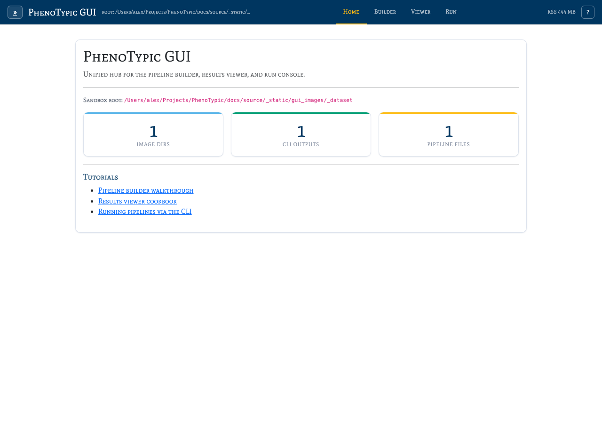
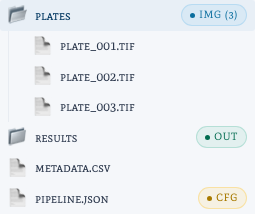

# File Explorer

The sidebar on the left of every page is a sandbox-scoped file browser. It
classifies each entry on the fly so you can see at a glance which folder is an
image directory, which JSON files are PhenoTypic pipelines, and which output
folders carry a finished CLI run.

## Initial state

When the hub boots, the sidebar lists the immediate children of the
`--root` you passed. Folders are collapsed by default — the file browser is
**lazy**: clicking a folder fetches and renders one level of children at a
time.

The sidebar header carries three controls:

| Control | Effect |
|---------|--------|
| `Hidden files` toggle | Show entries whose names start with `.`. Off by default. |
| `External symlinks` toggle | Show symlinks whose targets fall outside the sandbox root. Off by default — symlinks-to-elsewhere are a security hazard for the GUI's path-resolution. |
| `Refresh` button | Flush the classifier's LRU cache. Use this after dropping new files into a directory or moving a CLI output around. |

## Capability badges

Every entry is run through a small classifier (`phenotypic.gui.shell._classifier`)
that emits one or more capability tags:

| Badge | Meaning |
|-------|---------|
| `img` | Directory contains image files. The number in parens is a count, capped at `1000` so very large directories don't pay for a full scan. |
| `cfg` | File is a PhenoTypic pipeline JSON (detected by the `"pipe_cfgs"` or legacy `"operations"` marker in the first 4 KB). |
| `out` | Directory is a CLI output root: contains both `master_measurements.parquet` and a `results/` subdirectory. |
| `?` | Directory could not be listed due to a permission error. |

Click the `plates` row to expand it. The three TIFFs from the previous step
appear as children, and the parent folder swaps its closed-folder icon (📁)
for the open one (📂). A second click collapses the folder again.

## Hide the sidebar

The chevron button at the far left of the top bar (`«` when the sidebar
is visible, `»` when hidden) collapses the file explorer so the active
tool's pane spans the full width. Useful when you're focused on the
builder canvas or the run console's log tail and don't need the tree.

The collapsed flag is persisted to your browser's `localStorage` under
`shell-sidebar-collapse-store`, so it survives a page reload and
remains in effect as you tab between Builder, Viewer, and Run. Clear
your site data (or click the chevron again) to bring the sidebar back.

## Hand-off to the run console

Clicking a sidebar entry doesn't just expand it — the path is also stamped
into a shared selection store. The Run console reads that store and offers
context-appropriate `Set as pipeline` / `Set as input dir` / `Set as
output dir` buttons in its hand-off banner. You'll use that flow on the
[Run Locally](04_run_local.md) page.

Next: [Build a Pipeline](03_build_pipeline.md).
