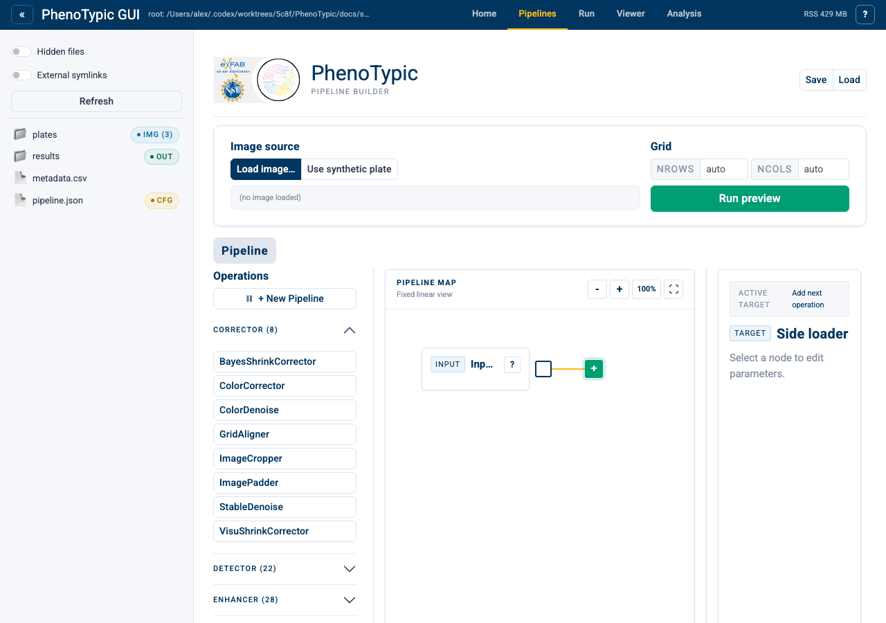
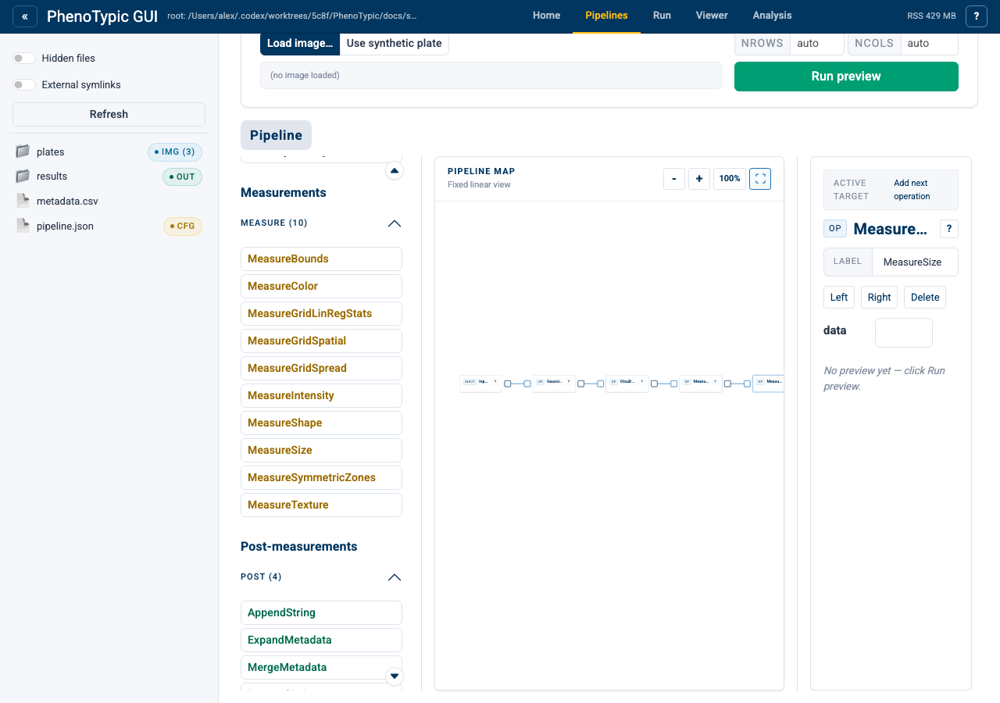

# Build a Pipeline

The Builder authors `ImagePipeline` JSON through a fixed linear port map. The
underlying state still round-trips through the DAG model, but the default UI is
click-only: operations are added at the green target, node cards stay fixed in a
left-to-right chain, and parameters that take operations or pipelines are filled
from the side loader.

## Open the builder

Click the `Builder` tab in the top bar, or navigate to `/builder/`:

The builder has four regions:

| Region | Contents |
|--------|----------|
| **Palette** (left) | Operations grouped by role. Clicking an item inserts it at the active green target. |
| **Pipeline map** (center) | Fixed HTML node map with clickable image ports, parameter ports, a floating continuation port, and view-only zoom controls. |
| **Side loader** (right) | Selected-node scalar parameters, side-value ports, filled side values, docstring help, reorder, delete, and embedded-pipeline edit actions. |
| **Pipeline I/O** (top right) | `Save` writes the current valid pipeline JSON; `Load` reads one back into the builder. |

Use the map zoom controls when a chain grows wider than the viewport:

- `-` zooms out.
- `+` zooms in.
- `100%` resets the map scale.
- The scan icon fits the full visible pipeline into the map viewport.

Zoom is view-only. It does not change the pipeline, does not save to JSON, and
ports remain normal clickable buttons at every zoom level.

## Compose a small pipeline

The walkthrough pipeline consists of:

1. `GaussianBlur` - smooths each plate before thresholding.
2. `OtsuDetector` - produces the binary colony mask.
3. `MeasureShape` and `MeasureSize` - extract per-colony shape and area
   measurements.

To build it:

1. Start with the floating `+` continuation port selected. It is the green
   target at the end of the map.
2. Click `GaussianBlur` in the `Corrector` palette group. The node appears after
   `InputImage`, becomes selected, and the green target moves to the new tail.
3. Click `OtsuDetector`, then `MeasureShape`, then `MeasureSize`. Each click
   appends to the current continuation target.
4. Use the node title buttons to select a node and edit scalar parameters in the
   side loader.
5. Click `Save` once the issue badge is clear.

## Ports and menus

Every visible port is a button. Image-output and continuation ports can open a
small menu with local actions such as `Preview here`. A parameter port selects a
side-value target; the next compatible palette click fills or replaces that
target. A `?` button beside nodes and parameter rows opens the class or
parameter docstring.

The on-disk JSON is the same public `ImagePipeline` format used by the command
line tools. The builder-only target selection, open menus, and zoom level are UI
state only and are not written into pipeline JSON.

Next: [Run Locally](04_run_local.md).
