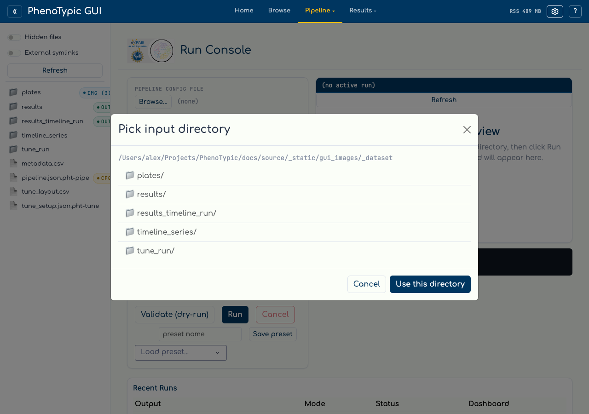
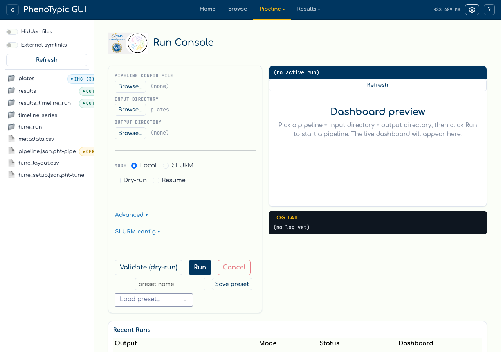

# Run Locally

The Run console drives a single CLI invocation as a subprocess of the GUI.
Stdout streams into a 5000-line ring buffer and onto disk under
`<output_dir>/.gui_log/stdout.log`; once the dashboard is written, an iframe
panel shows the live progress dashboard.

## Open the run console

Click the `Run` tab (or navigate to `/run/`):

The form has three pickers (Pipeline JSON, Input directory, Output
directory), a Local/SLURM mode radio, two short-flag checkboxes (Dry-run,
Resume), an `Advanced` collapse for the long-tail flags (`--sample`,
`--nrows`, `--ncols`, `--image-type`, `Workers` → `--njobs`), and a
`SLURM config` collapse covered on the [next page](05_run_slurm.md).
The `Log level` field in `Advanced` is reserved — the GUI accepts a
value but the CLI does not currently expose `--log-level`, so the field
is a no-op until that flag lands. The
right pane shows the dashboard preview slot and the log tail.

## Pick the pipeline and dataset

You can fill in the pickers two ways:

**From the sidebar (hand-off).** Click `pipeline.json.pht-pipe` in the sidebar; the
hand-off banner above the form activates with `Set as pipeline`. Click it —
the picker label updates. Then click `plates/` and use `Set as input dir`,
and finally choose a fresh output folder and use `Set as output dir`.

**From the inline modal browser.** Click any `Browse…` button. A modal
opens rooted at the sandbox:

Click into the directory you want and use `Use this directory`. The modal
respects the same hidden-files / external-symlinks toggles as the sidebar.

## Validate before running

`Validate (dry-run)` spawns `python -m phenotypic --mode full <args> --dry-run`. The
CLI parses the pipeline JSON, lists the images it would process, then
exits without writing any output. The log tail shows the dry-run output.
Use this whenever you're not sure the form values match what the CLI
expects — the dry-run takes seconds, a bad real run can waste minutes.

## Run

Clicking `Run` spawns `python -m phenotypic --mode full <args>` (no `--dry-run`).
While the subprocess is alive:

- The log tail polls the ring buffer on a short interval. Lines arrive in
  order with stderr merged in.
- Once the CLI writes `<output_dir>/deliverables/dashboard.html`, the
  iframe panel points at `/runs/<rel>/deliverables/dashboard.html` and the
  live dashboard renders inside the run console — same dashboard you'd open
  standalone, just iframed.
- Only one local run can be active at a time; the `Run` button stays
  disabled until the current run exits or you click `Cancel` (which
  sends SIGTERM, then SIGKILL after a 10-second grace period).

## Recent Runs

The Recent Runs panel below the form lists every run associated with this
sandbox — both runs from the current session and historical runs
rehydrated from the sandbox at boot time. The screenshot below shows the
panel populated with the synthetic dataset's run:

Each row carries the output directory, mode (`local` or `slurm-<job-id>`),
status (rendered uppercase by CSS, stored lowercase as one of `running`,
`complete`, `failed`, `cancelled`, `unknown`), and a `Dashboard`
indicator. Clicking a row re-points the iframe at that run's dashboard
so you can re-visit historical results without leaving the page.

The status comes from `<output_dir>/progress/manifest.json`; the dashboard
indicator is true when `deliverables/dashboard.html` is present. The hub
registers a `/runs/<rel>/<file>` route on the shell's Flask server so the
iframe URLs work regardless of which tab is currently active.

For SLURM submissions, see [Run on SLURM](05_run_slurm.md).
