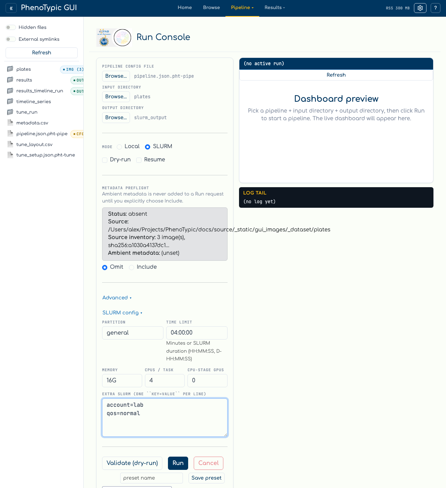

# Run on SLURM

The same Run console form submits to SLURM when you toggle `Mode` from
`Local` to `SLURM`. The hub shells out to the existing
`phenotypic._cli._cli_slurm_submission` pathway — the same code path used
by `phenotypic --pipeline pipeline.json.pht-pipe --input input/ -o output/
--slurm partition=general --slurm time=240`.

## Switch to SLURM mode

Click the `SLURM` radio in the form. The `SLURM config` collapse opens
with the typed common fields:



| Field | Maps to | Notes |
|-------|---------|-------|
| `Partition` | `--slurm partition=…` | Required. Use the partition your cluster admin assigned. |
| `Time (HH:MM:SS)` | `--slurm time=…` | SLURM walltime cap. |
| `Memory` | `--slurm mem=…` | Per-node memory (e.g. `16G`, `64G`). |
| `CPUs / task` | `--slurm cpus_per_task=…` | Maps to `--cpus-per-task` in `sbatch`. |
| `GPUs` | `--slurm gpus=…` | Set to 0 unless your pipeline needs a GPU detector. |
| `Extra SLURM (one key=value per line)` | repeated `--slurm key=value` | Free-form pass-through for anything not in the common fields (`account`, `qos`, `mail-user`, etc.). The example screenshot uses `account=lab` and `qos=normal`. |

## Submit

Clicking `Run` starts a short local submitter that calls `phenotypic …
--slurm key=value …` against your cluster. The run registry allocates a
durable generation before submission. Recent Runs then follows
generation-bound scheduler, controller, and finalizer evidence through
`queued`, `reconciling`, running, terminal, and `cancelling` states. This
works for ordinary arrays and staged GPU controller lifecycles without
confusing an older attempt with a new one.

```{warning}
This page captures a fully selected pipeline, input, and output plus form-valid
SLURM fields. The capture does not launch a dry-run generation or submit to a
scheduler.
Submitting requires `sbatch` on `PATH` and a real SLURM cluster — neither
exists on the workstation that captured these screenshots. To verify your
form values translate to the right CLI invocation, click
`Validate (dry-run)`: the dry-run validates the selected paths and prints the
argv the hub would pass to `phenotypic`. Once you're satisfied, click `Run`.
```

## What SLURM submission writes

A successful submission writes lifecycle evidence under the output directory.
The submit script uses `sbatch --export=ALL`. PhenoTypic also snapshots the
caller's `PYTHONPATH` internally as `PHENOTYPIC_SLURM_PYTHONPATH`; generated
ordinary, staged, and recovery scripts restore that snapshot before starting
Python on clusters that filter `PYTHONPATH`. Users set `PYTHONPATH` normally and
do not set the internal variable themselves.

An explicit GUI cancellation remains authoritative until it settles, even if
publication becomes visible. When there was no explicit cancellation, an
ordinary run whose scheduler fence is inactive but whose successful publication
is visible reconciles through the finalizer and is never autonomously reported
as cancelled.

Key artifacts are:

- `<output_dir>/.phenotypic/progress/job_metadata.json` with the array primary job id
  and per-chunk job ids. The hub reads this file to surface the
  `slurm-<id>` row in Recent Runs — it does **not** parse Rich-formatted
  stdout (locale and terminal-width fragile).
- `<output_dir>/deliverables/dashboard.html`, published by the normal or
  staged finalizer once the run is complete.

## Operational restart guidance

Restarting the GUI does not cancel submitted work. On startup it rehydrates
durable output records and reattaches only when it can prove the matching
generation. If a restart occurs during submission, wait for scheduler metadata
and use Refresh rather than launching the same output again. Keep
`.phenotypic/progress/` and staged-controller ledgers intact when redeploying
the hub.

For deeper SLURM operational detail (chunk sizing, recompile-on-resume,
per-chunk cgroups), see [SLURM Pipelines](../../how_to/pages/slurm_pipelines.md).

Next: [View Results](06_view_results.md).
