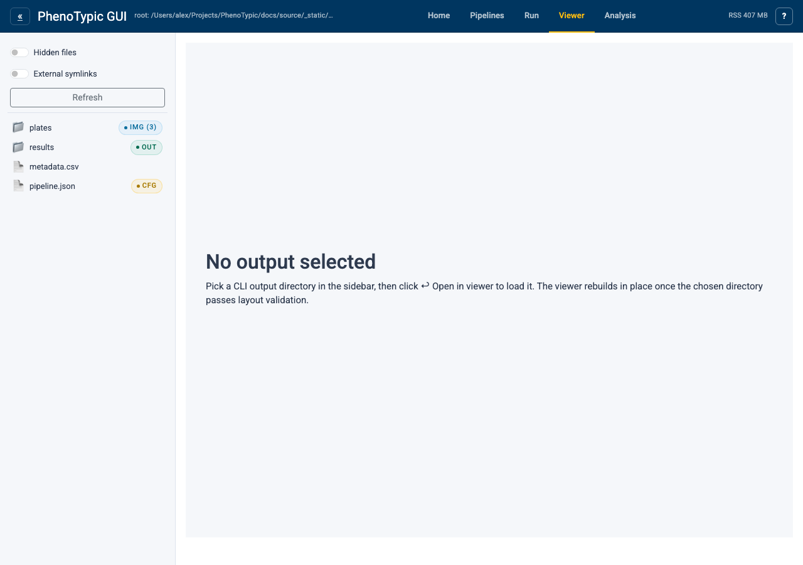
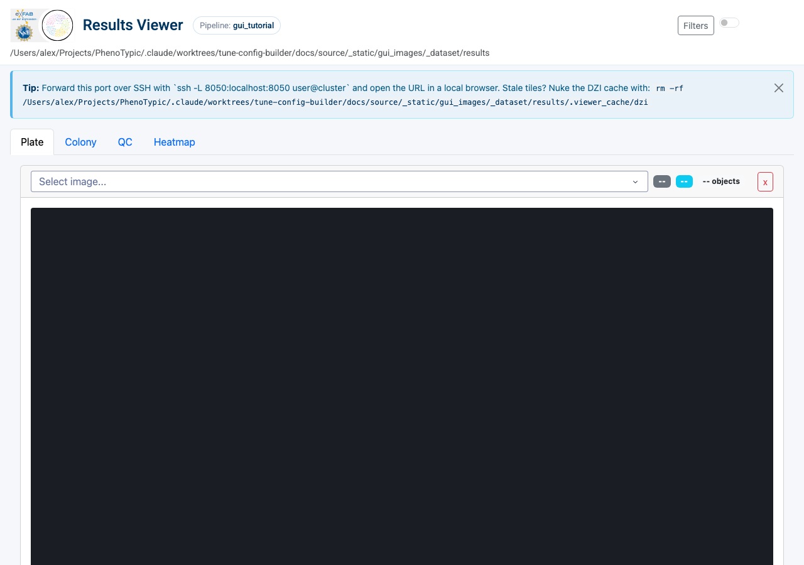
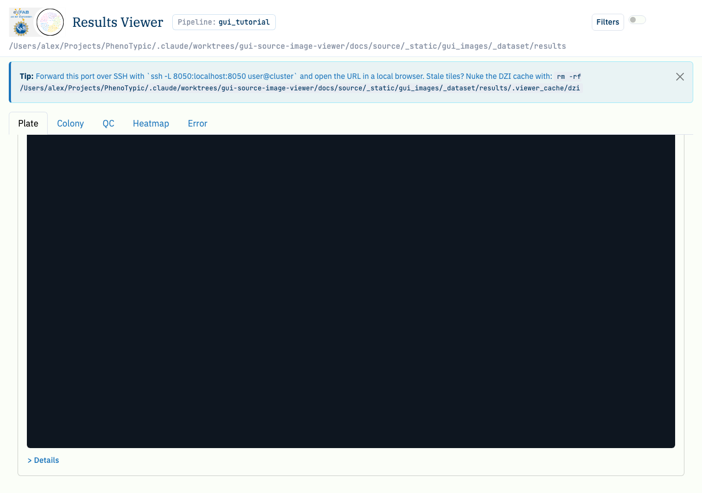

# View Results

The Results viewer pairs the master measurements parquet with each plate's
overlay tiles. You filter the measurements pane on the left, pick an image
from the dropdown, and the OpenSeadragon canvas renders the colony map
with detection overlays.

## Hub viewer (empty state)

Open the `Viewer` tab in the hub:



The hub viewer starts in **empty state**. The text on the page tells you
to "pick a CLI output directory in the sidebar to load the viewer", and
in v1 the rebuild-on-select path is not yet wired. Two ways to get a
populated viewer:

1. **Standalone launch** (recommended for now). Run
   `phenotypic.gui.results_viewer` directly with `--output-root` pointing
   at the CLI output:

   ```bash
   uv run python -m phenotypic.gui.results_viewer \
       --output-root gui_tutorial_dataset/results --port 8051
   ```

2. **Open `deliverables/dashboard.html`** in a browser. The dashboard is a
   self-contained HTML report under the output directory's `deliverables/`
   subfolder; you don't need a server to view it.

The remaining screenshots come from the standalone launcher pointed at
the output the [Run Locally](04_run_local.md) page produced.

## Loaded viewer

```{note}
The screenshots below are the **standalone** results viewer (no top bar /
sidebar) so the page header reads "Results Viewer" instead of "PhenoTypic
GUI". The body is identical to what the hub viewer would show once
rebuild-on-select lands.
```



The viewer is split into three regions:

| Region | Contents |
|--------|----------|
| **Header** | The output's pipeline name (here `gui_tutorial`) and an SSH-tunnel reminder. Use the cache-nuke command if you ever see stale tile thumbnails. |
| **Filter pane** (left) | A query builder over `deliverables/measurements.parquet` (the post-applied mirror; falls back to `deliverables/master_measurements.parquet` on legacy outputs). The header shows how many images currently match. `+ Add filter` adds a clause (column / operator / value); the dropdown is populated from the parquet's columns. |
| **Plate / Colony tabs** (right) | `Plate` shows the full-plate overlay with OpenSeadragon. `Colony` shows per-colony crops aligned to the grid layout. |

To render a plate, pick a filename from the `Select image…` dropdown. The
dropdown is populated from the master measurements; once you pick one,
the OpenSeadragon canvas tiles the overlay and the `> Details` link
reveals per-image stats. Clicking individual colonies in the canvas
highlights the matching row in the measurements.



Scrolling further shows the full measurements table.

## Memory note

The viewer loads the master measurements parquet and per-image overlays
into memory on first access. If the parquet is large (tens of MB+),
expect the first navigation to take a moment. Subsequent navigation
between plates reuses the in-memory state. When the viewer is mounted
inside the hub, the hub chrome's `Release` control (not visible in the
standalone screenshots above) drops the in-memory state; the next
access reloads from disk.

Process RSS may not return to the OS after release — the CPython
allocator pools freed pages rather than returning them immediately.
"Release" is honest about freeing the *Python object graph*; it is not
a promise about RSS.

## Where to next

- [GUI hub guide](../../how_to/pages/gui_hub.md) — the full reference for every panel,
  store, and admonition in the hub.
- [SLURM Pipelines](../../how_to/pages/slurm_pipelines.md) — chunk sizing, resume
  semantics, recompile flags.
- [CLI Batch Processing](../../how_to/pages/cli_batch_processing.md) — every CLI flag the
  Run console form exposes (and a few more).
