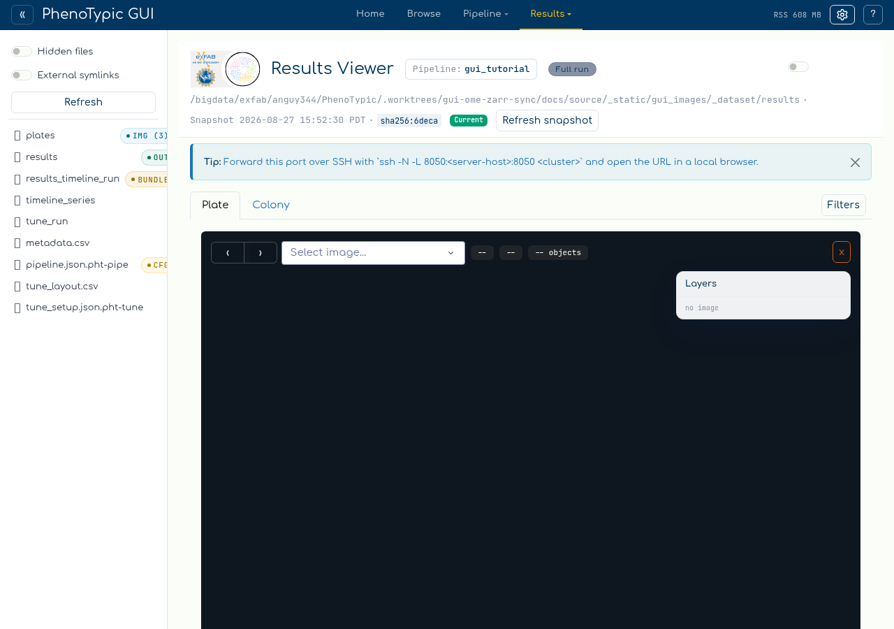
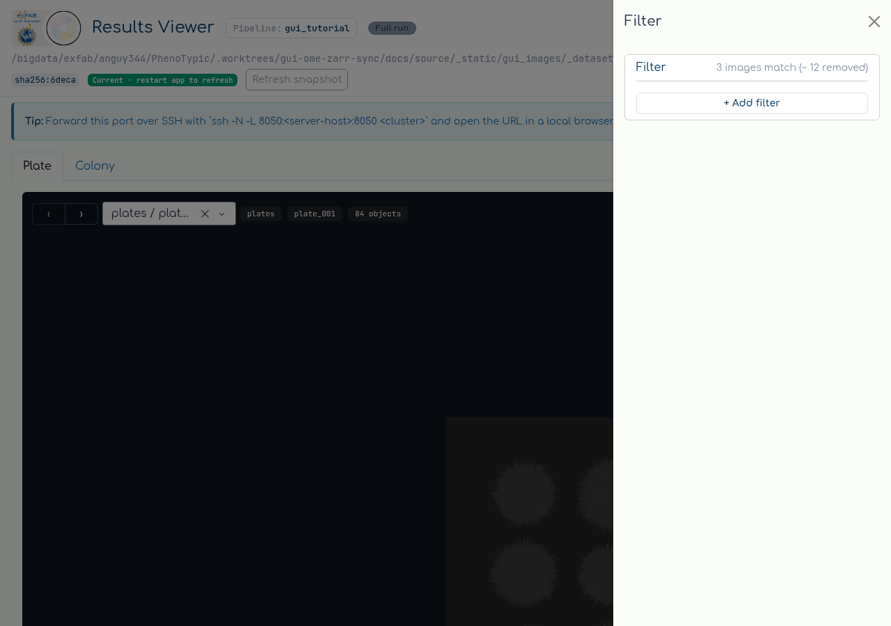

# View Results

The Results viewer pairs the master measurements parquet with each plate's
per-image OME-Zarr store. You pick an image from the dropdown, and the
**Plate** stage reads that store's chunks directly in your browser and
paints the colony map with its objmap overlaid. There is no server-rendered
tile pyramid and no tile cache to go stale --- the deep-zoom levels are the
ones the CLI already wrote into the store.

## Hub viewer (empty state)

Open the `Viewer` tab in the hub:


The hub viewer starts in **empty state**. Pick a CLI output directory in the
sidebar and use the hand-off banner to bind it. The shared binding panel reports
queued/discovery/publication progress and permits cancellation. Results and
Analysis receive one coherent, read-only snapshot, so a failed, cancelled, or
superseded bind keeps the previous output visible rather than mixing two runs.
If the output-consistency report finds contradictory or incomplete terminal
evidence, you may inspect it but mutation controls for QC, Error, curation,
Analysis, rebuild, and publication stay disabled. Two other ways to get a
populated viewer are:

1. **Standalone launch** (recommended for now). Run
   `phenotypic.gui.results_viewer` directly with `--output-root` pointing
   at the CLI output:

   ```bash
   uv run python -m phenotypic.gui.results_viewer \
       --output-root gui_tutorial_dataset/results --port 8051
   ```

2. **Open `deliverables/dashboard.html`** to monitor progress and inspect
   failures. Local dashboards render progress directly; SLURM dashboards add
   Progress and Download tabs. Use the Results Viewer or `/analysis/` app for
   result exploration.

The remaining screenshots come from the standalone launcher pointed at
the output the [Run Locally](04_run_local.md) page produced.



## Loaded viewer

```{note}
The screenshots below are the **standalone** results viewer (no top bar /
sidebar) so the page header reads "Results Viewer" instead of "PhenoTypic
GUI". The body is identical to a bound hub snapshot.
```


The **Plate** tab is one full-canvas image stage with every control floating
over it:

| Where | Control |
|-------|---------|
| **Header** (above the tabs) | The output's pipeline name (here `gui_tutorial`), the snapshot identity, and an SSH-tunnel reminder. |
| **Top-left**, over the stage | The `‹` / `›` image stepper, the `Select image…` dropdown, and the dataset / image / object-count chips. |
| **Top-right**, over the stage | The **Layers** panel. It lists the series the store *actually* holds --- `rgb`, `gray`, `detect_mat` and, when the image carries one, `original` --- plus `objmap` tagged as a *label image*. A series row selects what is displayed; the objmap row toggles the overlay. Each row has an opacity slider and a colour swatch. |
| **Bottom-left**, over the stage | The current zoom. |
| **Bottom-right**, over the stage | The served-level readout, e.g. `pyramid level 0 of 3 · 1536×1024 · 1024² chunks`. This names the level deck.gl is *actually* drawing, so it is the fastest way to tell whether a slow pan is fetching full-resolution chunks. |
| **Colony tab** | Per-colony crops aligned to the grid layout, each one its own camera on the same store, all sharing one zoom. |

To render a plate, step to a filename with `›` or pick one from the
`Select image…` dropdown; both are populated from the master measurements.
The stage opens the store and begins painting, and the note under the
stage confirms the source (`served directly from plate_001.ome.zarr —
no tile cache`).

Filters live in a right-docked slide-in rather than a left pane. The
**Filters** button on the tab row opens it, and the badge on the button
counts the active clauses:



It is a query builder over `deliverables/measurements.parquet` (the
post-applied mirror; it falls back to
`deliverables/master_measurements.parquet` on legacy outputs). `+ Add
filter` adds a clause (column / operator / value) with the dropdown
populated from the parquet's columns, and filtering narrows both Plate and
Colony.


The `> Details` link under the stage opens the per-object table for the
displayed image --- one row per colony, sortable and filterable in place,
with a Status column carrying each colony's curation state.

## Memory note

The viewer loads the master measurements parquet into memory on first
access; pixels are not part of that --- they are streamed from the store
to the browser a chunk at a time. If the parquet is large (tens of MB+),
expect the first navigation to take a moment. Subsequent navigation
between plates reuses the in-memory state. When the viewer is mounted
inside the hub, the hub chrome's `Release` control (not visible in the
standalone screenshots above) drops the in-memory state; the next
access reloads from disk. Standalone viewers intentionally do not subscribe to
hub refresh events.

Process RSS may not return to the OS after release — the CPython
allocator pools freed pages rather than returning them immediately.
"Release" is honest about freeing the *Python object graph*; it is not
a promise about RSS.

## Where to next

- [GUI hub guide](../../how_to/pages/gui_hub.md) — the full reference for every panel,
  store, and admonition in the hub.
- [SLURM Pipelines](../../how_to/pages/slurm_pipelines.md) — chunk sizing,
  automatic continuation semantics, and recompile flags.
- [CLI Batch Processing](../pages/cli_batch_processing.md) — every CLI flag the
  Run console form exposes (and a few more).
- [CLI Execution Modes](../pages/cli_modes.md) — what `full`, `measure`,
  `recompile`, and `process` each produce.
