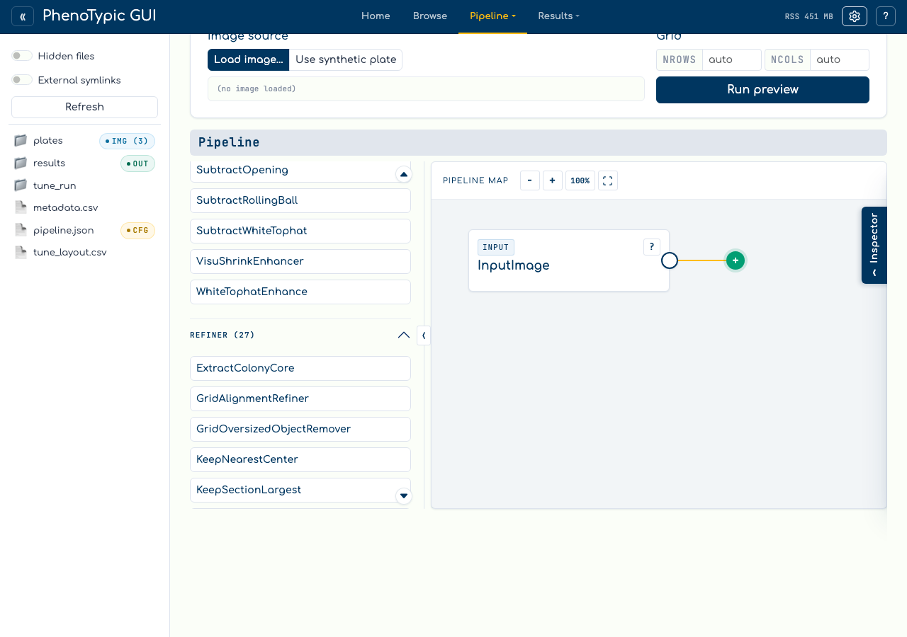
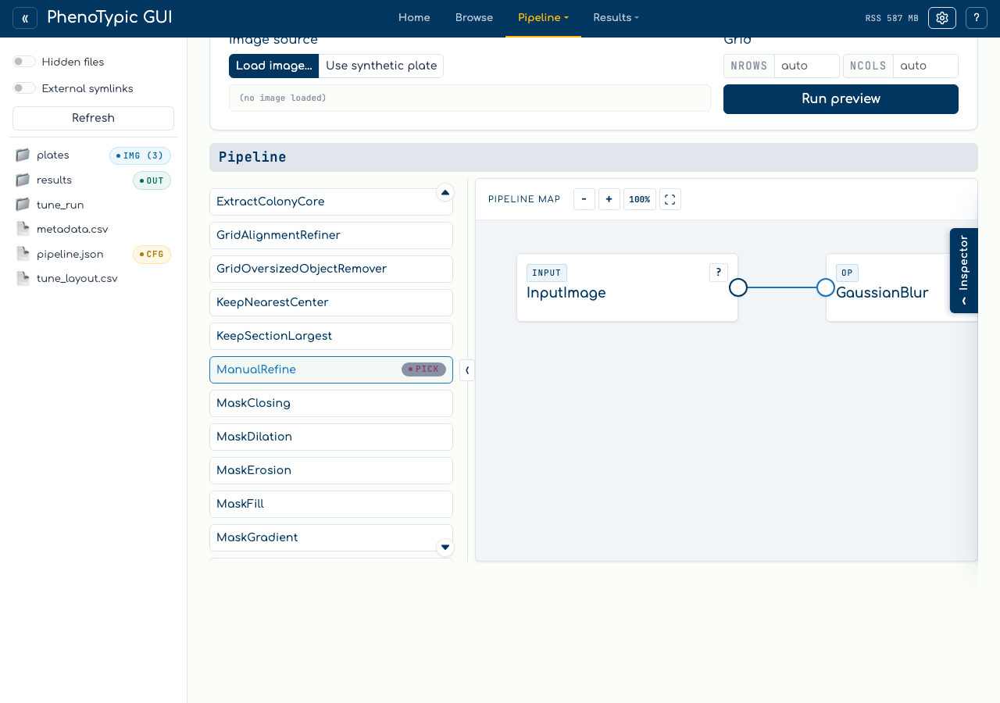
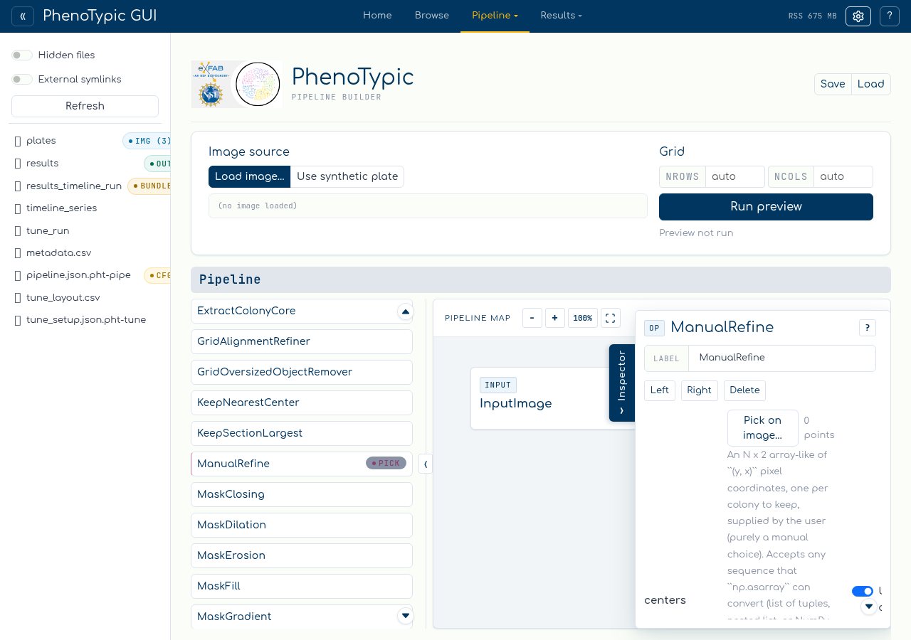
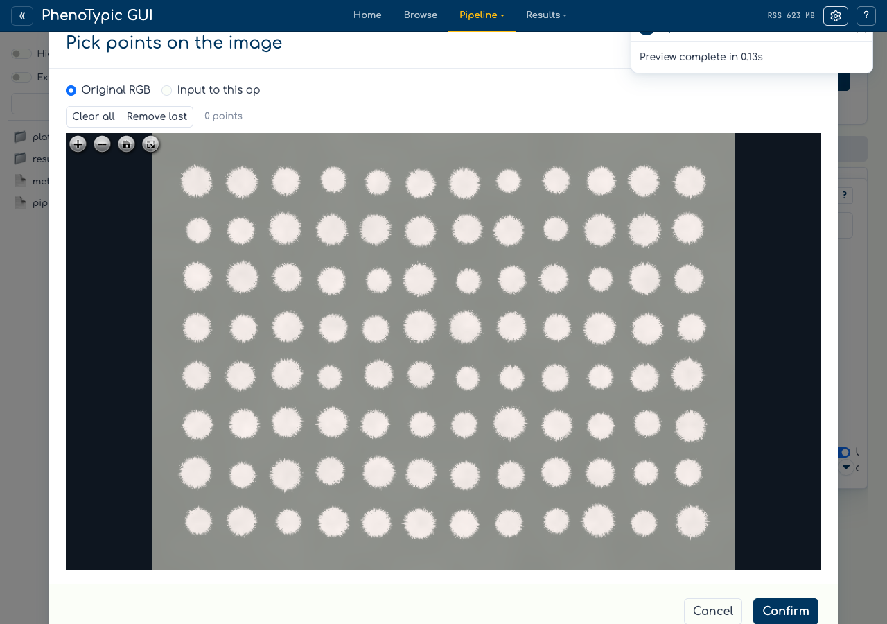
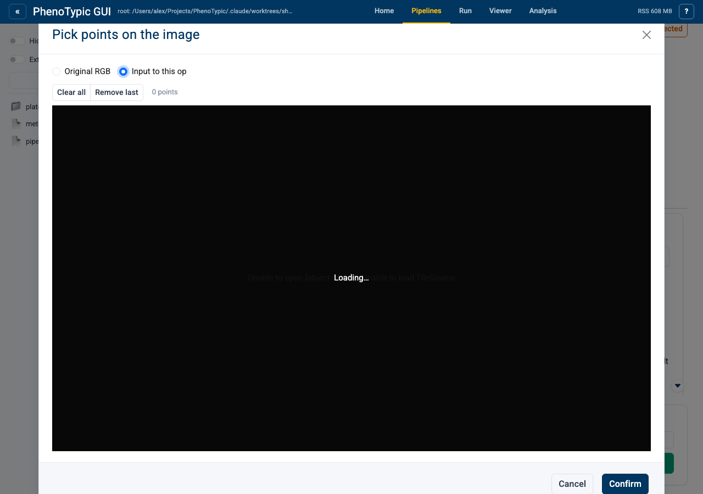
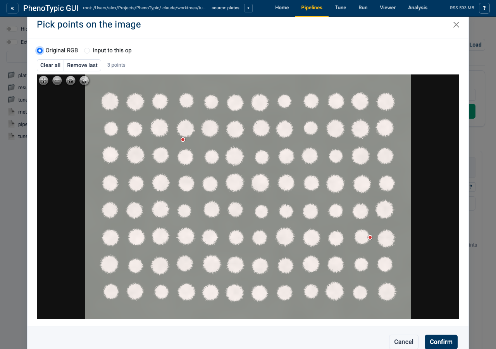
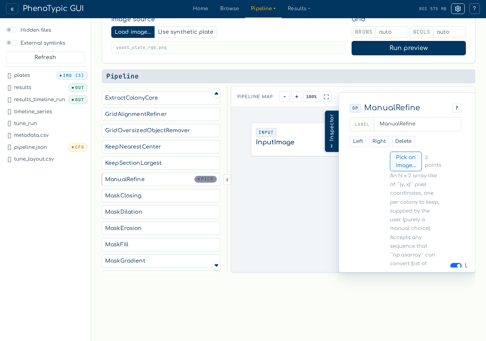
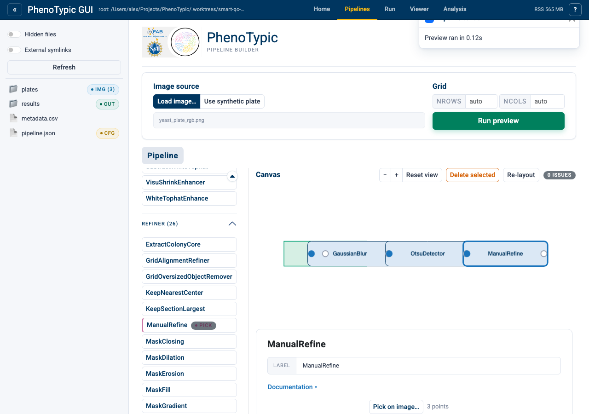

# Pick Points

Some operations need explicit `(y, x)` coordinates that you can't infer from
an image automatically — for example, when you want to *curate* an existing
detection by keeping only the colonies you confirm visually, or when you want
to *generate* an `objmap` from scratch at user-picked centres.

The builder ships an in-page point-picker for two operations:

- **`ManualRefine`** (`Refiner`) — keep only the labels in an existing
  ``objmap`` whose pixels overlap user-picked footprints. Useful for dropping
  false positives without re-running the detector.
- **`ManualPointDetector`** (`Detector`) — produce an ``objmap`` from
  scratch by stamping a footprint at each user-picked centre. Useful for
  irregular plates or quick prototyping.

Both operations carry a purple **PICK** badge in the operations palette so
you can spot them at a glance.

## Set up a curation pipeline

This walkthrough curates an Otsu detection. The flow is:

1. Drag `BlurGauss` from `Corrector` onto the canvas.
2. Drag `OtsuDetector` from `Detector`.
3. Drag `ManualRefine` from `Refiner` (it carries the PICK badge).
4. Connect them in order: blur → detect → select.

Run preview once so the predecessor (`OtsuDetector`) caches its output —
the picker modal can then offer that intermediate as a clearer view for
disambiguation.

## Open the picker

Click the `ManualRefine` node to open its param form in the inspector.
The `centers` parameter has a **Pick on image…** button instead of a text
input.

Click the button. A modal opens with an OpenSeadragon viewer showing the
original RGB plate.

## Switch channels

The radio at the top of the modal lets you switch between **Original RGB**
and **Input to this op**. The latter shows the predecessor's output — for
this pipeline, that's the Otsu binary mask, which can make individual
colonies easier to distinguish from background noise.

The first time you toggle to **Input to this op** the modal pauses briefly
while the intermediate tile pyramid is generated; subsequent toggles are
instant. If the option is greyed out, run preview first so the predecessor
caches its output.

## Pick, undo, confirm

Click on each colony you want to keep. A small red marker appears at the
click position; the count label updates. The picks survive channel toggles —
they're stored as image-coords, so they re-anchor when the underlying view
changes.

If you over-click, the **Remove last** button drops the most recent pick.
**Clear all** wipes the list.

When you're satisfied, click **Confirm**. The modal closes. The param form's
count label now reflects your picks.

## Re-run preview

Run preview again. The `ManualRefine` step keeps only the labels whose
pixels overlap your picked footprints; everything else drops out of the
``objmap``.

## When to use which

- **`ManualRefine`** is the right choice when an automated detector finds
  *too many* objects and you want to retain a hand-picked subset. The
  surviving labels keep their original IDs, so downstream measurements
  reference the same identifiers.
- **`ManualPointDetector`** is the right choice when you need to *create* an
  ``objmap`` from scratch — for example, on irregular plates where no
  automated detector tracks the geometry, or when generating ground-truth
  masks for benchmarking.

Both pick on the same image-coords frame, so coordinates exported from one
op are reusable in the other.
