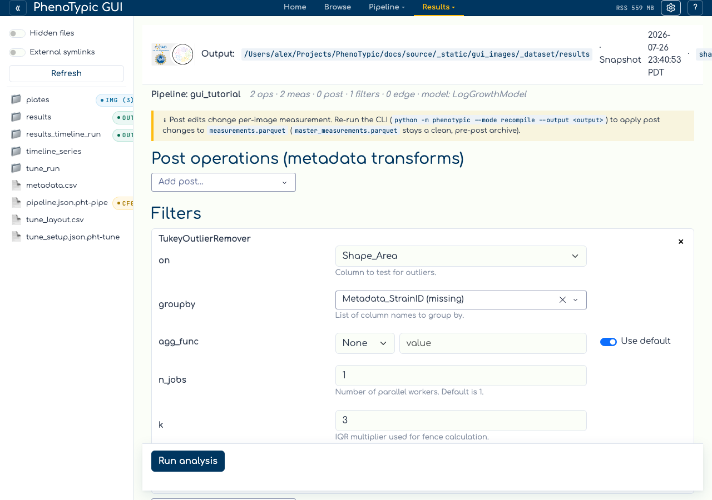
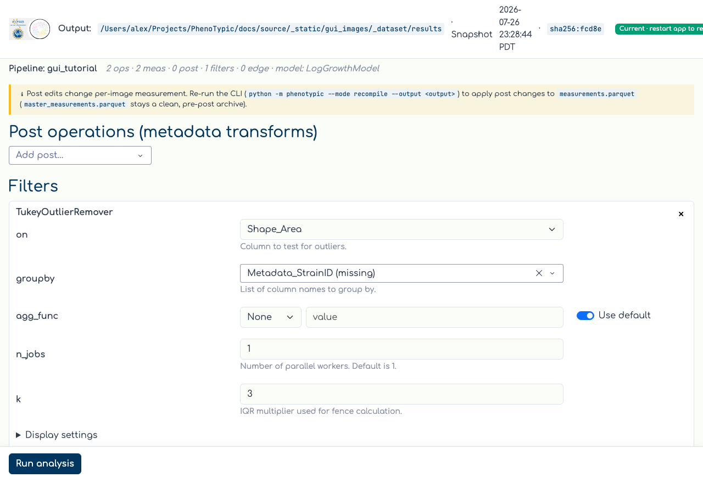
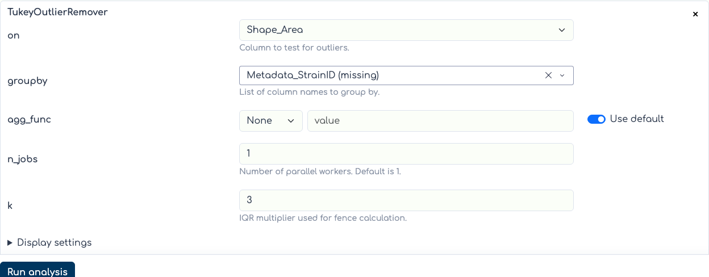
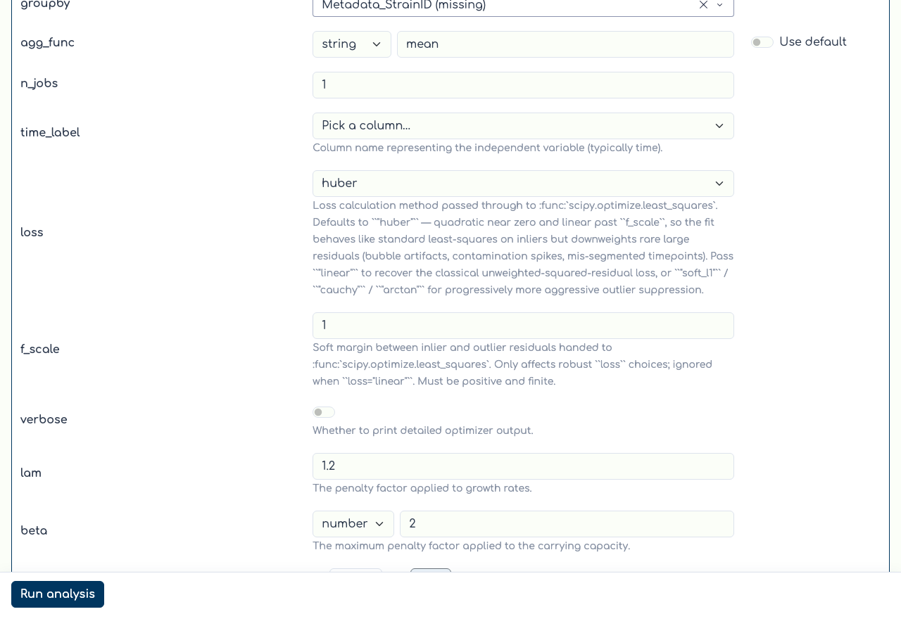

# Analysis sub-app

The `Analysis` tab composes the `phenotypic.analysis` chain — filters
plus an endpoint model — over the curated measurements produced by a
CLI run. Recipes are persisted as fields on the pipeline itself
(`deliverables/pipeline.json.pht-pipe`, next to
`deliverables/master_measurements.parquet`), so the same
chain re-runs deterministically from the CLI when you run recompile mode.


## Hub mount (empty state)

Open the `Analysis` tab in the hub:



Like the Viewer, the hub-mounted Analysis sub-app starts empty. Pick a
CLI output directory in the sidebar — the hand-off banner picks up your
selection and shows the resolved path. Click **↩ Open in analysis** to
bind. The bind endpoint is shared with the Results Viewer, so picking
an output here also binds the viewer to the same directory.

```{note}
The standalone launcher is still useful for headless workflows or
long-running fits where you don't need the rest of the hub:

    uv run python -m phenotypic.gui.analysis \
        --root <path-to-cli-output> --port 8051
```

## What you can do

- **Author the post stack** (metadata transforms): pick a class from the
  "Add post…" dropdown (`PrependString`, `AppendString`,
  `ExpandMetadata`, `MergeMetadata`). The recompile banner reminds you
  that post edits change per-image measurement and require a CLI re-run
  (`python -m phenotypic --mode recompile --output <output>`) to reach
  `deliverables/master_measurements.parquet`.
- **Author the filter chain**: pick a class from the "Add filter…"
  dropdown (`EdgeCorrector`, `TukeyOutlierRemover`). Filters reshape the
  aggregate measurements during analysis — they don't touch the master.
- **Pick the endpoint model**: `LogGrowthModel`, `LinearLagModel`, or
  `LinearCapAndLagModel`. Only one model can be configured at a time;
  selecting `(no model)` clears it and disables the run button.
- **Tune params inline**: every section card hosts an editable form
  generated from the analyzer's constructor signature. Bools become
  switches, numerics become number inputs, `Literal[...]` becomes a
  dropdown, and multi-type unions (e.g. `LinearLagModel.s0_prior`)
  render as a small type-tag dropdown plus an adaptive value input.
  Edits save to `<output>/deliverables/pipeline.json.pht-pipe` automatically.
- **Run analysis**: click `Run analysis`. The sub-app reads
  `<output>/deliverables/measurements.parquet` (the curated mirror), runs
  the chain via `pipeline.analyze(...)`, and writes
  `<output>/deliverables/<AnalysisClass>.csv` and
  `<output>/deliverables/<AnalysisClass>.parquet`, with
  `<output>/deliverables/analysis_manifest.json` recording the available
  analysis tables for downstream consumers. Publication is atomic and checks
  that the bound output, processing generation, source measurements, and
  pipeline revision are still current before replacing artifacts.

## Loaded state

After binding, the page loads with the pipeline summary header, the
recompile reminder banner, and any pre-existing post/filter/model
sections rendered as editable cards:



Each section card is a fully editable form generated from the
analyzer's constructor signature. Bools become switches, numerics
become number inputs, `Literal[...]` becomes a dropdown, and
`list[T]` / `tuple[T, ...]` become comma-separated text inputs.
Editing any value persists to `<output>/deliverables/pipeline.json.pht-pipe`
automatically. Unknown or forward-compatible analyzer nodes remain load
warnings and are preserved unchanged when you edit a supported neighboring
section:



The model section showcases the more advanced widget kinds: the
`agg_func` field is a multi-type union (`bool | float | int | str |
None`) rendered as a type-tag dropdown plus an adaptive value input;
`loss` is a `Literal["linear", "soft_l1", "huber", "cauchy",
"arctan"]` dropdown; `Kmax_label` is an `Optional[str]` paired with a
"Use default" toggle that strips the param from the constructor
kwargs when on:



## CLI parity

Every section you author from the GUI is persisted to
`<output>/deliverables/pipeline.json.pht-pipe`. A subsequent
`python -m phenotypic --mode recompile --output <output>` run reads that file and emits
the same `deliverables/analysis.{csv,parquet}` without booting the GUI —
so `deliverables/pipeline.json.pht-pipe` is the single reproducibility surface.

## Where to next

- [GUI hub guide](../../how_to/pages/gui_hub.md) — the full reference for the hub.
- [Run Locally](04_run_local.md) — produce a CLI output before opening
  the analysis sub-app.
- [View Results](06_view_results.md) — curate
  `deliverables/measurements.parquet` before running analysis.
