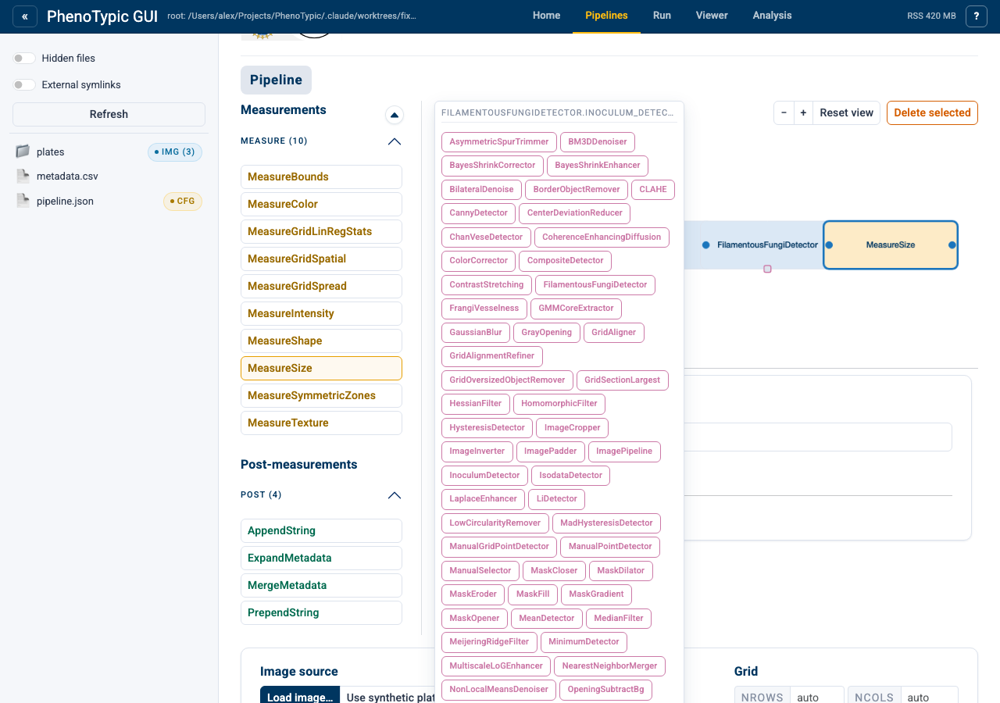
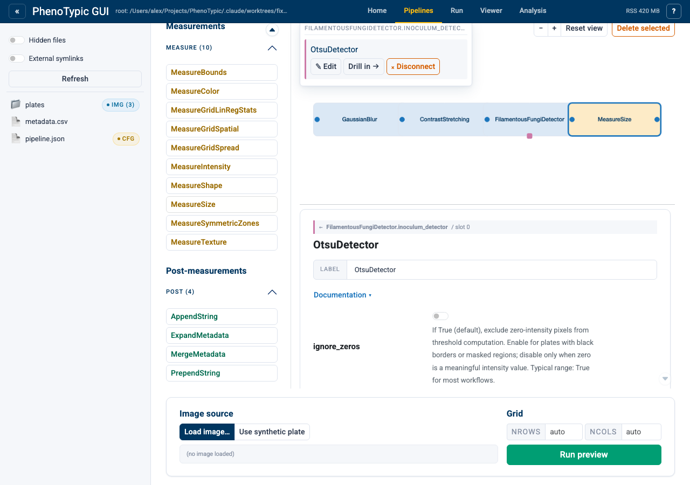
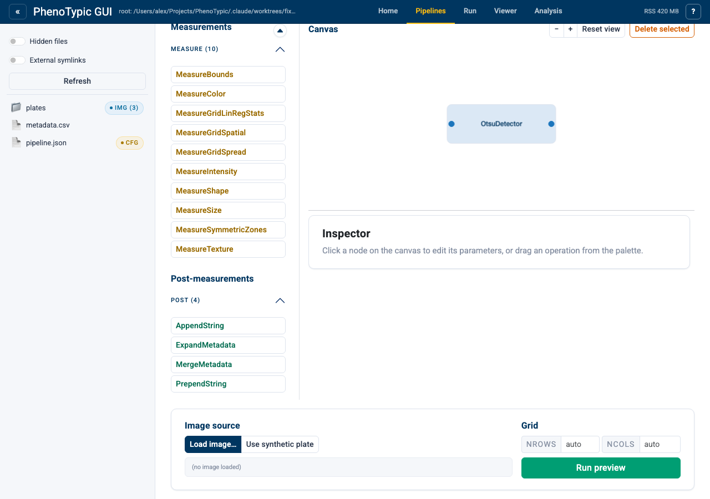
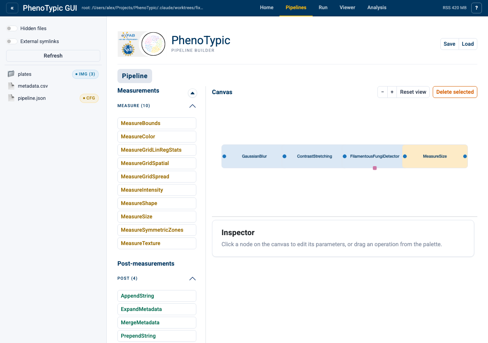
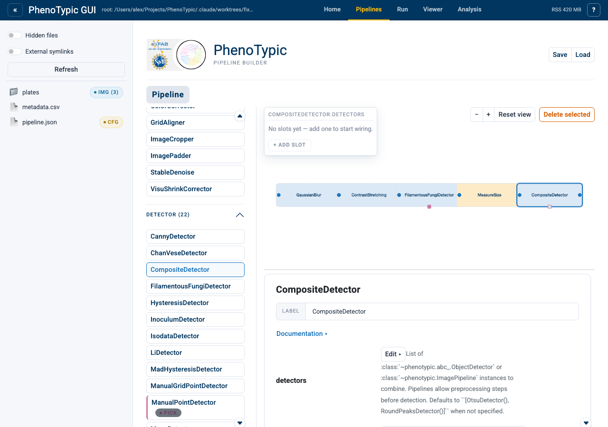
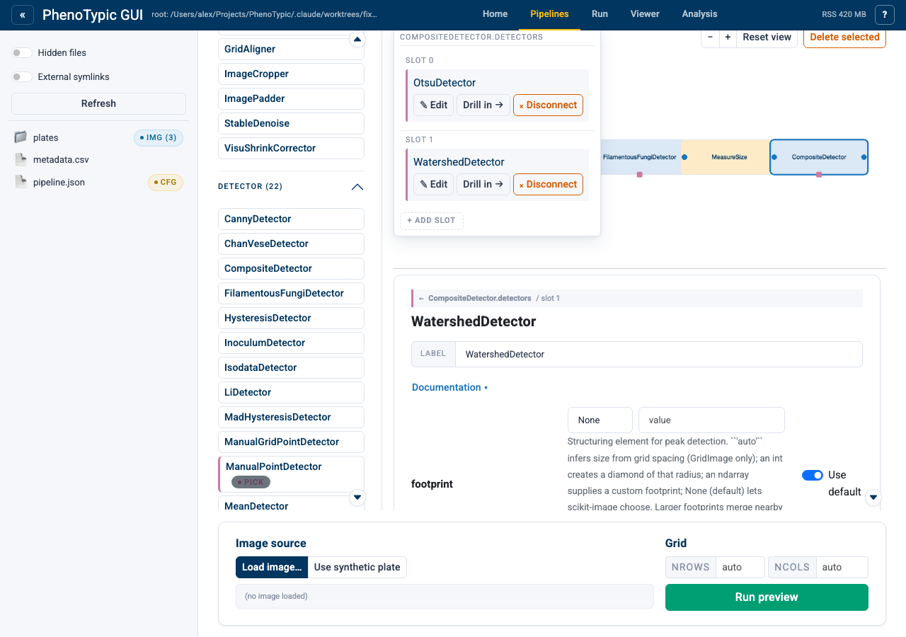
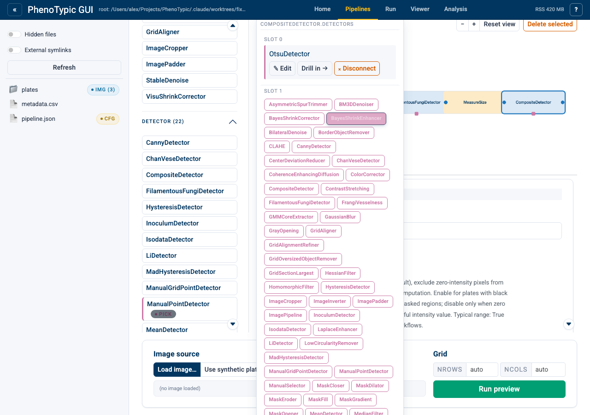

# Wiring aux op params

Some operations accept another operation as a constructor parameter —
e.g. `FilamentousFungiDetector.inoculum_detector` takes an
`ObjectDetector` or `ImagePipeline`. The builder surfaces these slots
as small **aux ports** on the consumer node. Clicking an aux port
opens a **popover** to pick a class, edit a wired aux's params, or
drill into a multi-step aux pipeline.

This tutorial covers three flavours of aux wiring:

1. **Scalar aux** — a single-slot op param (`FilamentousFungiDetector.inoculum_detector`).
2. **Drill-in + extend** — turning a wired scalar aux into a
   multi-step inline pipeline.
3. **List-typed aux** — multi-slot ports
   (`CompositeDetector.detectors`) with per-slot wire / drill /
   disconnect actions.

## Step 1 — Empty canvas

Open the `Builder` tab (or navigate to `/builder/`):

The palette groups ops by `Corrector` / `Detector` / `Enhancer` /
`Refiner`. No aux UI yet — it only appears once a consumer with
op-typed params lands on the canvas.

## Step 2 — Add the main pipeline

Drop the following four ops in order:

1. `GaussianBlur`
2. `ContrastStretching`
3. `FilamentousFungiDetector`
4. `MeasureColonySize`

Four ribbon nodes wired left-to-right by solid image-flow edges
between their **blue I/O ports** (input left, output right).
`FilamentousFungiDetector` carries one **purple aux port** on its
bottom edge — the `inoculum_detector` op-typed param, rendered
**hollow** since nothing is wired yet.

## Step 3 — Open the aux popover

Click the aux port on `FilamentousFungiDetector`:

A popover appears anchored to the port. Since the slot is empty, it
shows a **class palette** filtered to types that satisfy the port —
every `ObjectDetector` subclass plus `ImagePipeline`. The inspector
stays on `FilamentousFungiDetector` until something is wired.

## Step 4 — Pick a class

Click `OtsuDetector` in the popover palette:

The popover flips to **wired** state — class name plus three actions:
`✎ Edit`, `Drill in →`, `⨯ Disconnect`. The inspector swaps to
`OtsuDetector`'s param form with a breadcrumb header
`← FilamentousFungiDetector.inoculum_detector / slot 0` so the
edited slot is unambiguous. The aux port on the consumer flips to
**filled purple**.

## Step 5 — Drill in to inspect the aux scope

Click `Drill in →` in the popover:

The popover dismisses and the canvas swaps to a one-step ribbon of
just `OtsuDetector`. The builder breadcrumb shows the drilled path:
`Pipeline / FilamentousFungiDetector / inoculum_detector / slot 0`.
The inspector now edits the aux's params directly (every aux is
surfaced as a 1-step ribbon for visual continuity even when it's a
single op).

To **extend** an aux into a multi-step inline pipeline, pick
`ImagePipeline` from the popover palette in step 4 instead of a
concrete detector class. Drilling into an `ImagePipeline` aux opens a
*writable* nested scope where the palette can append ops; the same
breadcrumb / drill-in mechanics apply. Single-op auxes (like the
`OtsuDetector` here) are surfaced read-only — replacing the wired
class via `⨯ Disconnect → pick new class` is the way to swap them.

## Step 6 — Drill out and save

Click `FilamentousFungiDetector` in the breadcrumb to drill back out:

The canvas restores to the 4-step main ribbon. The aux port stays
filled purple and now carries a small `1` badge for the one wired
slot. Saving (`Pipeline I/O → Save`) preserves the wired aux as a
standard `__op_param_scope__` marker inside the consumer's params —
the JSON round-trips byte-identically.

## Step 7 — Multi-slot aux: list-typed params

Some consumers accept a *list* of ops, not just one. `CompositeDetector`
takes `detectors: list[ObjectDetector | ImagePipeline]` so a single
detection step can vote across several detectors. Add a
`CompositeDetector` to the ribbon (it appears as a 5th main node), then
click its bottom-edge aux port:

The popover renders in **list mode**: there are no slots yet, so the
body shows a muted "No slots yet — add one to start wiring." line plus
a `+ Add slot` button. Adding the first slot mounts an empty row with
its own class palette — list ports are scalar-popovers stacked
vertically.

## Step 8 — Wire two slots

Click `+ Add slot`, pick `OtsuDetector` for slot 0; click `+ Add slot`
again, pick `WatershedDetector` for slot 1:

Both slots are independent: each carries its own
`✎ Edit / Drill in → / ⨯ Disconnect` actions, and clicking `Drill in →`
on either drills into THAT slot's scope. The `+ Add slot` button stays
at the bottom for adding more.

## Step 9 — Per-slot disconnect

Click `⨯ Disconnect` on slot 1's row only:

Slot 0 stays wired to `OtsuDetector` (compact wired-row at the top of
the popover); slot 1 reverts to its palette state ready to accept a
different class. The slot order survives the disconnect — slot 1 is
still slot 1, just empty again — so any drill / edit references to
slot 0 stay valid.

## Reference

- **Aux port indicator** — purple square on the consumer's bottom
  edge. Hollow = empty, filled = wired (badge shows slot count).
- **Popover dismissal** — click outside, press `Esc`, or click a
  different aux port to swap focus.
- **List-typed params** — for `list[ObjectDetector | ImagePipeline]`
  params like `CompositeDetector.detectors`, the popover stacks every
  slot vertically with per-slot `✎ / → / ⨯` actions plus a `+ Add
  slot` button. Empty slots are folded out on save.
- **Nested aux of aux** — drill-in recurses. An aux's own op-typed
  params get aux ports inside the drilled scope; the breadcrumb
  grows another segment.

## Where to next

- [Build a Pipeline](03_build_pipeline.md) — the basics of the main
  image-flow ribbon.
- [Pick Points](07_pick_points.md) — another consumer-with-config
  pattern (manual curation).
- [GUI hub guide](../../how_to/pages/gui_hub.md) — full reference for
  every panel, store, and admonition in the hub.
