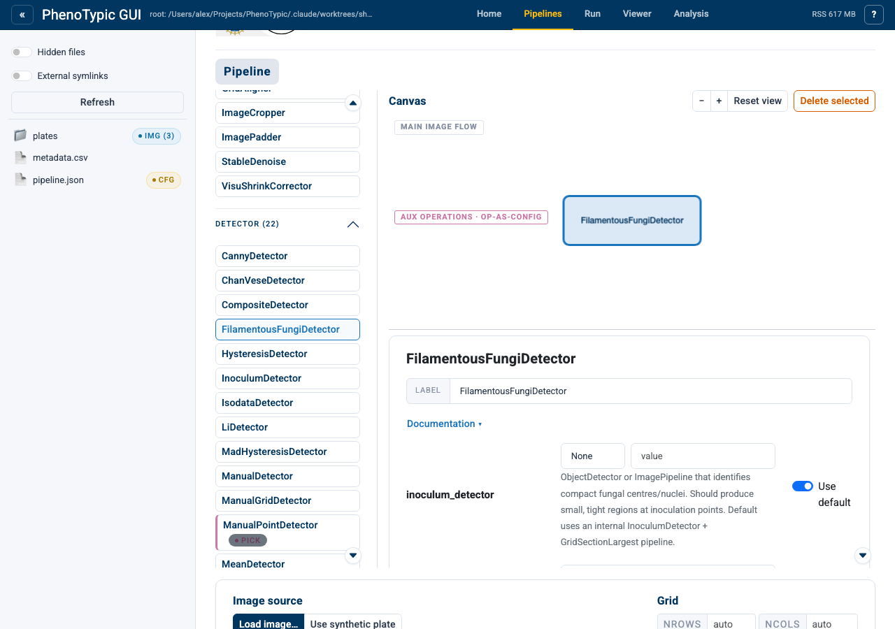
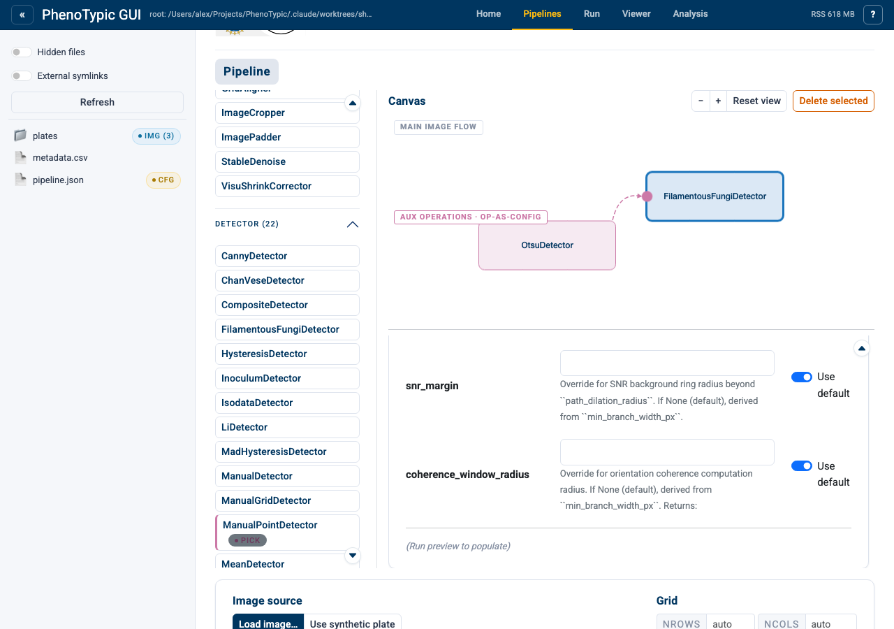

# Aux ports

A handful of operations don't just process the image — they accept
**other operations** as constructor parameters. The classic example is
`FilamentousFungiDetector`, whose `inoculum_detector` parameter is itself
an `ObjectDetector` (typically an `OtsuDetector`) that locates the
inoculum spot before the filamentous-growth measurement runs. Another is
`CompositeDetector`, which takes a `list[ObjectDetector | ImagePipeline]`
and merges their results.

In v1 the pipeline builder surfaces these "operation-as-config" params
as **input ports** on the consumer node, wired from free-floating **aux
nodes** that hang off a dock area below the main image-flow ribbon.
The wiring metaphor is borrowed from Galaxy and other workflow editors:
the main pipeline ribbon stays linear, and the aux ports declare
configuration dependencies visually so a deeply-nested config like
`CompositeDetector([OtsuDetector(), RoundPeaksDetector()])` is legible
at a glance.

## What's an aux port?

An *aux port* is a parameter slot on a consumer node that wants an
operation, not a primitive. Rather than rendering as a number input or
checkbox in the inspector, the param shows as a small **port handle**
attached to the consumer's left edge on the canvas. Clicking the
handle starts a wire; clicking an aux node finishes it.

Two types of aux ports exist:

- **Scalar** — exactly one source, e.g. `inoculum_detector`. Renders as
  a single port handle.
- **List** — one-or-more sources, e.g. `CompositeDetector.detectors`.
  Renders as a stack of port handles plus a `+` button to grow the
  list and a `×` per slot to remove it.

Aux nodes are operation nodes that don't flow image data through the
main pipeline — they only feed into a port on a consumer. They never
sit on the main ribbon; they live in the **aux dock** below it.

## Walkthrough

This section shows the end-to-end flow of wiring an `OtsuDetector` aux
into a `FilamentousFungiDetector` on the main ribbon.

### Open the builder

Click the `Builder` tab (or navigate to `/builder/`):

### Add the consumer

Drag `FilamentousFungiDetector` from the `Detector` palette onto the
canvas. The node lands on the main ribbon as usual, but unlike most
detectors it sprouts a **port handle** on its left edge — that's the
`inoculum_detector` aux input.

The handle is a small square styled with the `port-handle` /
`port-handle--operation` CSS classes (see
[`builder.css`](https://github.com/exfab/PhenoTypic/blob/main/src/phenotypic/gui/builder/assets/builder.css))
so it's distinct from the operation node's body. Hovering shows the
parameter name (`inoculum_detector`) and its expected type
(`ObjectDetector | ImagePipeline`).

### Add an aux source

In v1 the simplest way to drop an aux source is to use the inspector's
**aux palette**: click the consumer's port handle to focus it, then
pick a class from the filtered "Add aux…" dropdown that surfaces only
the operations satisfying the port's type constraint. For
`inoculum_detector` that's any `ObjectDetector` subclass — Otsu,
RoundPeaks, FilamentousFungi (recursively), etc.

The aux node shows up in the dock below the main ribbon. It's
free-floating — no wires yet — and stays there until you connect it to
the consumer's port (or delete it).

### Wire it up (click-then-click)

Click the consumer's port handle and then click the aux node (or the
other way around — order doesn't matter). A purple dashed wire renders
between them:

The wire uses the `aux-wire` cytoscape edge class — purple dashed to
distinguish it from the solid gray `image-flow` edges on the main
ribbon. The pending-wire intermediate state (the first click before
the second) is held in the `store-pending-wire` Dash store; clicking
empty canvas or pressing `Esc` cancels it.

### Inspector treatment

Selecting the consumer node opens its param form in the inspector. The
`inoculum_detector` row no longer shows the drill-in form — instead it
displays a grayed-out **"Connected from canvas"** treatment with a
**Disconnect** button:

The grayed treatment communicates that this parameter is owned by the
canvas wire, not the inspector form. To edit the aux operation's own
params (e.g. tune Otsu's `ignore_zeros`), click the aux node — its
inspector form opens normally.

To detach, click **Disconnect** in the inspector or click the wire on
the canvas and press `Del`/`Backspace`. The wire goes away; the aux
node remains in the dock as an *orphan*.

### Save and reload

Save the pipeline (`Pipeline I/O → Save`). The wire round-trips through
`pipeline.json` as a standard `__op_param_scope__` marker on the
consumer's `inoculum_detector` parameter — no schema change. Loading
the same JSON re-extracts the marker into a fresh aux node + wire, so
the canvas reflects the persisted state.

Orphan aux nodes (those with no remaining incoming wires) are dropped
on save with a toast warning. The save handler validates that the main
ribbon is still one connected linear chain before accepting the write.

## Multi-port (lists)

`CompositeDetector` takes a `list[ObjectDetector | ImagePipeline]` —
its `detectors` parameter is a *list-typed* aux port. The builder
renders it as a stack of port handles plus a `+` button:

1. Drop `CompositeDetector` on the ribbon. It shows one empty slot
   (slot 0) plus a `+` button to add more.
2. Click `+` twice — now there are 3 slots.
3. Wire `OtsuDetector` into slot 0 and `RoundPeaksDetector` into slot 1.
4. Slot 2 stays empty. On save, empty slots are folded out of the
   serialized list so the runtime sees `detectors=[otsu, roundpeaks]`.

Each slot has a `×` button to remove it. Removing a slot also clears
any wire pointing at it; downstream slot indices shift to fill the gap.

## Drill-in for aux of aux

An aux node can itself host op-typed parameters. For example, you can
wire a `FilamentousFungiDetector` *as an aux* into another consumer
that takes `ObjectDetector`, and that aux node has its own
`inoculum_detector` port to wire.

To edit the inner port, click the chevron on the aux node's right edge
to **drill in**. The breadcrumb above the canvas pushes a new segment
(`{"aux_id": <node_id>}`) and the canvas re-renders the aux node's
own scope as if it were a top-level pipeline. Wire the inner aux,
then click the parent breadcrumb segment to drill back out. The
nested wires persist in `pipeline.json` exactly the way the top-level
ones do — a `__op_param_scope__` marker nested inside another
operation's params.

## Known limitations (v1)

- **No drag-to-connect.** Wires are created via click-then-click; the
  cytoscape `edgehandles` extension is deferred to v2 polish.
- **No manual node positioning.** The layout module computes positions
  for the main ribbon and aux dock on every load; positions are
  transient and not persisted in `pipeline.json`.
- **No keyboard shortcuts during wire creation.** `Esc` cancels a
  pending wire and `Del`/`Backspace` deletes a selected wire, but
  there's no keyboard-driven palette navigation yet.
- **Aux nodes can't participate in the main ribbon.** A node is
  either main-ribbon or aux-dock, not both. If you need an op to feed
  both an aux port and the main image flow, you'll need two separate
  nodes.

## Where to next

- [Build a Pipeline](03_build_pipeline.md) — composing the main
  ribbon with simple operations.
- [Pick Points](07_pick_points.md) — manual curation, another
  consumer-with-config pattern.
- [GUI hub guide](../../how_to/pages/gui_hub.md) — the full reference
  for every panel, store, and admonition in the hub.
