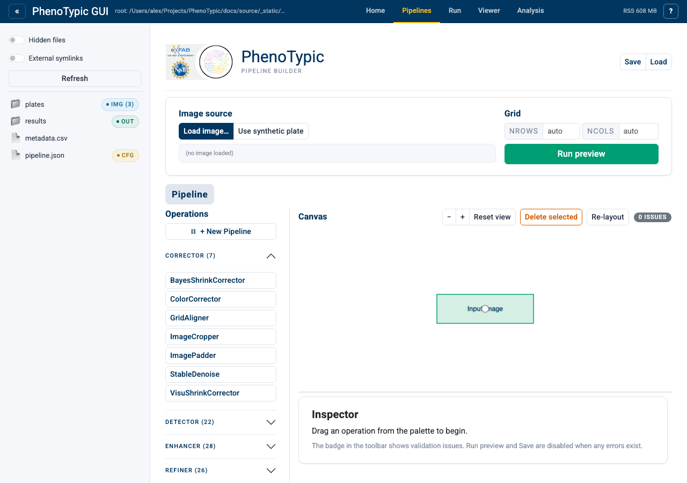
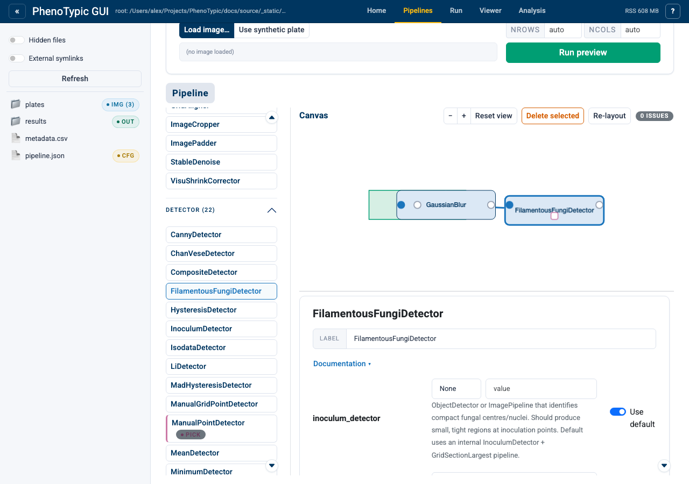
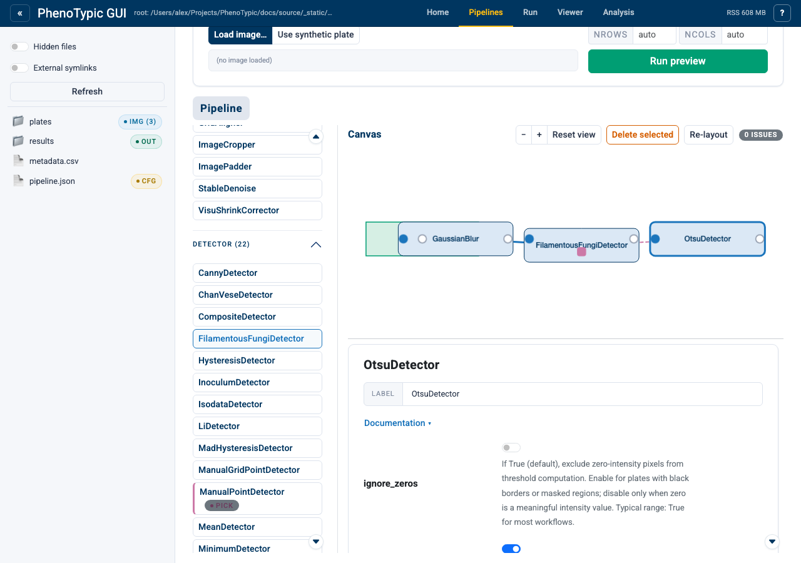
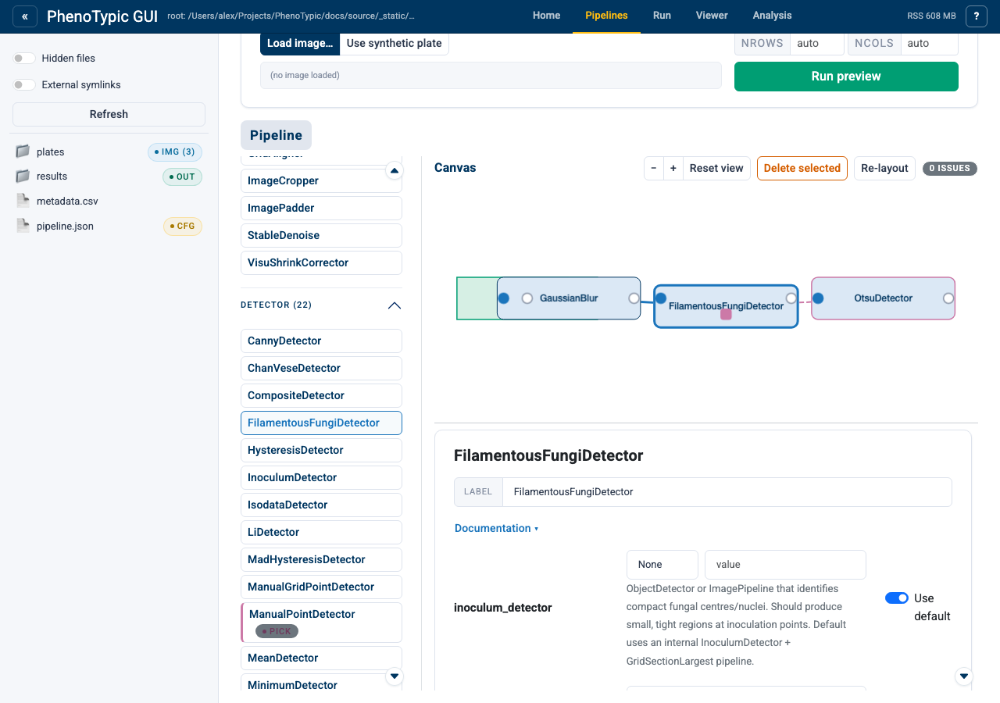

# Wiring aux op params

Some operations accept another operation as a constructor parameter —
e.g. `FilamentousFungiDetector.inoculum_detector` takes an
`ObjectDetector` or `ImagePipeline`. The builder surfaces these slots
as small **aux ports** on the bottom edge of the consumer block. In the
DAG builder the aux producer is a **first-class block on the canvas**,
the assignment is a **purple wire** from the producer's output port to
the consumer's aux port, and the wired aux is managed from the
**inspector's Aux ports section** — there is no popover.

This tutorial covers the scalar-aux flow end to end: surfacing an empty
required aux port, wiring a producer into it, and managing the wired
aux from the inspector.

## Step 1 — Empty canvas

Open the `Builder` tab (or navigate to `/builder/`):

The palette groups ops by `Corrector` / `Detector` / `Enhancer` /
`Refiner`. Every scope auto-seeds one `Input Image` source block; no
aux UI appears until a consumer with op-typed params lands on the
canvas.

## Step 2 — Add the main pipeline

Drop `GaussianBlur` then `FilamentousFungiDetector` onto the canvas.
Each palette add wires onto the current ribbon tail, so the chain is
`Input Image → GaussianBlur → FilamentousFungiDetector`.

`FilamentousFungiDetector` carries one **aux port** on its bottom edge
— the `inoculum_detector` op-typed param. Because that parameter is
**required** (no registry default), the port renders with a **red
ring** while empty and the toolbar issue badge lights up: Rule 3 of
the validator ("required aux ports must be wired") is unsatisfied, so
`Run preview` and `Save` are disabled.

## Step 3 — Wire an aux producer

Drag an `OtsuDetector` from the palette onto an empty patch of canvas
— it lands as a **free-floating block** with no incoming image wire
(it is not part of the main spine). Then draw a wire from its
right-edge **output port** to the `inoculum_detector` aux port on
`FilamentousFungiDetector`.

On drop the wire **snaps purple-dashed** (its colour follows the
target — a purple aux port). Three things change at once:

- the consumer's aux port flips from hollow red-ring to **filled
  purple**;
- the `OtsuDetector` block's border turns **solid purple** — the
  "aux-consumed" cue (spec §4.2): this block lives off the main spine;
- the toolbar issue badge clears to `0 issues` and `Run preview`
  re-enables.

## Step 4 — Inspect the wired consumer

Click the `FilamentousFungiDetector` block to select it:

Selecting the consumer opens its inspector. The `inoculum_detector`
op-typed parameter appears in the parameter form with its registry
documentation and a `Use default` toggle — when the aux port is wired
the slot follows the wired producer; toggling `Use default` (or
deleting the aux wire) falls the slot back to the registry default.
To remove the wire entirely, select it on the canvas and press
`Delete`, or use `Delete selected` in the toolbar — the aux port
reverts to its empty red-ring state and the validation badge fires
again.

## Reference

- **Aux port indicator** — a square on the consumer's bottom edge.
  Hollow purple = optional + empty; red ring = required + empty;
  filled purple = wired.
- **Aux wire colour** — wires are neutral grey while dragging and snap
  to their settled colour on drop: blue-solid into a blue image-input
  port, purple-dashed into a purple aux port.
- **Aux-consumed border** — a block whose output feeds an aux port
  carries a solid purple border so you can tell "this is aux" from the
  block chrome alone, without following the wire.
- **List-typed aux** — params annotated `list[ObjectDetector | …]`
  (e.g. `CompositeDetector.detectors`) accept many wires; the inspector
  renders them as an ordered, reorderable list with a `+ Add empty
  slot` button.
- **Containers as aux** — an `ImagePipeline` container can be wired as
  a single aux producer; see
  [Wire a Pipeline as aux](13_wire_pipeline_as_aux.md).

## Where to next

- [Build a Pipeline](03_build_pipeline.md) — the basics of the main
  image-flow ribbon.
- [Wire an aux in the DAG](12_aux_wire_in_dag.md) — the same aux flow
  with more on the wire-drawing gesture and the validation badge.
- [Wire a Pipeline as aux](13_wire_pipeline_as_aux.md) — wrap a
  multi-step chain in a container and wire the whole container as aux.
- [GUI hub guide](../../how_to/pages/gui_hub.md) — full reference for
  every panel, store, and admonition in the hub.
