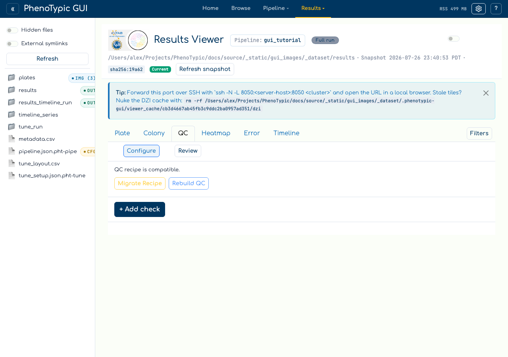
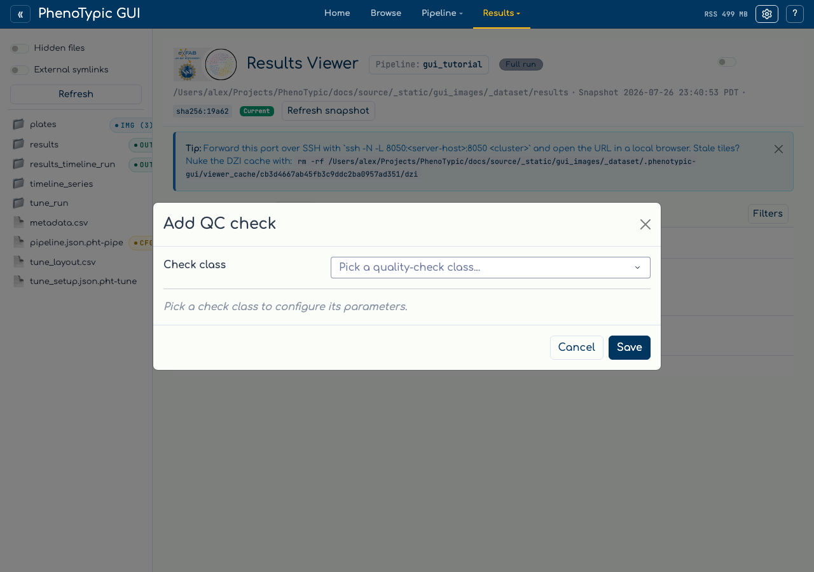

# QC curation loop

The `QC` tab in the Results Viewer composes one Plotly card per
configured `QualityCheck` analyzer. Each card subscribes to the same
`STORE_REMOVED_KEYS` store that backs the "remove colony" toggle, so
every time you curate a flagged colony the card's figure, summary
strip, and status badge re-render automatically — no manual refresh,
no full page reload.

The loop:

1. Configure one or more checks (e.g. `ExpectedVsDetectedCount`,
   `GridOccupancy`, `ReplicateAgreement`).
2. The card highlights every flagged group with its severity.
3. Mark all flagged colonies for removal (per-card button) or curate
   individuals from the Plate / Colony tabs.
4. The card re-renders; remaining severity drops; status badge
   transitions `fail → warn → pass`.

## Prerequisites

- A finished CLI run with `deliverables/master_measurements.parquet` +
  the post-applied `deliverables/measurements.parquet` mirror under
  `<output>/deliverables/measurements.parquet`. See
  [Run Locally](04_run_local.md) to produce one.
- A `metadata.csv` describing the expected plate layout if you plan to
  configure `ExpectedVsDetectedCount` or `GridOccupancy` (their `groupby`
  columns must resolve against the master measurements schema). Both read
  the layout's per-group row count as the expected colony/cell count;
  `GridOccupancy` additionally counts distinct filled grid cells
  (`Grid_RowMajorIdx`), so it reports occupancy without double-counting
  doublets.

## Walkthrough

Open the `Viewer` tab in the hub and pick the `QC` sub-tab:

The empty state shows a placeholder explaining that no checks are configured
yet. The top strip carries `+ Add check`, which opens a modal listing every
concrete `QualityCheck` subclass discovered by `OperationRegistry`. After
configuration changes, **Rebuild QC database** explicitly publishes the
validated catalog and module tables to
`<output>/deliverables/qc/qc.duckdb`.

Click `+ Add check`. The modal opens with a class dropdown plus an
inline param form that adapts to the chosen check's constructor
signature:

Pick `ExpectedVsDetectedCount`, fill in the path to your plate-layout
`metadata.csv`, then click `Save`. A new card slides into the cards
container with:

- a Plotly figure showing per-group Delta (expected − detected),
- a summary strip reading
  `groups: N | flagged: K | max severity: X.YZ`,
- a status badge coloured by the worst per-group status (green /
  yellow / red),
- per-card buttons: `Edit`, `Duplicate`, `Toggle enabled`, `Delete`,
  and `Mark all flagged for removal`.

Switch to the `Plate` tab and remove a flagged colony (or hit the
per-card `Mark all flagged for removal` button to union every flagged
`(ImageFile, Object_Label)` into `STORE_REMOVED_KEYS` in one click).
Switching back to the QC tab shows the card re-rendered with the new
severity.

## Common gotchas

- **Metadata schema:** use the canonical `MetadataImage_ImageName` image key.
  `ExpectedVsDetectedCount` uses the caller-selected `groupby` columns, which
  must exist in both the measurements and supplied metadata layout. A missing
  grouping column records a load warning instead of breaking viewer startup;
  the banner lists the affected `instance_id` and underlying error.
- **QC recipe:** every add / edit / delete writes the `qc` array in the
  pipeline config under `<output>/deliverables/` (`pipeline.json.pht-pipe`
  on current runs). Legacy/incompatible payloads are classified first: any
  migration is an explicit, backed-up, atomic action, never a startup rewrite.
  A configuration edit waits for the explicit **Rebuild QC database** action;
  rebuild stages and validates `deliverables/qc/qc.duckdb` and refuses an
  active or changed source.
  Concurrent viewer sessions on the same output dir are still unsupported.
- **Severity legend:** check-side `severity_warn` / `severity_fail`
  thresholds default to `0.05` / `0.10`. Tune them on the per-check
  edit modal to match your QC tolerance.

## Where to next

- [Heatmap exploration](11_heatmap_exploration.md) — pivot the same
  measurements into a plate-shaped heatmap and watch edge /
  contamination patterns light up.
- [View Results](06_view_results.md) — the curation primitives the
  QC tab piggybacks on.
- [Analysis](08_analysis.md) — once the QC chain is happy, configure
  filters + an endpoint model and emit `analysis.{csv,parquet}`.
