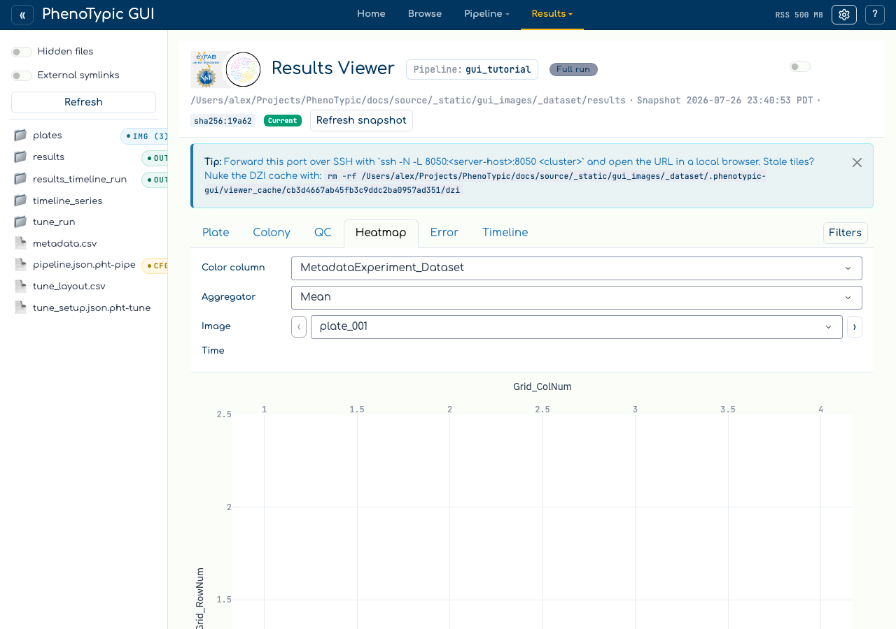
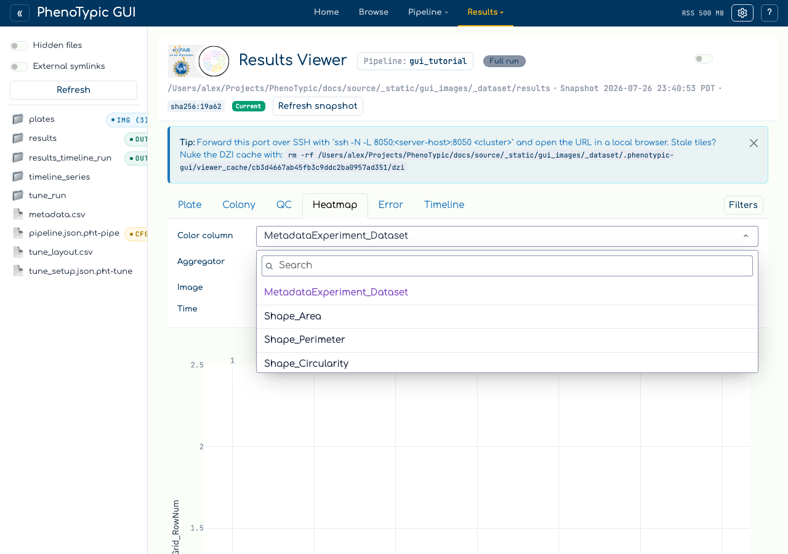

# Heatmap exploration

The `Heatmap` tab in the Results Viewer pivots
`(Grid_RowNum, Grid_ColNum)` into a plate-shaped Plotly heatmap.
Coloring is driven by any measurement column — or, when QC checks are
configured, by any `QC_*_Severity` column the QC tab emits into the
augmented frame — so the same surface doubles as a quick-look quality
dashboard.

The exploration loop:

1. Pick a color column (e.g. `Size_Area`, `Shape_Circularity`, or a
   `QC_*_Severity` column).
2. Pick an image from the dropdown.
3. If multi-timepoint data is present, sweep the time slider to watch
   the colour pattern evolve.
4. Spot edge effects, contamination patches, or replicate-level
   anomalies at a glance — then curate the offending cells from the
   Plate / Colony tabs and watch the × overlay appear on the same
   heatmap.

## Prerequisites

- A CLI run that emitted `Grid_RowNum` / `Grid_ColNum` columns into
  `deliverables/measurements.parquet` (i.e. a `GridFinder`-aware
  pipeline). The empty-state placeholder is rendered when these columns
  are absent.
- Optionally, one or more configured QC checks (see
  [QC curation loop](10_qc_curation_loop.md)) so the color picker
  surfaces `QC_*_Severity` columns.

## Walkthrough

Open the `Viewer` tab in the hub and pick the `Heatmap` sub-tab:

When `Grid_RowNum` / `Grid_ColNum` are absent from the filtered frame
(as is the case for the synthetic tutorial dataset, which uses a
non-grid pipeline) the tab renders an explanation card pointing at
`GridMeasureFeatures`. No exceptions, no blank figure — the empty
state is a first-class affordance.

On a real grid-aware run, the top strip shows four controls:

- **Color column:** dropdown listing every measurement column in
  the schema plus any `QC_*_Severity` columns currently emitted
  (recipe-revision-aware — adding a QC check at runtime adds its
  severity column to the dropdown).
- **Aggregator:** `mean / median / max / min`. Aggregation fires
  **after** the image-file filter, so it only matters when more than
  one row shares a `(Grid_RowNum, Grid_ColNum, Metadata_Time)` bin.
- **Image:** the source image whose colonies are pivoted.
- **Time:** slider with marks at every unique numeric `Metadata_Time`
  value. Hidden when only one timepoint exists, when the column is
  absent, or when coercion to numeric yields all-NaN.

The heatmap renders below the strip. Hover labels carry
`(row, col) — value — ImageFile — Object_Label`. Curated cells —
those tracked in `STORE_REMOVED_KEYS` — render as `COLOR_MUTED`
× markers on a secondary `go.Scatter` trace, visually distinct from
genuinely low-value cells in the colormap.

## Common gotchas

- **Empty state vs. NaN cells:** the empty-state card fires only when
  the grid columns are absent from the schema. If they're present but
  every cell in the current `(image, time)` slice is NaN, the heatmap
  still renders — just with no coloured cells. Switch the time
  slider or aggregator to surface valid bins.
- **Non-numeric time values:** if `Metadata_Time` carries strings
  like `"T0"` / `"baseline"`, `pd.to_numeric(..., errors="coerce")`
  drops those rows and a small caption (`skipping N non-numeric time
  values`) appears below the slider. Coerce upstream in your
  metadata if you want every row to participate.
- **Aggregator semantics:** for the typical one-row-per-well case
  flipping aggregator is a no-op. It only changes the picture when
  the pipeline emits multiple rows per well (e.g. multi-object
  detection without `GridMeasureFeatures`'s per-cell collapse).

## Where to next

- [QC curation loop](10_qc_curation_loop.md) — produce
  `QC_*_Severity` columns so the heatmap can colour by quality
  instead of raw measurements.
- [View Results](06_view_results.md) — curate flagged cells from the
  Plate / Colony tabs; the × overlay updates in lockstep.
- [Analysis](08_analysis.md) — fit a model against the cleaned
  measurements.
