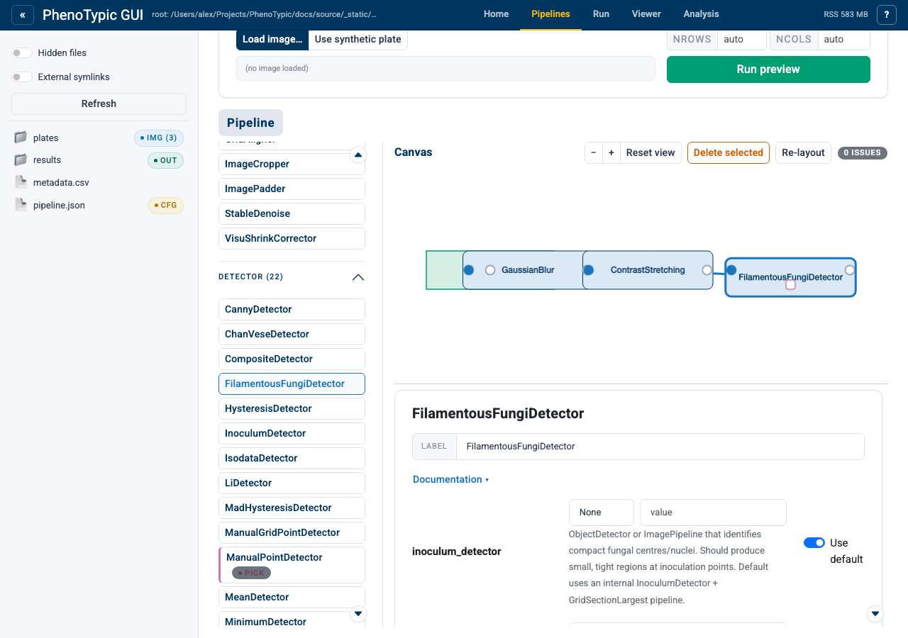
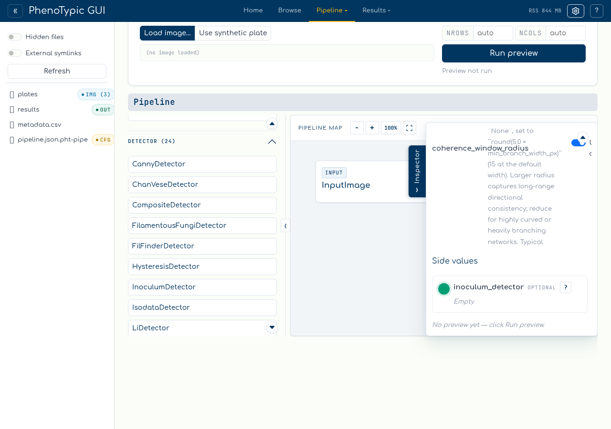
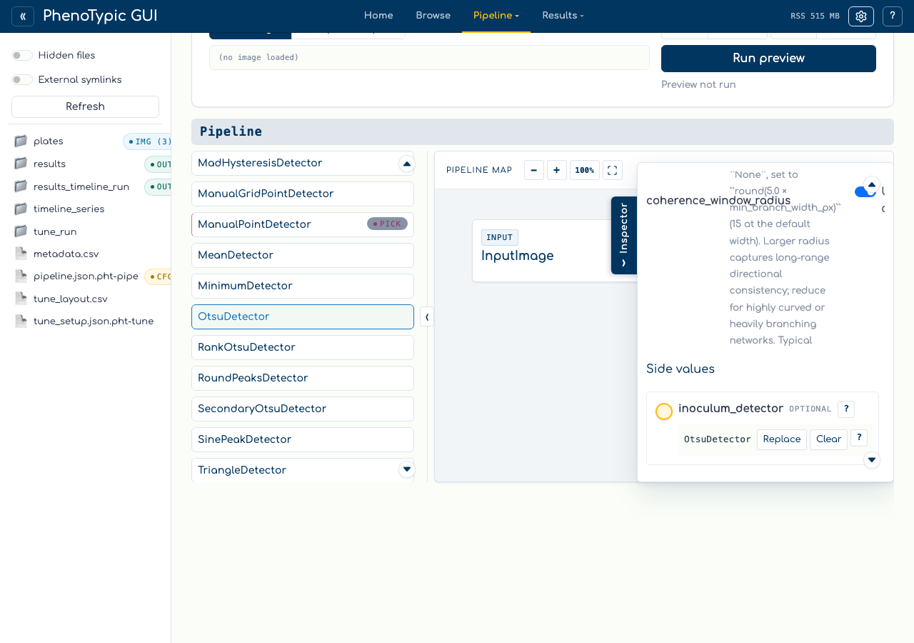

# Fill a scalar aux target

The shipped builder no longer asks users to draw aux wires on a DAG canvas.
Operation-valued parameters are side-loader targets. Selecting a target marks it
green; clicking a compatible palette operation fills it.

This walkthrough uses `FilamentousFungiDetector.inoculum_detector`.

## Step 1 - Add the consumer

Open the `Builder` tab, then click `BlurGauss`, `ContrastStretching`, and
`FilamentousFungiDetector` in the palette. The main chain is fixed and
left-to-right:

The side loader shows `inoculum_detector` as a required side value. Until that
value is filled, the issue badge remains active.

## Step 2 - Select the side port

Click the gold port button beside `inoculum_detector` in the side loader. The
port turns green and the active target strip names the parameter you are about
to fill:

This is the same target-selection model used by the floating continuation port
on the map. The next compatible palette click goes to the green target.

## Step 3 - Choose the aux operation

Click `OtsuDetector` in the palette:

The builder creates a hidden aux source, records it in the DAG state, and keeps
the visible map linear. The filled row can be replaced, cleared, or inspected
from the side loader.

## Reference

- **No drag gesture** - aux fill is click-only in the default builder.
- **Compatibility** - incompatible palette choices leave the pipeline unchanged
  and show a warning.
- **Doc help** - click `?` beside the parameter or filled value to read the
  docstring.
- **Preview** - image-output and continuation port menus can preview a prefix;
  global preview/save still require the whole pipeline to validate.

## Where to next

- [Open an embedded Pipeline aux](13_wire_pipeline_as_aux.md) - use `+ New
  Pipeline` as the side value.
- [Fix validation issues](14_fix_validation_issues.md) - see how missing side
  values appear in the issue badge.
- [Build a Pipeline](03_build_pipeline.md) - the main image-flow basics.
