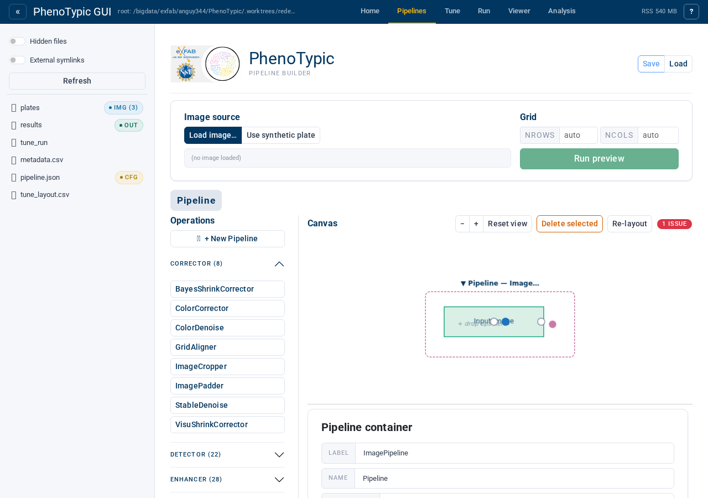
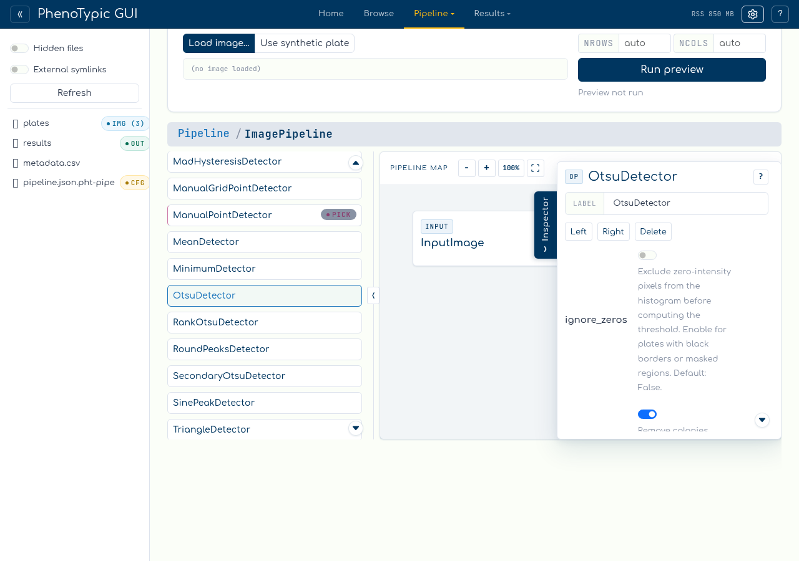
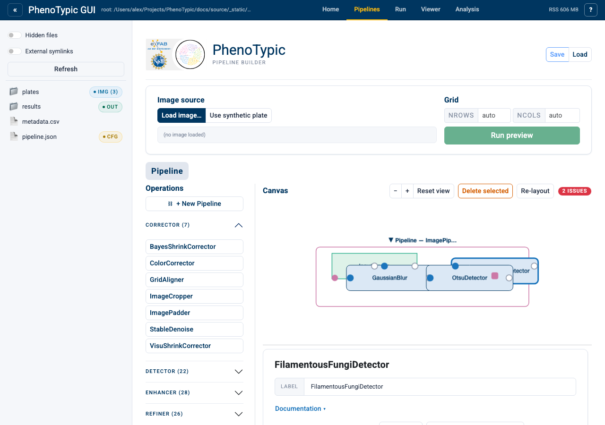

# Open an embedded Pipeline aux

Some side parameters need more than one operation. Instead of filling the slot
with a single detector, fill it with a nested `ImagePipeline`, drill into that
pipeline, and build a fixed linear chain inside it.

This tutorial fills `FilamentousFungiDetector.inoculum_detector` with a nested
pipeline containing `BlurGauss -> OtsuDetector`.

## Step 1 - Create the embedded pipeline

Add `FilamentousFungiDetector` to the main map, select it, and click the gold
port beside `inoculum_detector`. With that side target selected, click
`+ New Pipeline`.

The builder creates a hidden `ImagePipeline` side value and immediately drills
into its nested scope. The breadcrumb shows that you are inspecting the side
value rather than the root pipeline.

## Step 2 - Build the nested chain

Inside the embedded scope, click `BlurGauss`, then `OtsuDetector`:

The nested scope has the same controls as the root: fixed node cards, visible
ports, docstring help, side-loader parameters, and view-only zoom/fit controls.

## Step 3 - Return to the parent

Click the root breadcrumb segment to return to the parent pipeline, then select
`FilamentousFungiDetector`:

The side value row shows `ImagePipeline` with an `Open` action. Click `Open` to
drill back into the nested pipeline later.

When the pipeline saves, the side value serializes as a nested public
`ImagePipeline` value inside the consumer parameter. Builder-only UI state such
as selected targets, open menus, breadcrumbs, and zoom does not become pipeline
JSON.

## Reference

- **Create** - select a side target, then click `+ New Pipeline`.
- **Open** - click `Open` on the filled side value row.
- **Breadcrumbs** - use the root crumb to drill back out.
- **Validation** - the parent pipeline remains invalid until the required side
  value exists; the embedded pipeline must also be valid before save.
- **Read-only mobile mode** - breadcrumbs, help, zoom, and inspection remain
  available; insertion/edit/delete/save are disabled.

## Where to next

- [Fill a scalar aux target](12_aux_wire_in_dag.md) - the single-operation side
  value flow.
- [Fix validation issues](14_fix_validation_issues.md) - required side-value
  validation and issue badge behavior.
- [Build a Pipeline](03_build_pipeline.md) - the main image-flow basics.
