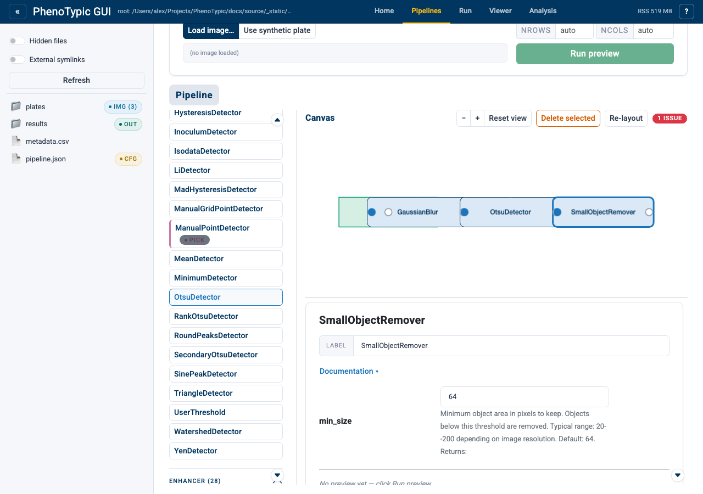
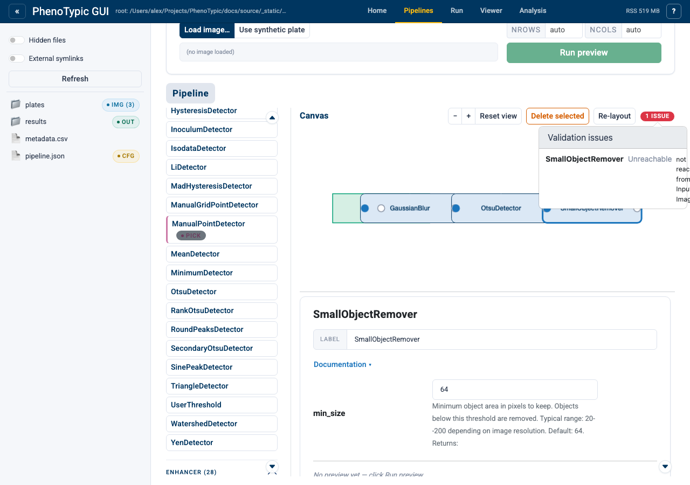
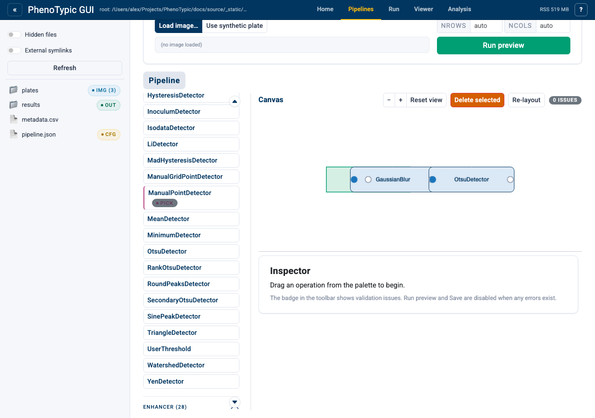

# Fix validation issues

The builder validates the DAG continuously as you author it. When a
rule fires, the toolbar shows a red **issue badge** with the count of
unresolved issues, and the offending block(s) carry a red border + a
`!` marker. The `Run preview` and `Save` buttons disable until the
DAG is clean.

This tutorial walks through one of the more common triage paths:
introducing a stranded block (no incoming image wire), surfacing the
validator's complaint, and clearing it.

## Step 1 — Introduce an issue

Drop a `GaussianBlur → OtsuDetector` ribbon, then add a third block
(`SmallObjectRemover`) without wiring it into the existing ribbon. The
`SmallObjectRemover` is now **stranded**: it has no incoming image flow, so
its preview can never resolve. The toolbar issue badge lights up
showing the issue count.

The validator runs against the canvas state on every mutation, so
the badge updates within ~50 ms of the drop. Issues are categorised
into **blocking** (preview/save disabled) and **advisory**
(highlighted but still runnable); a stranded image consumer is a
blocking issue because the pipeline cannot execute without it.

## Step 2 — Pan to the offender

Click the issue badge or open the toolbar's issue list and click the
specific row. The canvas pans to the offending block, the block
highlights with a red border + `!` marker, and the inspector shows
the validator's explanation (e.g. "Block has no incoming image wire;
either wire it from a producer or delete it").

The issue-click is non-destructive — you can use it as a navigation
aid even when you don't intend to resolve the issue immediately
(e.g. while reviewing a large pipeline someone else authored).

## Step 3 — Resolve the issue

Either wire the orphan into the main ribbon (drag from the
`OtsuDetector` output port to the `SmallObjectRemover` input port) or delete
it via `Delete selected` in the toolbar. The validator re-runs on
mutation, clears the issue, hides the red border, and re-enables
`Run preview` + `Save`.

The cleared state restores the canvas to a runnable pipeline. The
inspector's preview thumbnail repopulates the next time you click
`Run preview`.

## Reference

The validator enforces six blocking rules + one advisory hint:

1. **Every consumer needs an image input** — no stranded blocks.
2. **No image-flow cycles** — the DAG must remain acyclic on
   image-flow edges. Aux edges are exempt (they're not part of the
   main flow).
3. **No fan-out on image-output ports** — each producer's right-edge
   output can feed exactly one consumer's image input.
4. **Aux wires must target compatible types** — the producer's
   output type must satisfy the consumer's aux port type
   constraint (e.g. an `ObjectDetector` can wire into an
   `inoculum_detector` slot but a `Refiner` cannot).
5. **Containers must have a non-empty body** — an empty `Pipeline`
   container is a no-op and the validator surfaces it as blocking.
6. **Input Image sentinel cannot be deleted** — every scope's
   sentinel anchors its `Input Image` source; the validator refuses
   to clear it.

The single advisory hint covers unused producers (a block whose
output isn't wired into anything downstream). Advisories highlight
the block in amber rather than red and do not block preview.

## Where to next

- [Wire an aux in the DAG](12_aux_wire_in_dag.md) — clean authoring
  flow without issues.
- [Wire a Pipeline as aux](13_wire_pipeline_as_aux.md) — containers
  and their unique validation paths.
- [GUI hub guide](../../how_to/pages/gui_hub.md) — full reference
  for every panel, store, and admonition in the hub.
