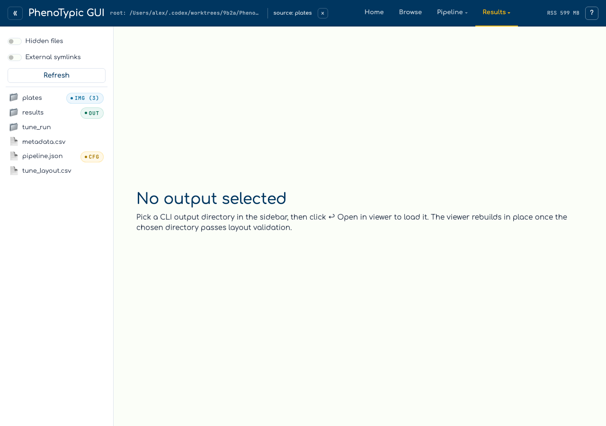
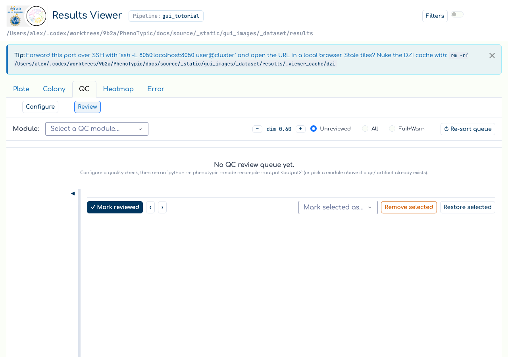
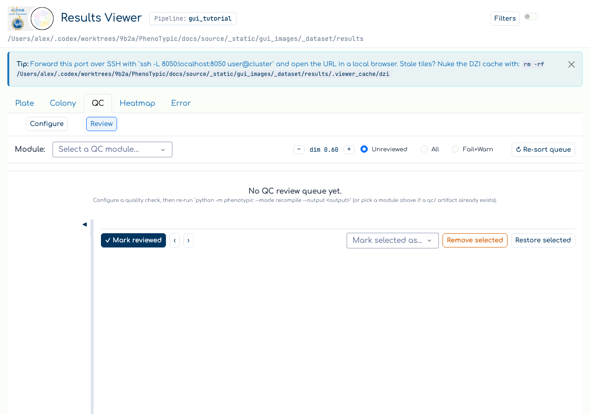

# QC review walkthrough

The `QC` tab in the Results Viewer has two modes, switched by a
**Configure | Review** segmented toggle:

- **Configure** — the per-check card editor (see
  [QC curation loop](10_qc_curation_loop.md)). Adding, editing, or
  deleting a check now writes the `qc` array of the output's
  `deliverables/pipeline.json` (a legacy `.viewer_cache/qc_recipe.json`
  sidecar is
  folded in once on first open).
- **Review** — a master–detail walkthrough that walks the
  worst-agreeing groups for one QC module, lets you curate the offending
  colonies in a tile gallery, and recomputes the module in place after
  each curated group.

The review loop:

1. Pick a **module** (one configured check) from the toolbar.
2. The **worklist** lists that module's groups sorted worst-first.
3. Open a group; its **detail gallery** shows every member colony as a
   tile (one row per timepoint for time-course checks).
4. Curate — remove the bad colonies (per tile or multi-select bulk).
5. **Mark reviewed** (or **Next**). If you changed anything, the module
   recomputes on the curated data and the group's metric updates in
   place with a `before → after` delta.

## Prerequisites

- A finished CLI run whose `deliverables/pipeline.json` carries at least
  one QC check, so the CLI wrote the `qc/` artifact
  (`qc/qc_summary.parquet`, `qc/qc_members.parquet`,
  `qc/qc_config.json` — these stay at the output-dir root). Configure a
  check in the **Configure** sub-view, then re-run
  `python -m phenotypic --mode recompile --output <output>` (or `--mode measure --pipeline <pipeline.json> --output <output>`) to compute
  it. See [Run Locally](04_run_local.md).
- The post-applied `deliverables/measurements.parquet` mirror under
  `<output>/deliverables/measurements.parquet` — the recompute reads this
  frame (it carries any `PostMeasurement` columns and joined metadata) and
  anti-joins your removals, so the in-session metric matches the CLI's.

## Walkthrough

Open the `Viewer` tab in the hub and pick the `QC` sub-tab. Before an
output root is bound the tab shows its empty state:

With an output root that carries a `qc/` artifact, flip the toggle to
**Review**. The toolbar exposes the module picker, the `on` / `groupby`
chips, a `Show: unreviewed / all / fail+warn` filter, and a
`↻ Re-sort queue` button. Below it, the summary header tiles the
per-module counts — `total`, `fail`, `warn`, `pass`, **`insufficient`**
(groups whose metric could not be computed — never shown as a green
`pass`), `reviewed`, `removed`, and a robust `median metric`. The
worklist sidebar lists the module's groups worst-first:

Click the worst (top) group. The detail pane renders its header — the
group key, the metric (with a `before → after` delta once you recompute),
the status badge, member count, and removed count — above the tile
gallery. Each tile is a centred crop of the colony served by the QC crop
route; removed colonies dim. The action bar carries `✓ Mark reviewed`,
`Next group →`, and bulk `Remove selected` / `Restore selected`:

Remove the outlying colonies (click each tile's `✕`, or shift-select a
range and hit `Remove selected`), then click `✓ Mark reviewed`. Because
you made changes, the module recomputes on the curated frame and the
group's metric/badge update **in place** — the row keeps its position and
gains a `⤳` "moved/changed" hint. The queue only reorders when you click
`↻ Re-sort queue`.

## Common gotchas

- **Recompute reads `deliverables/measurements.parquet`, not the
  master.** The in-session recompute uses the post-applied +
  metadata-joined mirror minus your removals, so it matches the artifact
  the CLI would write. The clean
  `deliverables/master_measurements.parquet` is metadata-free and is not
  used for recompute.
- **`insufficient` is not `pass`.** A check like `ICC` returns `NaN` on
  a sparse or under-powered group; the summary header counts those as
  `insufficient` and they sort to the bottom of the worklist — they are
  "no signal", not "good".
- **Review progress is per-module and resets on re-run.** Marked-reviewed
  groups live in GUI-owned `qc/review_state.json`, keyed by check
  `instance_id`. An in-session recompute preserves it; the next CLI
  recompile or measure-mode run clears it so a fresh run starts the queue
  over.
- **Curation is shared.** Removing a colony in Review removes it
  everywhere (the Plate / Colony tabs and the heatmap) — it writes the
  same `deliverables/measurements.parquet` removal set.

## Where to next

- [QC curation loop](10_qc_curation_loop.md) — the Configure sub-view's
  per-check card editor.
- [Heatmap exploration](11_heatmap_exploration.md) — pivot the same
  measurements (and any `QC_*_Metric` column) into a plate-shaped
  heatmap.
- [Analysis](08_analysis.md) — once QC is happy, configure filters + an
  endpoint model and emit `analysis.{csv,parquet}`.
