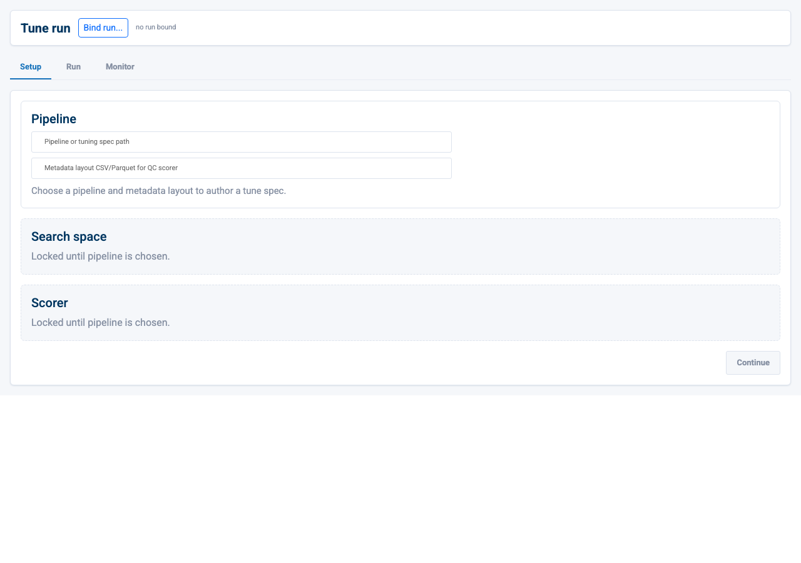
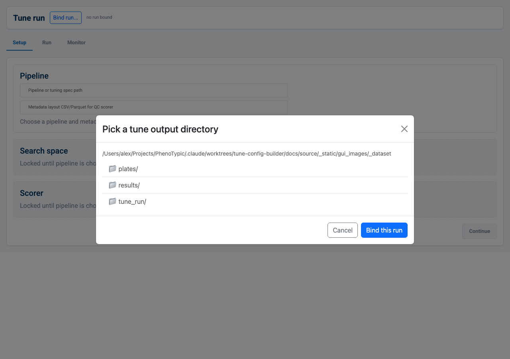
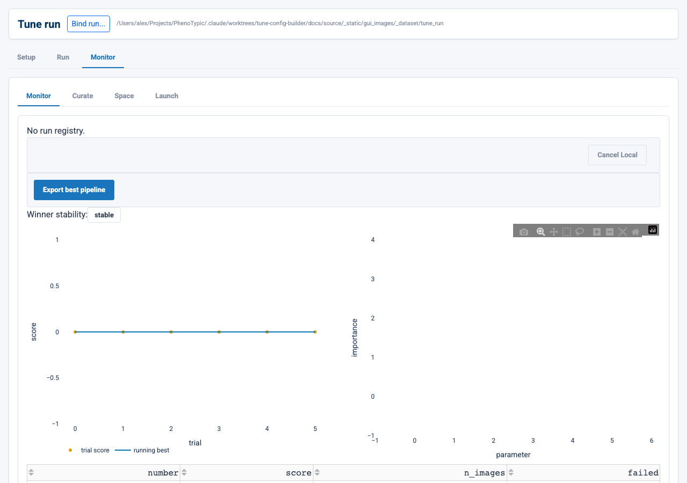
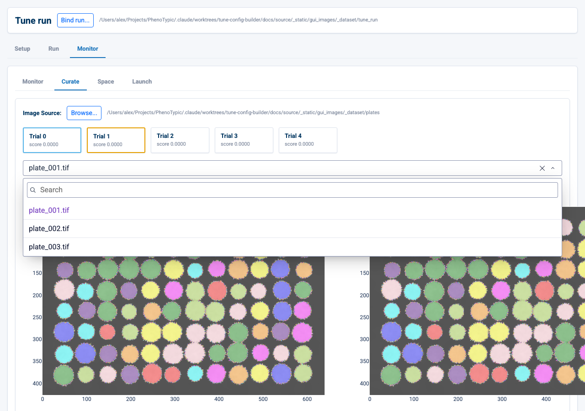
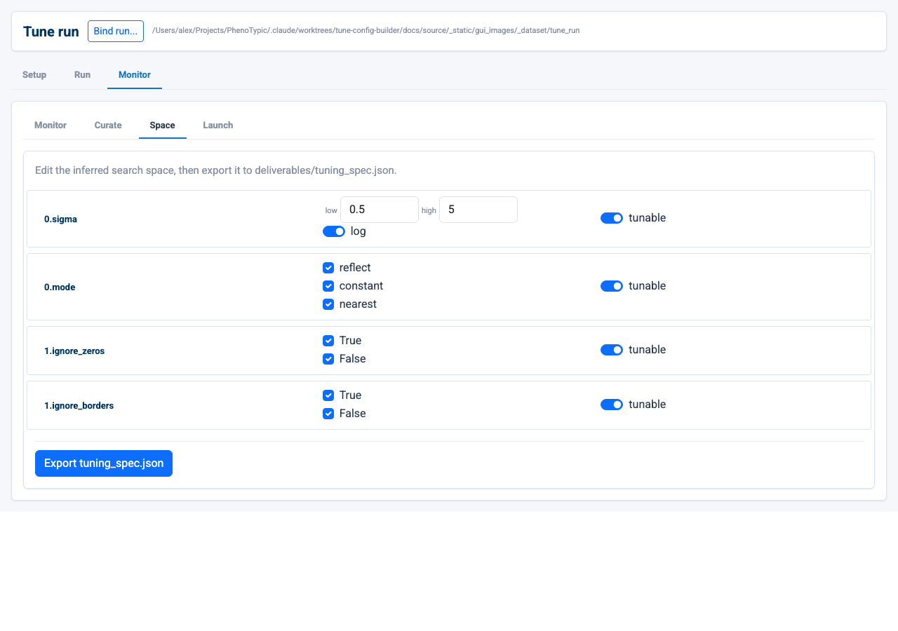
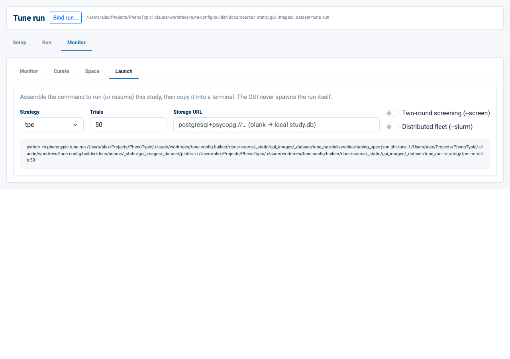

# Tune co-pilot

The `Tune` tab opens a **read-only** co-pilot over a
`python -m phenotypic.tune` output directory. It never re-optimizes — it
*reads* a finished or in-flight tuning run's markers, trial journal, and
study so you can watch progress, compare candidate pipelines on real
plates, review the search space, and compose the next run. The page is a
four-view sub-tab stack:

- **Monitor** — the live study read: an objective curve (raw scores +
  running best), a parameter-importance bar chart, a winner-stability
  (generalization-gap) badge, and a trials table. A 3-second poll
  re-reads the study; if the live store is unreachable it degrades to the
  finished `trials.parquet` journal.
- **Curate** — a shortlist of the best (and gap-flagged) trials. Pin two
  into the **A** / **B** slots and compare their colony overlays
  side-by-side (or as a single difference image) on any plate from the
  run's image directory. "Set as winner" writes `best_pipeline.json`.
- **Space** — the inferred search space, one editable knob-row per tuned
  target. Flat / presence knobs are editable (low / high / log or
  categorical choices); nested knobs are read-only. Export the edited
  space back to `tuning_spec.json`.
- **Launch** — a form (strategy / trial budget / storage URL / `--screen`
  / `--slurm`) and a live command card that mirrors the form into a real
  `python -m phenotypic.tune run` invocation.

## Prerequisites

- A tune output directory produced by `python -m phenotypic.tune run`,
  **inside the GUI sandbox** (the `--root` you launched `phenotypic-gui`
  with) so the run picker can reach it. It is recognised by its
  `.pht-tune-cache/run.json` marker (written at run start, before any
  deliverable lands), so both an in-flight run and a finished run resolve.
  A finished run also carries `trials.parquet` and
  `deliverables/tuning_spec.json`.
- For the Curate overlays, the run's calibration **image directory** must
  be reachable inside the GUI sandbox. The Image Source pre-fills from the
  marker's `images_dir`; you can re-point it with the sandbox-bounded
  Image Source picker.

## Walkthrough

Open the `Tune` tab. The co-pilot mounts **run-unbound** — an empty state
with a short prompt and a `Bind run` button in the header:

Click `Bind run` to open the **run picker** — a sandbox-bounded directory
browser (the same security boundary the builder / run-console pickers
enforce, so a tune output can only be bound from inside the GUI sandbox).
Navigate to the run's output directory and click `Bind this run`:

Binding only **reads** the directory — it runs `TuneRunRoot.discover`
over the run's markers and, on success, swaps the page into the loaded
four-view stack. A directory that is not a tune output (no
`.pht-tune-cache/run.json`, `tuning_spec.json`, or `trials.parquet`) — or
one outside the sandbox — is refused with a clear note next to the button,
never a crash.

Once bound, the **Monitor** view reads the study and renders the objective
curve (raw per-trial scores plus the monotone running-best trace), the
parameter-importance bars, the winner-stability badge, and the trials
table. The 3-second poll keeps all four live while a run is still in
flight:

Switch to **Curate**. The shortlist surfaces the top trials (plus any the
gap badge flagged). Click a card to pin it into slot **A**, a second to
pin **B**, then pick a plate — the two `go.Image` overlays render each
trial's pipeline applied to that plate so you can read the detection
difference directly. Panning or zooming one overlay mirrors the other
(linked pan/zoom); the **Difference** toggle collapses the pair into a
single image that paints both / only-A / only-B objects. `Set as winner`
writes the pinned trial's pipeline to `best_pipeline.json`:

**Space** infers the search space from the bound run's pipeline / spec
and renders one knob-row per tuned target. Flat and presence knobs are
editable — a range knob shows low / high / log inputs, a categorical knob
shows a choice checklist — while nested knobs render read-only. Toggle a
knob's `tunable` switch to include or drop it, then `Export
tuning_spec.json` to write the edited space back (the scorer is
preserved):

Finally, **Launch** turns the next run into a copy-pasteable command. Set
the strategy, trial budget, storage URL, and the `--screen` / `--slurm`
toggles; the live command card mirrors the form into a real
`python -m phenotypic.tune run` invocation using the actual CLI subcommand
and flag names:

## Common gotchas

- **The co-pilot is read-only.** It never re-runs the optimizer — Launch
  only *composes* the command; you run it yourself. The import surface
  stays optuna-free, and the live study is opened lazily inside the
  Monitor poll callback only. **Binding a run only reads its directory** —
  the run picker validates the markers and never writes to the run dir.
- **The page mounts empty.** Through `phenotypic-gui` the `/tune/` tab
  opens run-unbound; use `Bind run` to point it at a tune output. You can
  re-bind a different run at any time from the same header button.
- **A live run resolves before any deliverable lands.** Discovery reads
  the `.pht-tune-cache/run.json` marker first, so an in-flight run shows
  on Monitor before `trials.parquet` or `tuning_spec.json` exist. If the
  live study store is unreachable, the Monitor degrades to the finished
  parquet journal and surfaces a note rather than blanking.
- **Curate overlays need the image directory in the sandbox.** Plate
  loads are re-confined to the GUI sandbox; an out-of-sandbox Image Source
  is refused with a toast. Re-point it with the Image Source picker if the
  marker's `images_dir` is not reachable.
- **The Pareto card is multi-objective only.** A single-objective run
  hides it; a run whose scorer declares more than one direction shows the
  Pareto front card on Monitor.

## Where to next

- [Build a Pipeline](03_build_pipeline.md) — author the base pipeline a
  tune run searches over.
- [Run Locally](04_run_local.md) — run the winning `best_pipeline.json`
  the co-pilot wrote over your full dataset.
- [Analysis](08_analysis.md) — once the pipeline is tuned, compose
  filters + an endpoint model and emit `analysis.{csv,parquet}`.
