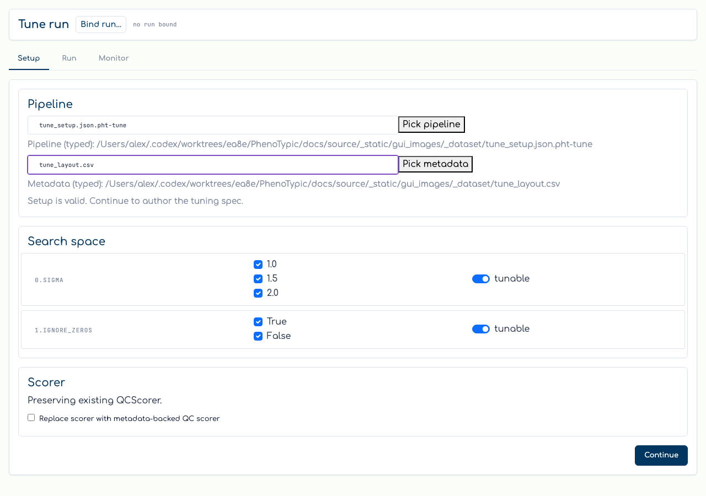
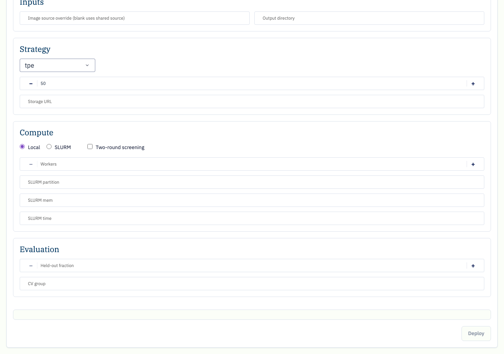
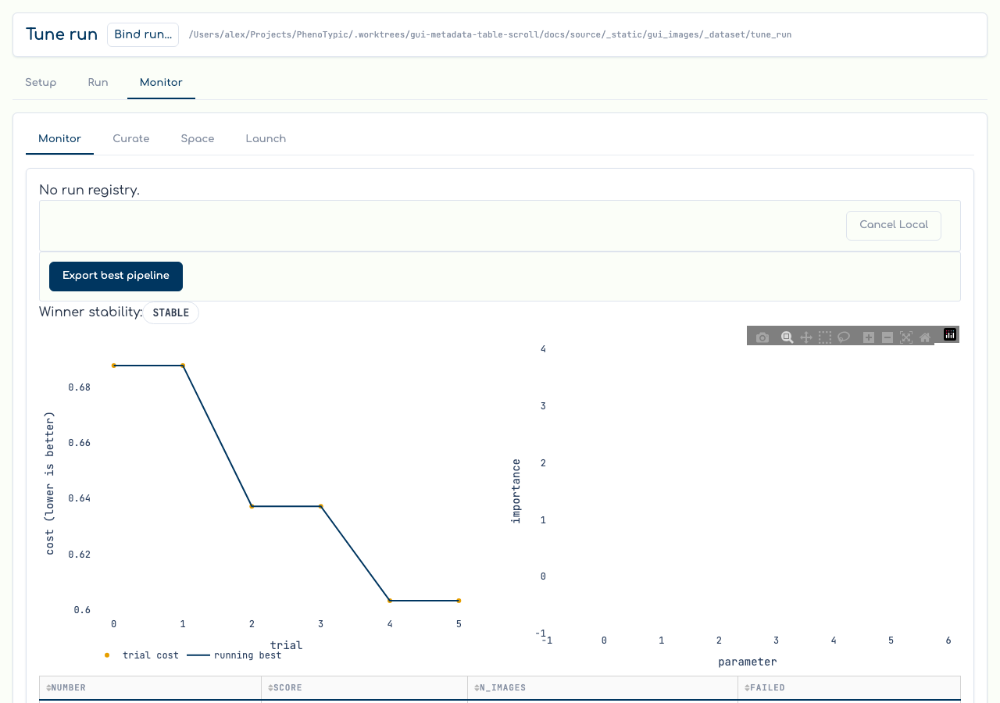
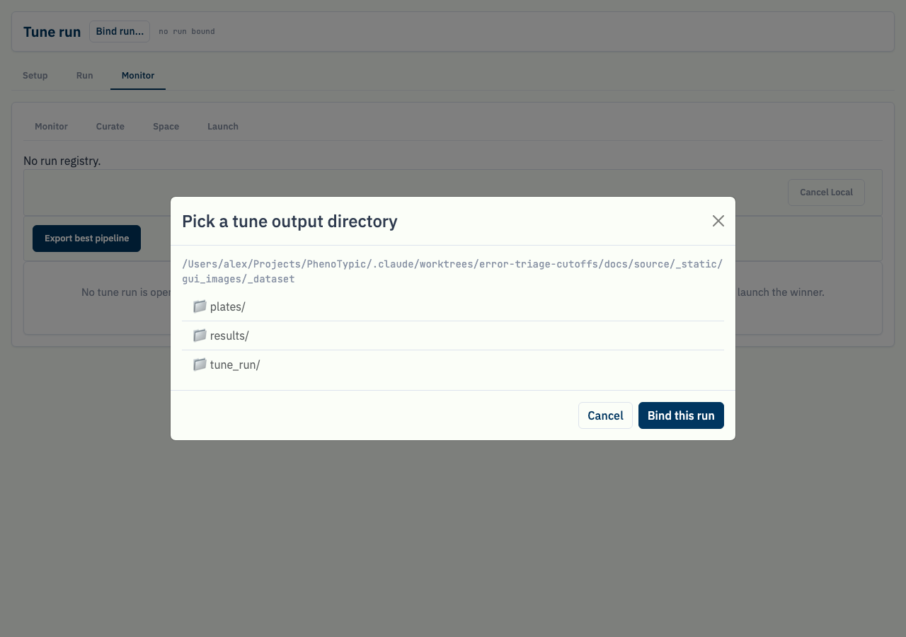
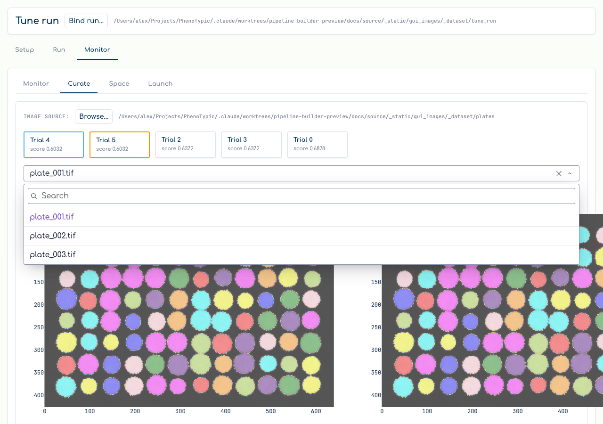
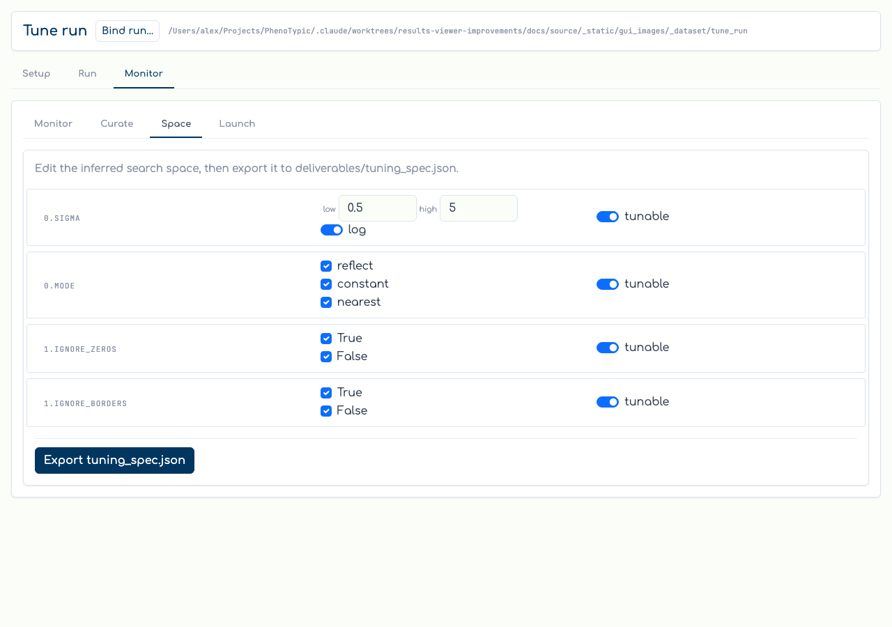
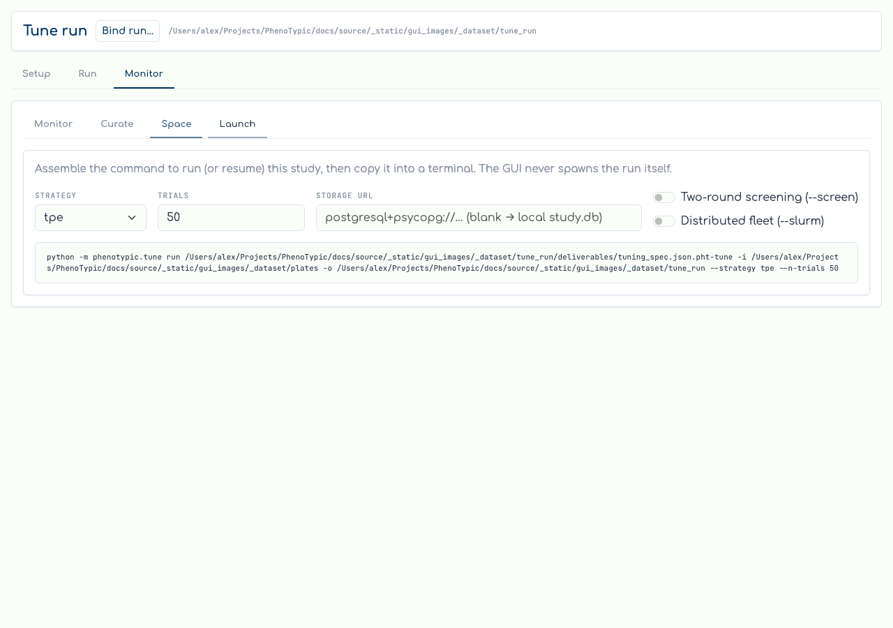

# Tune co-pilot

The `Tune` tab is a full **author → run → monitor** co-pilot for
hyperparameter tuning. From it you author a tuning spec over a base
pipeline, launch the search (locally or on SLURM) straight from the
browser, then watch the study, compare candidate pipelines on real
plates, and export the winner. The page is organised as three top-level
**destinations** — selected from the destination row at the top — with the
classic four-view co-pilot living inside **Monitor**:

- **Setup** — author a tuning spec: pick a base pipeline (or an existing
  spec) and a metadata layout for the default count scorer, review the
  inferred search space, and **Continue**.
- **Run** — configure the launch (image source, output dir, strategy,
  budget, storage, compute, evaluation) and **Deploy** the run. A live
  command card mirrors the form into the real
  `python -m phenotypic.tune run` invocation.
- **Monitor** — the live read over the study. Switch among registered
  Local/SLURM runs, cancel a Local run, export the best pipeline, and use
  the four sub-tabs: **Monitor** (objective + importance figures, gap
  badge, trials table), **Curate** (A/B colony overlays), **Space**
  (search-space inference + export), and **Launch** (render the `run`
  command).

```{admonition} This is no longer read-only
:class: note

Earlier versions of the co-pilot only *read* a finished tuning run and
made you copy a command out to a terminal. The current co-pilot authors
specs in **Setup** and **launches** them with **Deploy** in **Run** — the
GUI starts the local runner or submits the SLURM fleet for you. Binding an
existing run (below) is still strictly read-only.
```

## Prerequisites

- A **base pipeline** (or tuning spec) JSON reachable **inside the GUI
  sandbox** (the `--root` you launched `phenotypic-gui` with), e.g. one
  exported from the [pipeline builder](03_build_pipeline.md).
- A **metadata layout** CSV/Parquet inside the sandbox for the default
  `QCScorer` — one row per colony with the grouping column (e.g.
  `Metadata_ImageName`) so the count scorer has a path-backed source that
  round-trips into the spec.
- For the Curate overlays and (when monitoring an existing run) the run
  itself, the calibration **image directory** must be reachable inside the
  sandbox. A previously produced tune output is recognised by its
  `.pht-tune-cache/run.json` marker (written at run start, before any
  deliverable lands), so both in-flight and finished runs resolve.

## Setup — author a tuning spec

Open the `Tune` tab. It lands on the **Setup** destination. Point the
**Pipeline** field at a base pipeline (or an existing tuning spec) and the
**Metadata** field at the layout CSV/Parquet that feeds the default count
scorer. The search-space and scorer sections stay locked until a pipeline
is present, and **Continue** stays blocked until the scorer metadata is
also supplied — so a GUI-authored spec is always launchable:



The search-space and scorer sections stay locked until a pipeline is
present; the gate note confirms the selected pipeline and metadata once
both are supplied. One revisioned Setup draft supplies the rendered fields,
validation, Continue, spec write, copyable command, and Deploy request.
Pressing **Continue** writes a typed, path-backed authored spec under
`<root>/.phenotypic-gui/presets/tune/` and advances you
to **Run**. Existing scorer/search-space/strategy/budget/storage values are
preserved unless explicitly changed. Source, metadata, and authored-spec
fingerprints prevent a moved or edited file from being silently reused. (You
review and edit the inferred search space itself on the **Space** sub-tab,
below.)

## Run — configure and launch

The **Run** destination (unlocked once a pipeline is chosen) is the launch
form. A live command card under the form mirrors every field into the real
`python -m phenotypic.tune run` invocation — the same subcommand and flag
names you would type by hand — so what you Deploy is exactly what you would
run in a terminal:



The form is grouped. Its command card is the exact validated argv that Deploy
receives, including the same path-precedence choices:

- **Inputs** — an in-sandbox image-source override (blank falls back to the
  shared source root) and the output directory.
- **Strategy** — the strategy (`grid` / `random` / `tpe` / `cmaes` / `gp` /
  `nsga2`), trial budget, and Optuna storage URL.
- **Compute** — Local vs. SLURM, the two-round screening toggle, and the
  SLURM fleet sizing fields (workers, partition, memory, time).
- **Evaluation** — held-out fraction and CV-group overrides.

A pre-flight gate disables **Deploy** when the configuration cannot run —
for example a `grid` search over a continuous `FloatRange`. Pressing
**Deploy** registers the run in the shared run registry and starts it
through the local runner (or submits the SLURM fleet) and switches you to
**Monitor**. The GUI records the run's mode and status; it does not parse
or track a SLURM job id.

## Monitor — watch the study

The **Monitor** destination opens the live read over the study. A
run-switcher lists every registered Local/SLURM run. Selecting one retains its
exact run ID and generation, so a stale Monitor page cannot read, reap, or stop
a newer run that reused the same output identity. The active run drives the
figures. A Local run shows its stdout tail and a **Cancel Local**
button (wrapped in a confirm prompt); SLURM runs show fleet status and are
not killed from the GUI in v1. The objective curve plots the raw per-trial
scores plus the monotone running-best trace, the importance bars rank the
tuned parameters, the winner-stability badge flags a high-dispersion
winner, and the trials table lists every trial. A 3-second poll keeps all
four live while a run is in flight; if the live study store is unreachable
the Monitor degrades to the finished `trials.parquet` journal and surfaces
a note rather than blanking. **Export best pipeline** writes the run's
winner from `deliverables/best_params.json`:



### Binding an existing run (read-only)

You do not have to deploy from the GUI to monitor a run. Use **Bind run**
in the page header to open a sandbox-bounded directory picker (the same
security boundary the builder / run-console pickers enforce) and point it
at any `python -m phenotypic.tune` output directory:



Binding only **reads** the directory — it runs `TuneRunRoot.discover` over
the run's markers and, on success, swaps in the loaded views. A directory
that is not a tune output (no `.pht-tune-cache/run.json`,
`tuning_spec.json.pht-tune`, or `trials.parquet`) — or one outside the sandbox — is
refused with a clear note, never a crash. A live run resolves from its
`run.json` marker before any deliverable lands, so an in-flight run shows
on Monitor immediately.

## Curate — compare candidates on real plates

Switch to the **Curate** sub-tab. The shortlist surfaces the top trials
(plus any the gap badge flagged). Click a card to pin it into slot **A**, a
second to pin **B**, then pick a plate — the two `go.Image` overlays render
each trial's pipeline applied to that plate so you can read the detection
difference directly. Panning or zooming one overlay mirrors the other
(linked pan/zoom); the **Difference** toggle collapses the pair into a
single image that paints both / only-A / only-B objects. `Set as winner`
writes the pinned trial's pipeline to `best_pipeline.json.pht-pipe`:



## Space — review and edit the search space

**Space** infers the search space from the bound run's pipeline / spec and
renders one knob-row per tuned target. Flat and presence knobs are editable
— a range knob shows low / high / log inputs, a categorical knob shows a
choice checklist — while nested knobs render read-only. Toggle a knob's
`tunable` switch to include or drop it, then `Export tuning_spec.json.pht-tune` to
write the edited space back (the scorer is preserved):



## Launch — render the next command

Finally, **Launch** turns the next run into a copy-pasteable command. Set
the strategy, trial budget, storage URL, and the `--screen` / `--slurm`
toggles; the live command card mirrors the form into a real
`python -m phenotypic.tune run` invocation using the actual CLI subcommand
and flag names. (This sub-tab is the read-only twin of the **Run**
destination's Deploy — use it when you would rather launch from a
terminal.)



## Common gotchas

- **Setup needs a metadata layout.** The default `QCScorer` scores
  detected vs. expected colony counts, so Setup blocks **Continue** until a
  path-backed metadata layout is supplied — a spec with an unavailable
  scorer would not be launchable.
- **Run unlocks only after a pipeline is chosen.** The Run destination
  button is inert until Setup has a pipeline path; the pre-flight gate then
  blocks **Deploy** for impossible configurations (e.g. a `grid` over a
  continuous range).
- **Unavailable inputs are not launchable.** A source, metadata file, or
  authored spec that no longer resolves in the sandbox makes the command
  unavailable and disables Deploy/copy until it is reselected.
- **Binding a run is read-only.** The run picker validates the markers and
  never writes to the run dir; the import surface stays optuna-free and the
  live study is opened lazily inside the Monitor poll only.
- **Curate overlays need the image directory in the sandbox.** Plate loads
  are re-confined to the GUI sandbox; an out-of-sandbox Image Source is
  refused with a toast. Re-point it with the Image Source picker if the
  marker's `images_dir` is not reachable.
- **The Pareto card is multi-objective only.** A single-objective run hides
  it; a run whose scorer declares more than one direction shows the Pareto
  front card on Monitor.

## Where to next

- [Build a Pipeline](03_build_pipeline.md) — author the base pipeline a
  tune run searches over.
- [Run Locally](04_run_local.md) — run the winning `best_pipeline.json.pht-pipe`
  the co-pilot wrote over your full dataset.
- [Analysis](08_analysis.md) — once the pipeline is tuned, compose
  filters + an endpoint model and emit `analysis.{csv,parquet}`.
- [Hyperparameter Tuning](../../how_to/pages/tuning.md) — the Python/CLI
  side of the same engine, including the four scoring objectives.
