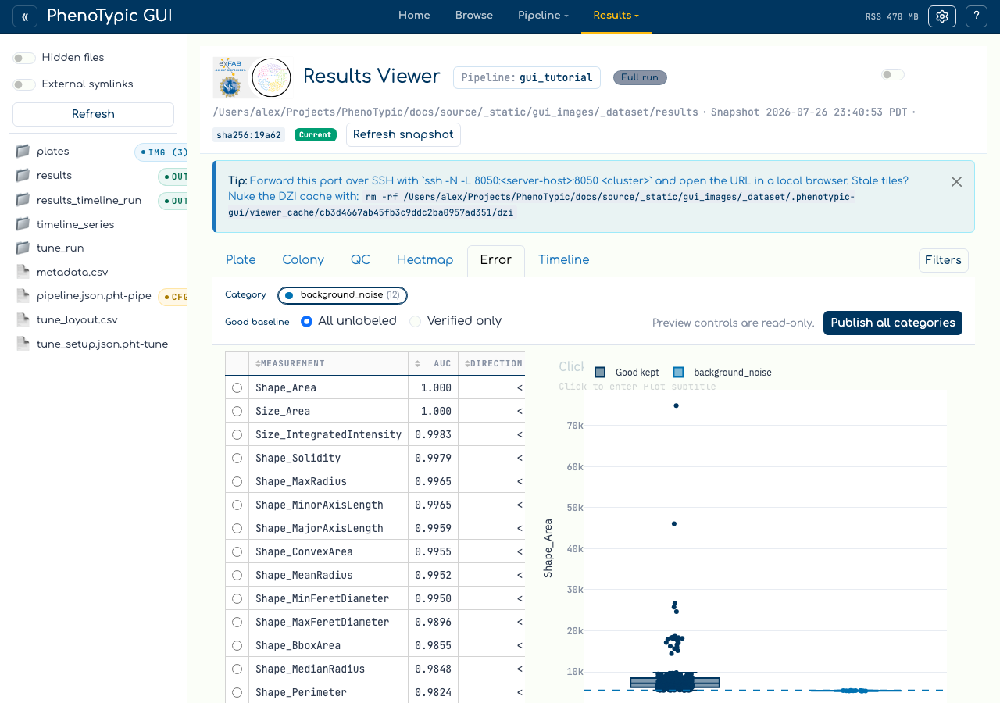
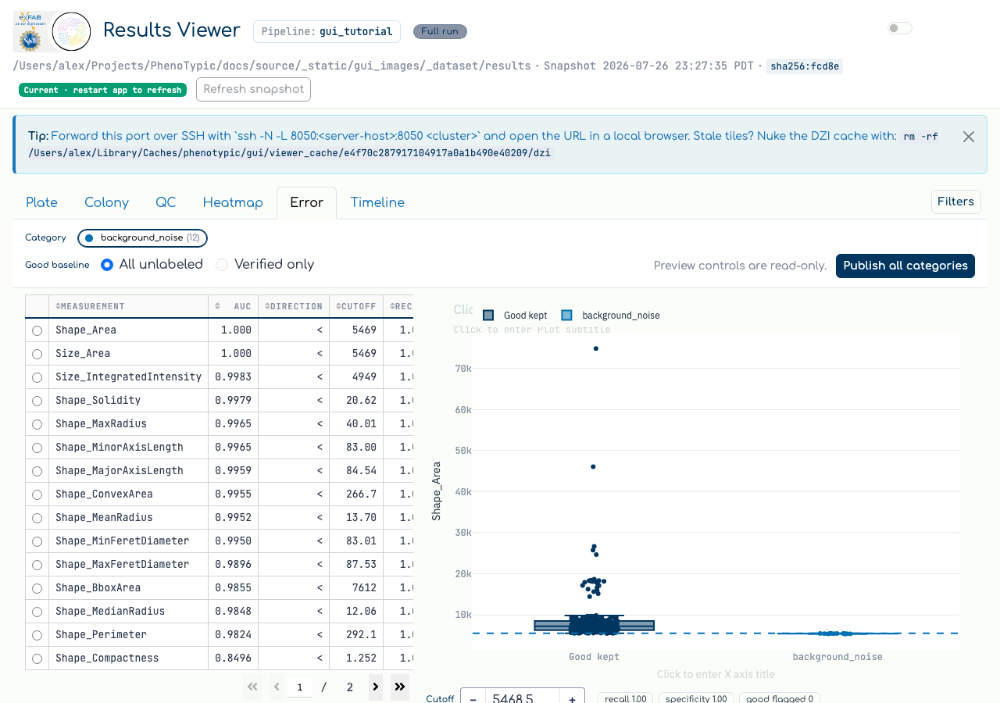
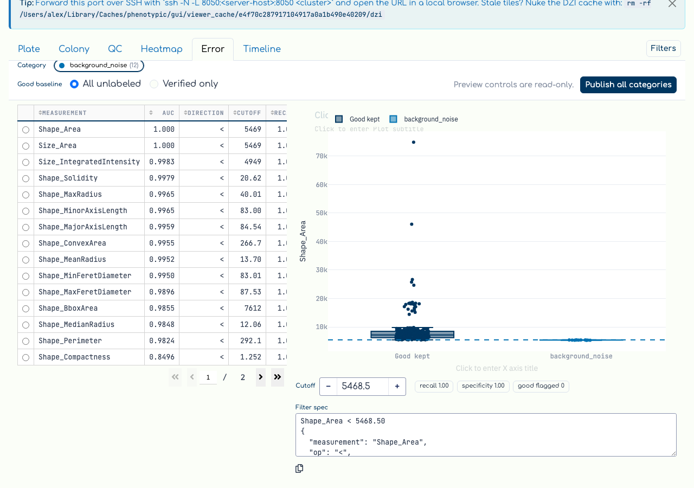
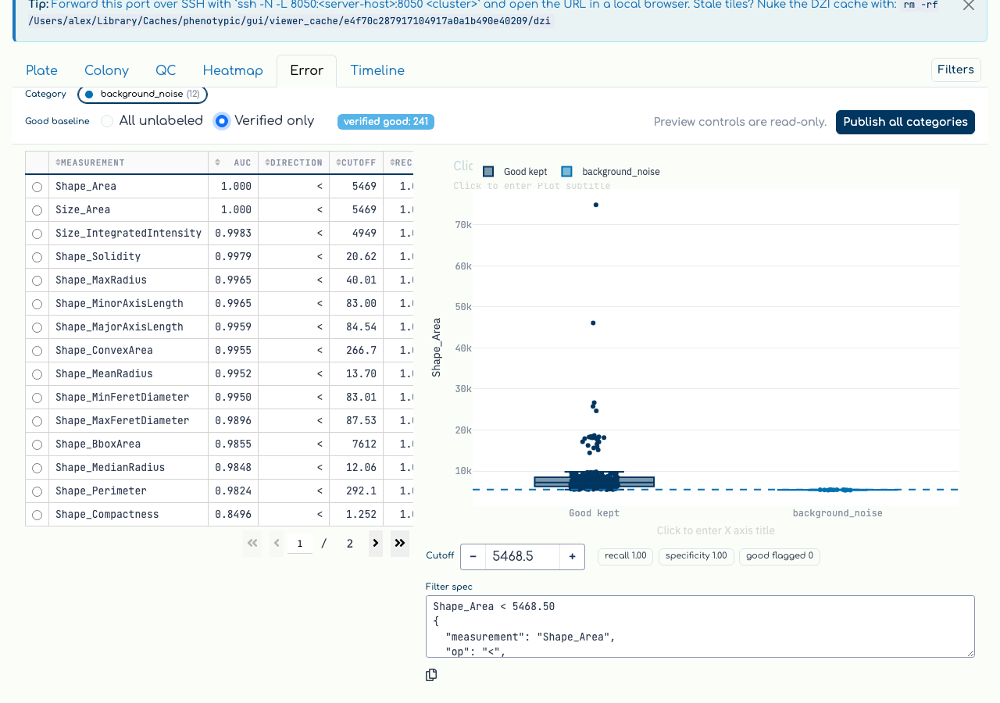

# Error analysis

The `Error` tab in the Results Viewer turns your error-category labels
into a **single-measurement cutoff finder**. Once you have triaged a
batch of detections into an error category (e.g. `background_noise`,
`debris`, `merged`) on the Colony or QC tab, this tab ranks every
measurement by how cleanly it separates that error category from the
**good baseline** — then lets you read a suggested cutoff straight off
the distribution and copy a filter spec to apply downstream.

The analysis loop:

1. Pick an **error category** chip (each carries a live count).
2. Read the **ranked cutoff table** — measurements sorted by how well
   they discriminate the category, with `AUC`, a suggested `cutoff`, the
   `recall` / `specificity` at that cutoff, and a Benjamini–Hochberg
   adjusted p-value.
3. **Drag the cutoff line** on the good-vs-error distribution (or type a
   value) to trade recall for specificity, watching the live readout.
4. **Copy the filter spec** for downstream use. Preview remains in memory;
   click **Publish all categories** only when you want one complete,
   transactionally receipted artifact generation.
5. Switch the **good baseline** between `All unlabeled` and
   `Verified only` to control what the error class is being compared
   against.

## Prerequisites

- A finished CLI run whose
  `deliverables/master_measurements.parquet` exists (see
  [Run Locally](04_run_local.md)), so the viewer can bind an output
  root.
- **At least `min_error_n` (8) objects labeled in one error category.**
  The ranked table is the whole point of the tab, and the cutoff finder
  refuses to rank an underpowered category. Triage detections into a
  category first — see [View Results](06_view_results.md) /
  [QC review walkthrough](15_qc_review.md) for the radial-menu
  curation flow that writes those labels into
  `deliverables/qc/curation_labels.parquet`. The tutorial dataset is seeded with 12
  `background_noise` labels (the smallest colonies) by the capture
  script so the populated state below renders.

## Walkthrough

Open the `Viewer` tab in the hub and pick the `Error` sub-tab. Before an
output root is bound — or before any error labels exist — the tab shows
its empty state:

With an output root whose `deliverables/qc/curation_labels.parquet` carries enough
labels, the tab populates. The **category chip row** at the top lists
every labeled category with its count; the selected chip is the focused
category. Below it, the **ranked cutoff table** lists the measurements
that best separate that category from the good baseline — `Shape_Area`
and `Size_Area` rank first here because the seeded `background_noise`
objects are the smallest colonies. Each row carries the discrimination
`AUC`, the cutoff `DIRECTION` (`<` / `>`), the suggested `CUTOFF`, and
the `recall` / `specificity` it achieves:

Selecting a measurement focuses it in the **good-vs-error distribution**
on the right: the good baseline (`Good kept`) and the error class
(`background_noise`) are drawn as a box + strip, with the suggested
cutoff as a draggable dashed line. Drag the line (or type into the
`Cutoff` input) and the `recall`, `specificity`, and `good flagged`
readout updates live so you can trade one against the other. The
read-only filter spec below the figure is copy-able — paste it into your
own post-processing to apply the same threshold:

The **good baseline** toggle controls what the error class is compared
against:

- `All unlabeled` (default) — every object you have *not* labeled is
  treated as good. This is the right baseline when most detections are
  fine and you have only triaged the bad ones.
- `Verified only` — the good class is restricted to objects in
  QC-reviewed groups you have explicitly cleared (the verified-good set
  derived from `deliverables/qc/review_state.json`). Use this when "unlabeled" is not
  trustworthy — i.e. when you have not yet looked at most objects — so
  the cutoff is calibrated against a baseline you actually vouched for.
  The verified-good count badge reports how many objects qualify.

## Common gotchas

- **"Need more labels."** The empty-state card fires when the focused
  category has fewer than `min_error_n` (8) labeled objects, or when the
  two classes don't separate on any measurement. Label more objects in
  that category (or pick a different category chip) and return to the
  tab — the recompute runs on tab activation.
- **"Review more QC groups" in verified mode.** In `Verified only`
  mode the good class can fall below `min_good_n`; the empty-state
  message then points you back to the QC review loop to clear more
  groups, because the cutoff cannot be calibrated against a too-small
  verified baseline.
- **The tab recomputes on activation, not on every label.** Marking a
  colony on the Colony or QC tab does *not* re-run the finder while you
  are on another tab (it would be wasteful). Returning to the `Error`
  tab always recomputes from the current
  `deliverables/qc/curation_labels.parquet`.
- **Preview is compute-only.** Activation, category selection, cutoff changes,
  and `Verified only` do not write canonical artifacts or
  `verified.parquet`. **Publish all categories** computes the entire category
  vocabulary, stages the complete generation, and atomically commits the
  manifest plus receipt. A failure leaves the preceding published generation
  intact. CLI finalize/recompile can publish the same all-category artifact
  family from the durable labels store.
- **Single measurement, single cutoff.** This tab finds the best
  *one*-measurement threshold per category; multi-measurement rules are
  out of scope. Combine several copied filter specs by hand if you need
  a compound rule.

## Where to next

- [QC review walkthrough](15_qc_review.md) — walk worst-first groups
  for a QC module and clear them, building the verified-good baseline
  this tab can compare against.
- [QC curation loop](10_qc_curation_loop.md) — configure the
  `QualityCheck` analyzers that surface the colonies worth triaging.
- [View Results](06_view_results.md) — triage detections into error
  categories with the per-colony radial menu that feeds this tab.
