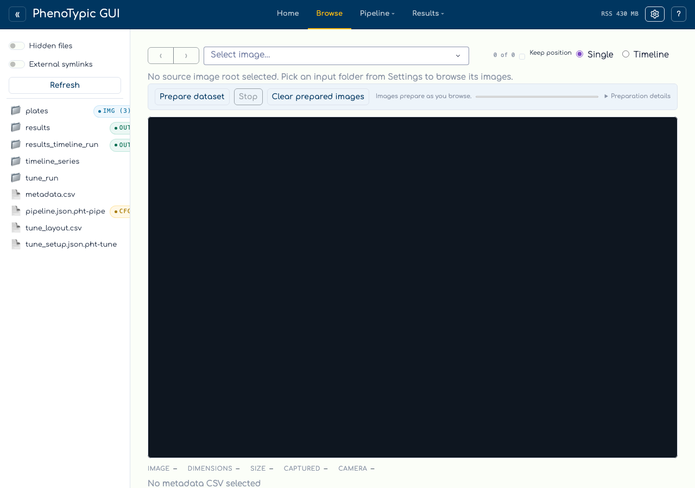
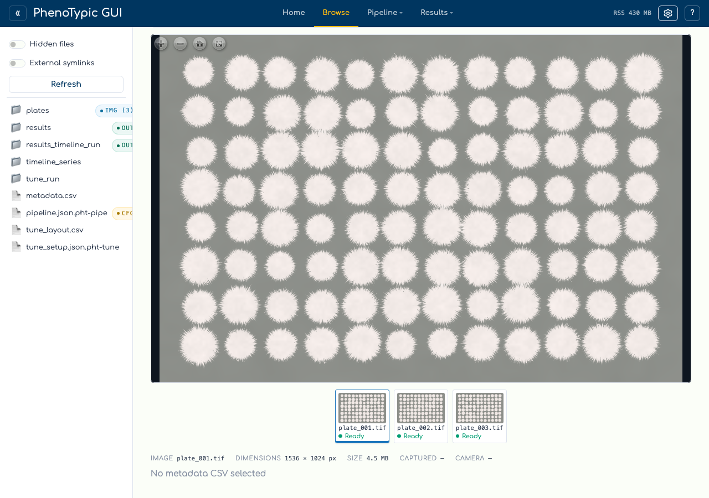

# Browse source images

The `Browse` tab is a deep-zoom viewer for the raw input images under your
selected source root, before you build a pipeline or run anything. It lists
every image under the source folder with two cascading dropdowns (dataset
folder → image), keyboard navigation, and a nearby-image filmstrip, and renders
any one in an OpenSeadragon viewport with a metadata panel.

It is designed to work offline over an SSH tunnel: OpenSeadragon is vendored
(no CDN), each source revision is prepared once, and its preview and deep-zoom
tiles are kept in a bounded persistent cache for later sessions.

## Step 1 - Open the Browse tab

`Browse` is a leaf tab immediately after `Home` in the top bar. Open it, or
navigate to `/browse/`:



With no source root selected, the page shows a hint asking you to pick one
from the top bar. The Browse tab reads the **shared source root** — the same
`source:` status control the rest of the hub uses — so once a source is set,
every page that consumes it (including Browse) updates together.

## Step 2 - Select a source

Click the `source:` status in the top bar to open the sandbox-bounded
directory picker, navigate to the folder holding your images, and confirm.
The Browse tab reacts immediately:



- **Dataset dropdown** — images are grouped by their subfolder relative to the
  source root (`.` is shown as `(root)`). When the source folder is *flat*
  (all images directly under it), the dataset dropdown is hidden and you only
  see the image picker.
- **Image dropdown** — lists the files in the selected dataset. The first image
  auto-selects so the viewport is never blank.
- **‹ / › stepper** — moves to the previous / next image within the current
  dataset. The buttons disable at the first and last image so stepping never
  wraps around.
- **Keyboard shortcuts** — press `J` / `K` for the previous / next image or
  `Shift+J` / `Shift+K` to jump ten images. Shortcuts are disabled while you
  type in a control or use a modal, and arrow keys remain available for
  OpenSeadragon panning.
- **Position and filmstrip** — the `N of M` readout shows your location. The
  centered filmstrip shows at most four images on either side and indicates
  whether each revision is Ready, Preparing, Queued, or Failed.

## Step 3 - Browse and zoom

The viewport is OpenSeadragon, so zoom (scroll / pinch) and pan (drag) stay
smooth even on large plate scans. Browse first shows a lightweight preview,
then replaces it with the deep-zoom (DZI) pyramid when preparation completes.
The OpenSeadragon instance is reused while you navigate, avoiding unnecessary
viewer teardown and setup.

Turn on **Keep position** to preserve the current center and zoom while moving
between images with identical decoded dimensions. It is opt-in and stored in
the browser. Images with different dimensions open at their normal home view.

Images are rendered *faithfully*: any supported format (standard formats and
camera RAW alike) is decoded through `phenotypic.Image` and downcast to 8-bit
with a full-range conversion — no auto-contrast or histogram stretching — so
what you see matches the pixel data the pipeline will operate on.

## Step 4 - Read the metadata

Below the viewport, the metadata panel reports, for the current image:

| Field | Source |
|-------|--------|
| **Dimensions** | Pixel width × height. |
| **Size** | On-disk file size (human-readable). |
| **Captured** | EXIF capture timestamp, when present. |
| **Camera** | EXIF camera make + model, when present. |

Dimensions and revision data are read from image headers without decoding the
full pixel array. EXIF is read with the existing metadata parser for JPEG and
TIFF-based RAW such as NEF / CR2. Any absent or unreadable field is omitted, so
a plain PNG simply shows `—` for the EXIF fields.

## Prepare a dataset and manage the cache

Normal navigation prepares the selected image first, then a small set of
directional neighbours through one bounded background worker. **Prepare** adds
the remaining images at lower priority. The progress display reports ready,
failed, and total counts. **Stop** removes queued dataset work and lets the
current native conversion finish. **Clear** prunes cached revisions while
protecting the displayed image and active work.

Prepared previews and DZI pyramids survive application restarts. Cache entries
are revision-addressed, so modifying a source image creates a new entry instead
of serving stale tiles. Browse begins pruning least-recently-used entries when
the cache exceeds 10 GiB and continues to the 8 GiB low-water mark. It first
tries `<sandbox>/.phenotypic-gui/browse_cache`, then a sandbox-namespaced user
cache, and finally a temporary session cache when neither persistent location
is writable.

The status details identify the active DZI backend. macOS and Windows GUI
installs include the official bundled libvips distribution. Linux and HPC
installations can use a system libvips module or package. Pillow is the fully
supported portable fallback when libvips cannot load or a libvips DZI
operation fails.

```{note}
The initial preview may use a fast thumbnail decoder. The final DZI always uses
the faithful normalized image path. A cold revision performs at most one full
normalization, and a warm revision performs none. RAW that cannot be decoded on
the current platform surfaces an inline viewer notice instead of a broken tile.
```

## Where to next

- [Build a Pipeline](03_build_pipeline.md) — once you have eyeballed the input
  images, compose the pipeline that will process them.
- [View Results](06_view_results.md) — after a run, the Results viewer renders
  each plate with detection overlays and the measurements table.
