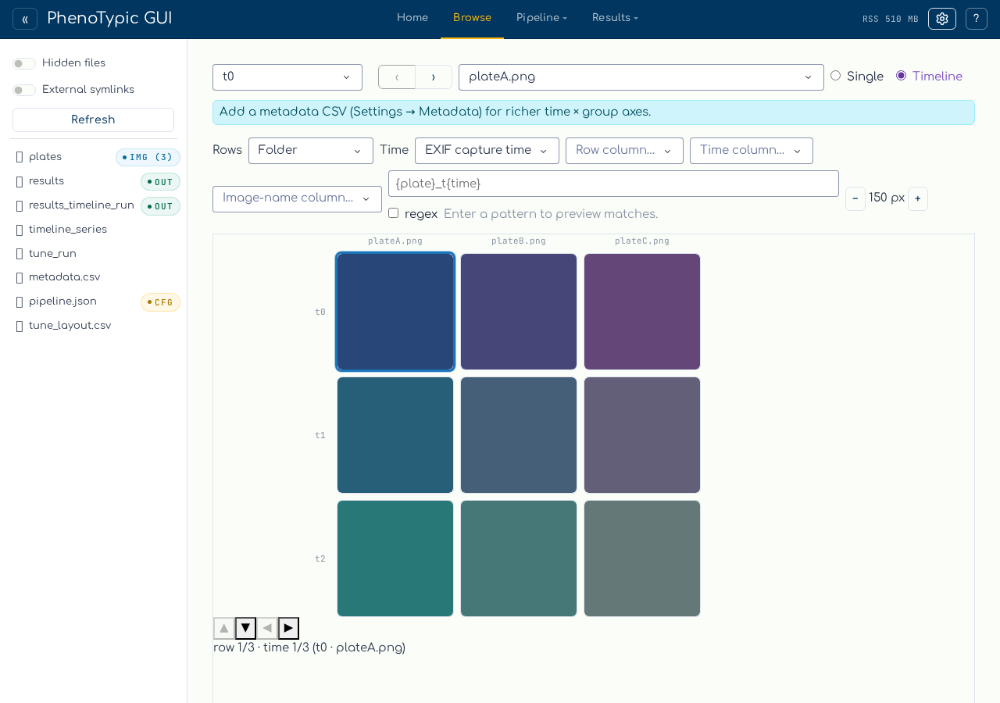
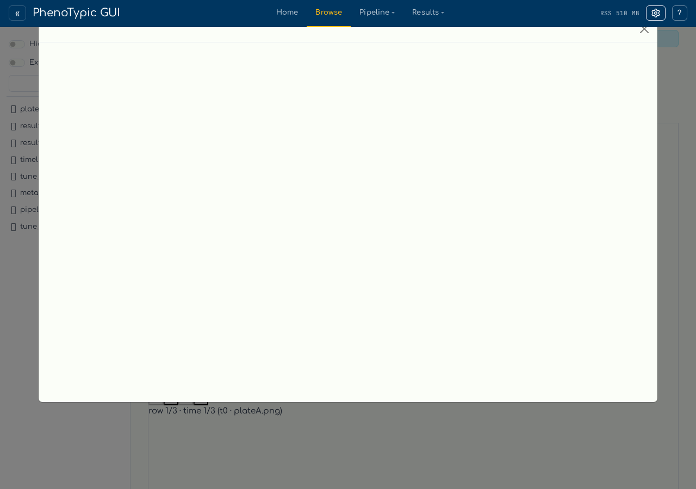

# Browse — find the ideal starting time

A time-course of plate scans is hard to skim one image at a time. The
**Timeline** view of the `Browse` tab lays every source image out as a matrix
— one row per plate (or folder / metadata group), one column per timepoint —
so you can step across a single plate's growth, compare plates side by side,
and zoom into any one frame without leaving the page.

It builds on the single-image [Browse viewer](18_browse.md): same shared source
root, same vendored OpenSeadragon deep-zoom, same ephemeral tile cache. The
Timeline adds a folder/EXIF filmstrip by default, an optional per-axis source
picker, token-keyed cached thumbnails, and a keyboard-driven
**focus-and-navigate** matrix.

## Step 1 - Switch Browse to Timeline mode

Open the `Browse` tab, set a source root from the top bar (see
[Browse source images](18_browse.md) if you have not yet), then flip the
`Single` ∣ `Timeline` toggle in the Browse header to **Timeline**:



By default the matrix uses the **folder** as the row axis and **EXIF capture
time** as the time axis — a folder/EXIF filmstrip that needs no configuration.
Capture time is read straight from each file's EXIF block (no full-image
decode), so even hundreds of source images lay out quickly.

## Step 2 - Choose what drives each axis (optional)

Two source selectors let you upgrade the default filmstrip:

- **Row source** — `folder` (default), a `{plate}` **pattern** over the
  filename stems, or a **metadata-CSV** column.
- **Time source** — `exif` (default), a `{time}` **pattern**, or a
  **metadata-CSV** column.

When you pick **pattern**, type a placeholder pattern such as
`{plate}_t{time}` (with `*` wildcards and literal text). The compiled pattern
extracts a plate identity and a time from each filename stem; an
**advanced-regex** toggle switches the input to a raw regular expression
requiring a named `(?P<plate>…)` group. A live **pattern preview** shows the
per-stem captures so a mistyped pattern is visible before the matrix renders.
Pattern rows stay **folder-scoped** — the same `{plate}` in two different
folders is two separate rows.

When you pick **csv**, dropdowns choose the image-stem join column and the
row/time value columns. The CSV joins **folder-scoped by image stem** (no path
column), and a banner warns if a stem appears in more than one folder and so
cannot be disambiguated. If no CSV is bound, a small nudge banner points you at
the richer source picker.

## Step 3 - Navigate the matrix

The matrix is **not scrollable**. A centered, no-scroll window renders around
one **focused cell** (highlighted), and the focused neighborhood plus a margin
ring of just-off-screen cells mount their thumbnails — everything further out
is offloaded, so the DOM stays light no matter how large the matrix is.

To move the focus:

- **Arrow keys** — click the matrix viewport, then press ←/→ to walk one
  plate's time-course and ↑/↓ to compare across plates. Focus clamps at the
  matrix edges (no wrap), and arrow keys are ignored while a text input (such
  as the pattern box) holds focus.
- **Edge buttons (◀▶▲▼)** — the four on-edge directional buttons move the
  focus the same way for pointer-only use.
- **Position readout** — a `row N/M · time N/M` caption reports where the
  focused cell sits in the matrix.

Stepping ←/→ across a row is how you **find the ideal starting time** — walk a
plate's frames until colonies are just resolvable, then read that column's
timepoint.

Each populated tile carries an `N=k` badge for the number of source images
that resolved to that (row, time) cell, and a **tile-size** − / + stepper
scales the whole matrix between a configured min and max.

## Step 4 - Deep-zoom a single frame

To inspect one frame at full resolution, open the **deep-zoom pop-out**:



- Press **Enter** (or **Space**) on the focused cell, **or**
- hover any visible tile and click the revealed **⤢** button.

Either path opens the same pop-out modal and mounts an OpenSeadragon viewer
that reuses the browse DZI deep-zoom route, so zoom and pan are GPU-smooth.
Close the modal to return to the matrix with your focus unchanged.

```{note}
Thumbnails are **token-keyed and cached** under the same ephemeral
`tempfile.gettempdir()/phenotypic/browse` tree as the single-view tiles
(in a `thumb/` sub-cache), wiped each session. RAW that cannot be decoded on
the current platform surfaces an inline notice rather than a broken tile.
```

## Where to next

- [Browse source images](18_browse.md) — the single-image deep-zoom viewer the
  Timeline builds on.
- [Build a Pipeline](03_build_pipeline.md) — once you have picked a starting
  time, compose the pipeline that will process the run.
