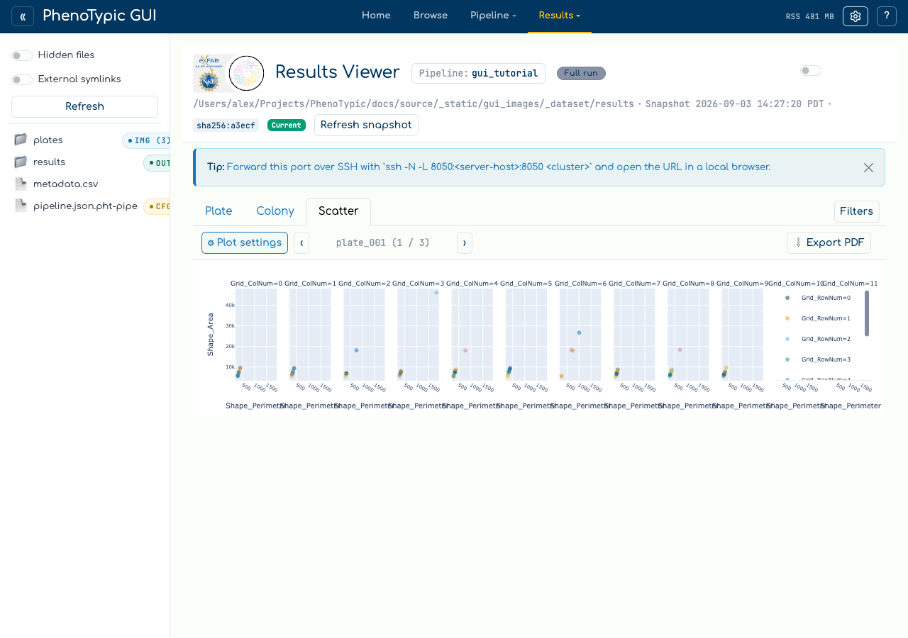
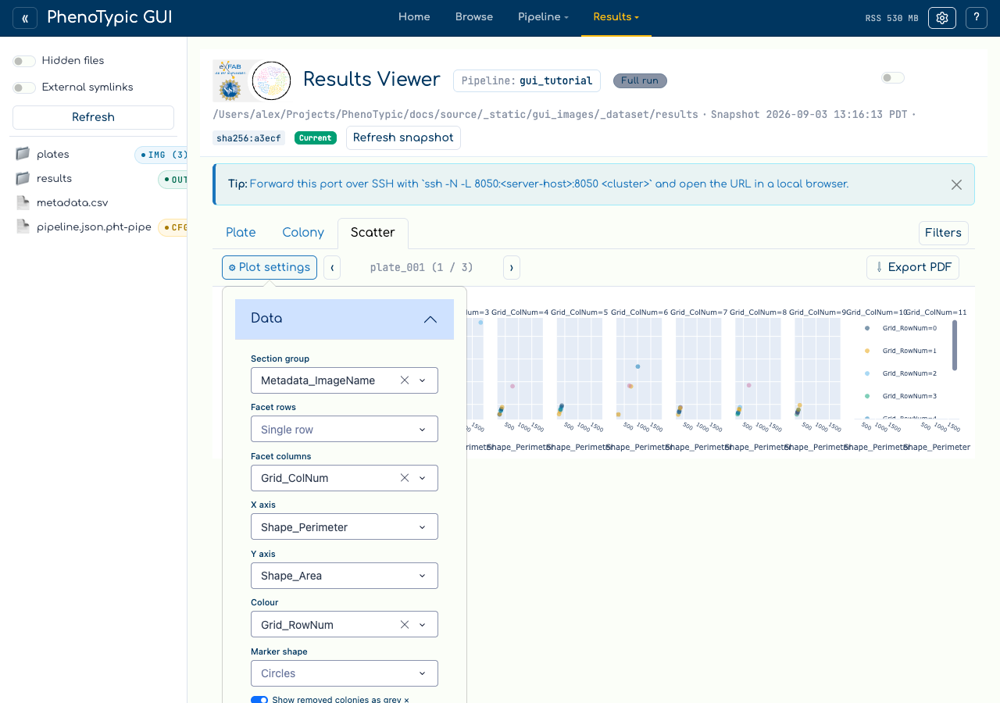
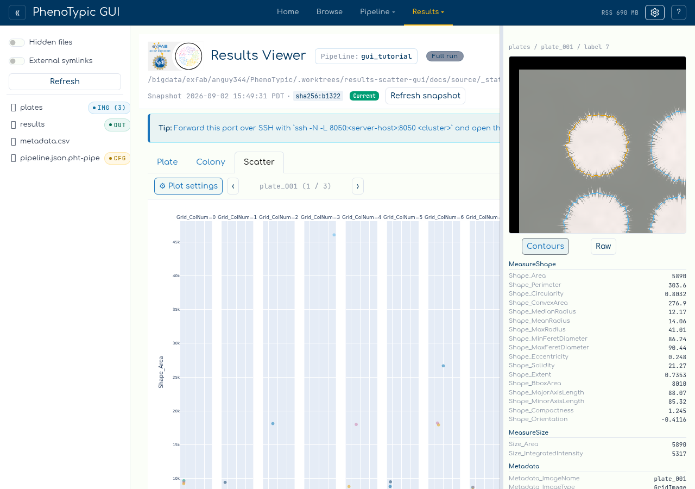
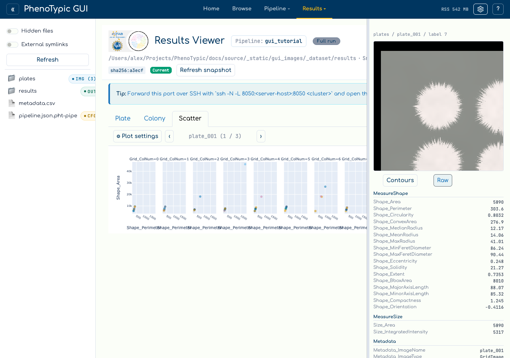

# Scatter plots

The results viewer's third tab turns the measurements a run produced into a
faceted, clickable scatter plot, and exports the same figure as a multi-page
PDF. It reads the same frame the Plate and Colony tabs do — the post-applied
`deliverables/measurements.parquet` mirror — and shares the viewer's filter
sidebar, its curation state, and its one **Refresh**.

Nothing about the plot is hard-coded. Every role a plotting script would fix
in source — what makes a page, what makes a facet row, what goes on each axis,
what colours and what shapes a point — is a dropdown here.

## Open the tab

Bind a CLI output in the viewer (see [View Results](06_view_results.md)), then
pick **Scatter** from the tab row.



The toolbar holds three things: **⚙ Plot settings**, the section pager, and
**⇩ Export PDF**.

## Bind the plotting roles

**⚙ Plot settings** opens a popover with one dropdown per role:

| Role | What it does |
|------|--------------|
| **Section group** | One value per page. The pager steps between them, and the PDF writes one page each. |
| **Facet rows** / **Facet columns** | Values become the rows and columns of a grid within the page. |
| **X axis** | Any numeric column, plus a derived *frame index (capture order)* — see below. |
| **Y axis** | Any numeric column. |
| **Colour** | A column mapped onto marker colour. |
| **Marker shape** | A column mapped onto marker symbol. |
| **Legend corner** / **Collapse the legend** | Where the floating legend sits, and whether it is shown at all. |
| **Show removed colonies as grey ×** | Whether curation-removed colonies stay visible. |



Two things about these lists are worth knowing:

- **They describe the run, not the current filter.** A column narrowed to one
  value by the filter sidebar is still offered, because a single-valued
  section, facet, colour or shape is an ordinary, correct figure. The Colony
  tab's axis dropdowns behave differently on purpose — there, a single-valued
  column makes a degenerate *grid*.
- **Each role has its own ceiling.** Sections are offered up to 60 distinct
  values, facet axes up to 12, colour up to 8 and shape up to 6 — the last two
  because the palette carries six colours and the symbol set five shapes.

### The derived frame index

`Metadata_FrameIndex` is often unpopulated, and `Metadata_Timepoint` is often a
constant, so X also offers **frame index (capture order)**. It ranks the
distinct `Metadata_ImageDatetime` values *within each plate*, zero-based, so
every colony in one image shares a frame number. An image with no timestamp is
excluded from the plot rather than ranked zero, and the ranking happens after
filtering, so a filtered-out image leaves no gap in the order.

## Page through the sections

`‹` and `›` step one section group at a time. The chip between them names the
section on screen and its position, and it also carries two notices when they
apply:

- `— showing first N of M facets`, when the row × column selection exceeds the
  24-panel cap. The cap bounds the *product*: a 12-value row axis crossed with
  a 12-value column axis is 144 panels, not 24.
- `— N rows excluded, no value to plot`, when rows were dropped for having no X
  or Y value.

Both are recomputed on every render. A live run adds images and facet values
over time, so a notice held from an earlier render would describe a figure
nobody is looking at.

```{note}
A **null** grouping value is dropped rather than becoming a `(none)` page. A
column with 23 distinct values, one of which is null, pages 22 sections.
```

## Click a point to open its colony

Clicking any point opens a right-docked inspector for the colony behind it.



It carries three things:

1. **The colony's identity** — `dataset / image / label`.
2. **A crop**, served centred on that colony. The **Contours / Raw** control
   switches between the crop composited with the objmap's object boundaries
   (the focal colony outlined differently from its neighbours) and the raw
   pixels. Contours is the default here: the inspector's job is to show what
   the detector found on this colony, not only its pixels.
3. **Its measurements**, grouped under the `MeasureFeatures` operation that
   emitted each column. The grouping is read from the run's own recorded
   pipeline parameters, so a measurer configured with non-default parameters is
   credited with the columns it actually claimed. Anything unattributable lands
   under `Unattributed`.

Drag the inspector's left edge to widen it.



Switching Contours to Raw re-requests the crop; it does not re-resolve the
click. That matters because a click can go stale:

```{warning}
If the run changes underneath you — a curation mark on the Colony tab, a
**Refresh** picking up a live run's new images — a point drawn before that
change is **refused** rather than resolved. The inspector says *"this point was
drawn before the run changed. Refresh the snapshot and click again."* This is
deliberate: resolving it anyway would open a real but wrong colony, with a real
crop, and nothing would look amiss.
```

Points the plot cannot resolve are refused the same way. Metadata-only phantom
rows — the placeholder rows a run writes for a strain it detected nothing for —
are never plotted at all, so the plotted count is a colony count rather than a
row count.

## Curation and filters

Scatter **reads** curation and never writes it; mark and restore stay on the
Colony tab. With **Show removed colonies as grey ×** on (the default),
curation-removed colonies stay on the figure as a grey × series so a plot says
what has been taken out of it. Turn it off and they disappear, and the shared
axis ranges narrow to what is left.

The filter sidebar is the viewer's, not the tab's: editing a clause rebuilds
this figure at the same time as it narrows Plate and Colony. So does the
viewer's single **Refresh** — there is deliberately no Scatter-local refresh
button, because one would let this tab disagree with the others about which
snapshot it is showing.

## Export a PDF

**⇩ Export PDF** renders *every* section — one page each — and merges them into
a single `scatter.pdf`. It consumes exactly the frame on screen, so the document
cannot describe a different selection from the one you are looking at, and it
does not downsample.

```{note}
Export needs a Chrome or Chromium binary for kaleido to render through, and
that is not part of `uv sync`. When it is missing, the export says so beside
the button rather than silently doing nothing. Fetch one with kaleido's
`plotly_get_chrome`, or point the `BROWSER_PATH` environment variable at a
browser you already have — the Chromium Playwright vendors for the e2e suite
works.
```

The on-screen figure draws WebGL traces so it can carry hundreds of thousands
of points; the export substitutes ordinary SVG traces, because kaleido renders
a WebGL trace as a valid, well-formed, entirely blank page.

## Where to next

- [View Results](06_view_results.md) — the Plate and Colony surfaces this tab
  sits beside.
- [Analysis](08_analysis.md) — fit models and emit analysis tables from the
  same measurements.
- [GUI hub guide](../../how_to/pages/gui_hub.md) — the full reference for every
  panel and store in the hub.
