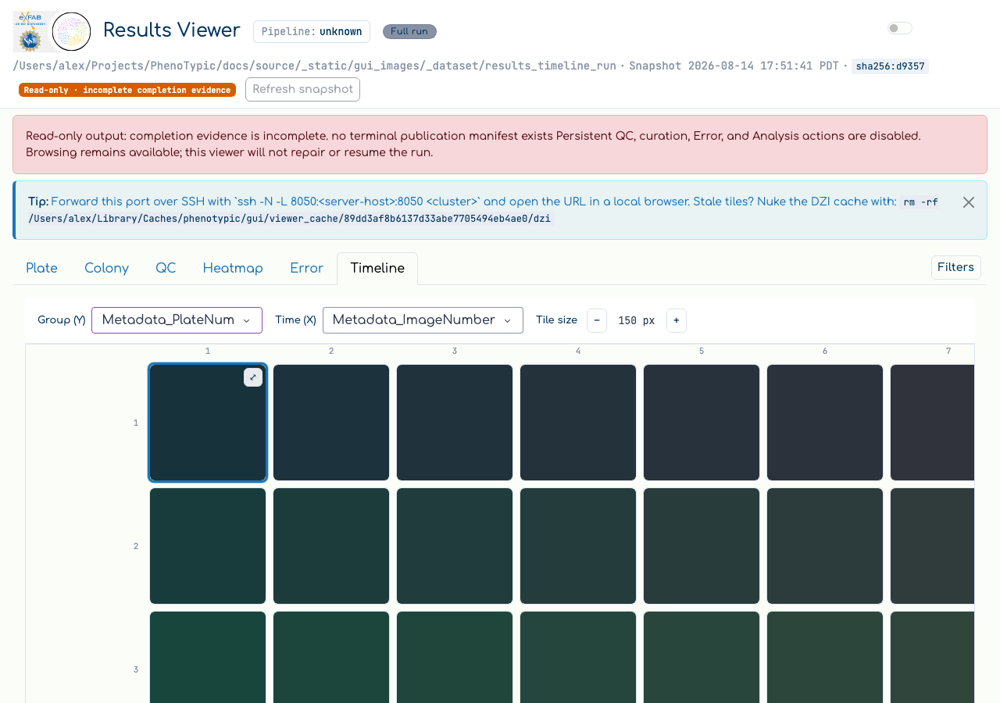
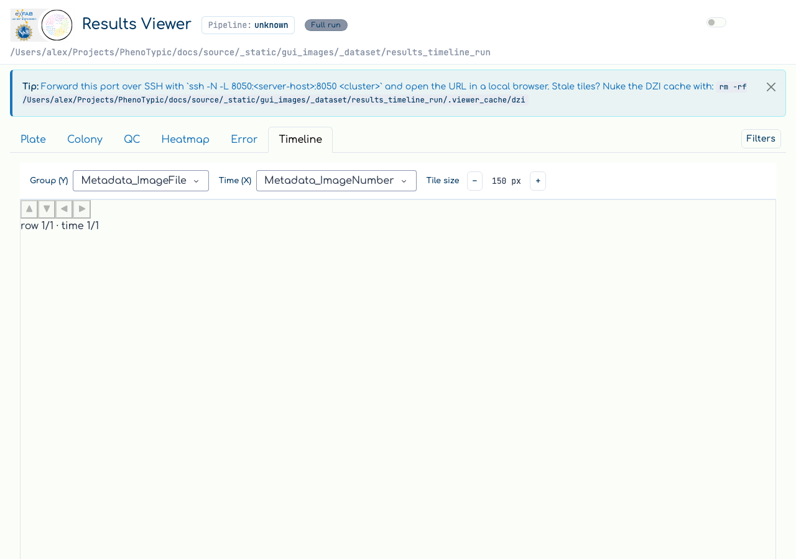

# Results — trait emergence over time

Once a run is finished, the colony **overlays** under
`deliverables/overlays/<dataset>/` capture how each plate looked at every timepoint.
The **Timeline** tab of the results viewer lays those overlays out as a matrix —
one row per grouping (e.g. plate number), one column per timepoint — so you can
watch a trait emerge across a single plate's time-course and compare plates side
by side without leaving the page.

It reuses the same focus-and-navigate engine as the [Browse
Timeline](19_browse_timeline.md), but draws its axes from the run's
post-applied measurement mirror (`OutputRoot.master_df`, which already carries
the joined `Metadata_*` columns) and renders overlay thumbnails instead of raw
source images. Pop-outs reuse the viewer's existing `/tiles` deep-zoom route, so
zoom and pan are GPU-smooth and need no extra wiring.

## Step 1 - Open the Timeline tab and choose the axes

Open a finished run in the results viewer (see [View Results](06_view_results.md))
and switch to the **Timeline** tab — the 6th tab in the strip. Two dropdowns
drive the matrix:

- **Y (group)** — the row axis. It offers every grouping column with no
  cardinality cap, so a high-cardinality grouping like `Metadata_PlateNum` (one
  row per plate) is selectable.
- **X (time)** — the time axis. It offers any column whose name looks like a
  time field **or** whose dtype is numeric/temporal, with no cap. Prefer a
  **monotonic** column such as `Metadata_ImageNumber`; a time-of-day column
  mis-orders across days.



If the run has no eligible time column, the tab shows a guided empty state
instead of a matrix, nudging you to re-run with a `--metadata <csv>` that carries
a time field.

```{note}
The Timeline honors the active **filter offcanvas** — it renders the same
`master_df` slice as the Plate and Colony tabs, so narrowing the filter narrows
the matrix.
```

## Step 2 - Navigate the matrix

The matrix is **not scrollable**. A centered, no-scroll window renders around
one **focused cell** (highlighted), and only the focused neighborhood plus a
margin ring of just-off-screen cells mount their thumbnails — everything further
out is offloaded, so the DOM stays light no matter how large the matrix is.

To move the focus:

- **Arrow keys** — click the matrix viewport, then press ←/→ to walk one
  plate's time-course and ↑/↓ to compare across plates. Focus clamps at the
  matrix edges (no wrap), and arrow keys are ignored while a dropdown holds
  focus.
- **Edge buttons (◀▶▲▼)** — the four on-edge directional buttons move the focus
  the same way for pointer-only use.
- **Position readout** — a `row N/M · time N/M` caption reports where the focused
  cell sits in the matrix.



Each populated tile carries an `N=k` badge for the number of images that
resolved to that (row, time) cell, and a **tile-size** − / + stepper scales the
whole matrix between a configured min and max.

## Step 3 - Deep-zoom a single plate

To inspect one overlay at full resolution, open the **deep-zoom pop-out**:

- Press **Enter** (or **Space**) on the focused cell, **or**
- hover any visible tile and click the revealed **⤢** button.

Either path opens the same pop-out modal and mounts an OpenSeadragon viewer that
reuses the viewer's overlay DZI deep-zoom route. Close the modal to return to the
matrix with your focus unchanged.

```{note}
Overlay thumbnails are cached on disk under the run's
`.viewer_cache/timeline_thumbs`, a sibling of the DZI pyramid cache, so the
matrix is warm on tab re-entry regardless of the controller's re-attach.
```

## Where to next

- [Browse — find the ideal starting time](19_browse_timeline.md) — the
  source-image Timeline the results Timeline mirrors.
- [Heatmap exploration](11_heatmap_exploration.md) — quantify a single
  measurement across the same plate × time grid.
- [Error analysis](17_error_analysis.md) — rank the measurements that separate a
  curated error category from the good baseline.
