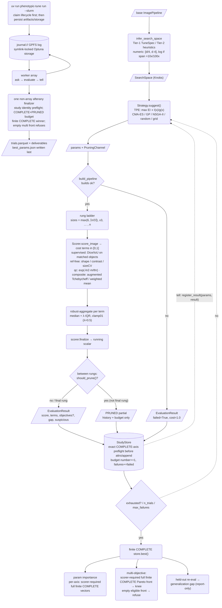
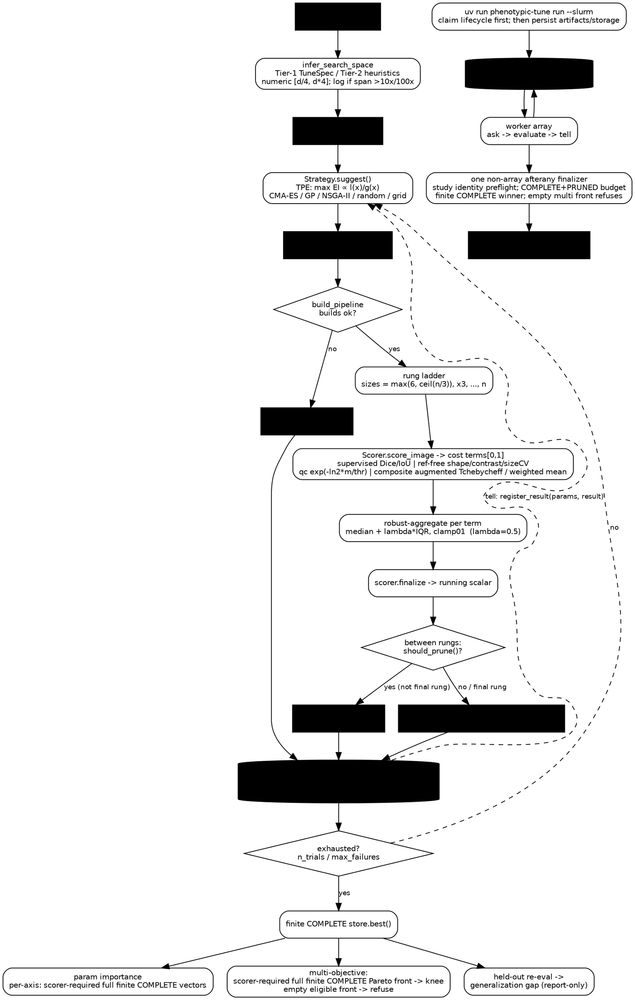

# Companion: render the `phenotypic.tune` data-flow graph

This file is a **self-contained prompt for Claude Desktop**. Paste the whole
file into a Claude Desktop conversation and ask it to *render the data-flow
graph as an artifact*. It carries two equivalent specs — **Mermaid** (renders
inline as an artifact) and **Graphviz DOT** (for a higher-fidelity layout) —
plus a legend so the diagram is self-explanatory.

The narrative companion is [`tune-with-optuna.md`](./tune-with-optuna.md).

---

## Prompt to paste into Claude Desktop

> You are given a Mermaid spec and a Graphviz DOT spec describing the
> hyperparameter-tuning data flow of the `phenotypic.tune` module. Render the
> **Mermaid** version as a diagram artifact. Keep every node and edge label
> verbatim. Do not invent steps. After rendering, give a 3-sentence summary of
> the loop using only the nodes shown. If I then ask for "the DOT version",
> render the Graphviz spec instead.

---

## Legend

- **Rounded boxes** = process steps (a function does work).
- **Rectangles** = data artifacts (`SearchSpace`, `params`, `EvaluationResult`,
  `Trial`, study store).
- **Diamonds** = decisions (prune?, exhausted?, build ok?).
- **Solid arrows** = forward data flow within one trial.
- **Dashed arrows** = feedback / cross-trial learning (the *tell* edge) and
  loop-back.
- **The cycle** Strategy → params → Evaluator → result → store → (tell) →
  Strategy is the ask-and-tell loop. Everything below `store.best()` is the
  one-time post-study finalize.
- **Distributed execution** resolves one `journal://` GPFS backend, submits one
  worker array, then lets exactly one non-array `afterany` finalizer validate
  terminal trials and publish artifacts. It is not a parallel scheduler sidecar.

---

## Mermaid spec

---

## Graphviz DOT spec

---

## Node reference (maps each box to source)

| Node | Source | Math / role |
|---|---|---|
| `infer_search_space` | `_search_space/_infer.py:685` | fields → Knobs; `[d/4, d·4]`, log auto-trip |
| `Strategy.suggest()` | `strategy/_optuna.py:268` | TPE EI ∝ `l(x)/g(x)`; sampler at `:248` |
| `build_pipeline` | `_evaluation/_builder.py` | clone base + overlay params |
| rung ladder | `_evaluation/_evaluator.py:222` | `max(6, ⌈n/3⌉)`, ×3, …, n |
| `Scorer.score_image` | `score/*` | four strategies, **cost** terms ∈ [0,1] (oriented by `to_cost`) |
| `Scorer.to_cost` | `score/_orient.py` | natural value → cost ∈ [0,1] (Sense + anchor) |
| robust-aggregate | `_evaluator.py:55` + `_aggregate_math.py:28` | `median + λ·IQR` (clamped), λ=0.5 |
| `should_prune()` | `_optuna.py:218` (ASHA) | top `1/reduction_factor` survive |
| `StudyStore` | `_study_store.py` / `_study/_optuna_store.py` | local SQLite, journal, or explicit Optuna RDB |
| Slurm submit/finalizer | `_tune_cli/_run.py`, `_execution/_slurm.py`, `_tune_cli/_finalize.py` | one array → one `afterany` finalizer → fenced publication |
| param importance | `_screening.py:85` | fANOVA vs RF-permutation |
| Pareto knee | `_study/_pareto.py:54,115` | dominance + max chord distance |
| generalization gap | `_generalization.py:58` | loss-space `heldout_cost − cal_cost`; `rel>0.15 ∧ abs>0.05` flag |
