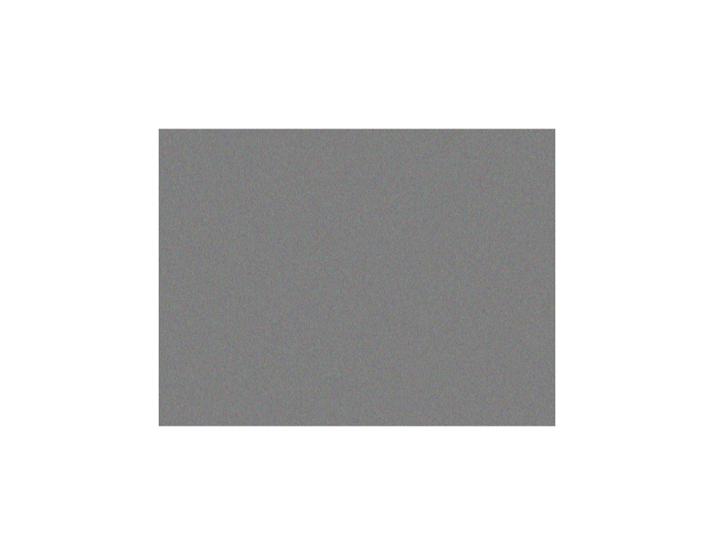

# Spike gate findings — phase 0

Run 2026-08-27 against the landed CLI writer. Environment: node v24.16.0, npm 11.13.0,
Playwright chromium present, npm registry reachable, `zarr` 3.1.5.

## Task 0.1 — a store written by the real writer

Two stores, because the first turned out to be an invalid subject:

| Store | Source | Extent | Levels |
|---|---|---|---|
| `plate.ome.zarr` | `load_synth_yeast_plate()` | 800×600 | 2 |
| `big.ome.zarr` | synthetic `GridImage(nrows=32, ncols=48)` | **4000×3000** | **4** |

**The synth yeast plate cannot serve as the spike subject.** At 800×600 the chunk clamps to
the whole image (`chunk_shape [3,600,800]`), so it exercises neither the 1024² inner chunk
nor sharding. Spec §1.4's reference plate is 4000×3000; that is what the numbers below use.

### Backend §1.4 — every claim confirmed on the reference plate

```text
shape          [3, 3000, 4000]
shard shape    [3, 4096, 4096]      <- §1.4
inner chunk    [1, 1024, 1024]      <- §1.4
inner codecs   bytes, zstd          <- decision C1
key encoding   {"name": "default", "configuration": {"separator": "."}}
pyramid        levels 4, stop_px 512, downsample {image: mean, label: nearest}
```

`levels 4` at 4000 px matches `ceil(log2(4000/512)) + 1`, the ladder whose `floor`/`ceil`
boundary backend §1.3 records as having failed once.

### Q3 — does the `"."` separator round-trip? **ANSWERED: yes.**

```text
rgb/0/c.0.0.0     3-D  (channel, y, x)
gray/0/c.0.0      2-D  (y, x)
```

Confirms the plan's round-2 corrected literals (FLOW-13). One path segment per chunk key, as
backend §1.4 requires for Windows `MAX_PATH`.

---

## FINDING — spec §1.4's "verified" file-count table is wrong

§1.4 states as **verified** that 4 levels (auto) yields **40** files: 16 data + 24 metadata.
Measured on the reference plate:

```text
total 36  =  12 data  +  23 zarr.json  +  1 METADATA.ome.xml
```

**The gap is the objmap.** Zarr does not write a chunk whose contents equal `fill_value`, and
a Stage-1 objmap is all zeros — so the label levels contain **zero** chunk files, not four:

```text
rgb            L0=1 L1=1 L2=1 L3=1
gray           L0=1 L1=1 L2=1 L3=1
detect_mat     L0=1 L1=1 L2=1 L3=1
labels/objmap  L0=0 L1=0 L2=0 L3=0      <- sparse; the table assumed 4
```

Not a defect — sparse storage is correct and strictly better. But the table is presented as
verified and is off by 4 for **every image between Stage 1 and Stage 3**, which backend §3.3
guarantees carries a zeros objmap. The inode budget built on it (~40/image, 400k at 10k
images) is conservative by ~10%.

**Recorded for a backend-spec amendment. Not blocking, and it makes the format cheaper, not
dearer.**

---

## Task 0.2 — Range. The measurement that existed in no document.

One 16-byte ranged request for `big.ome.zarr/rgb/0/c.0.0.0`:

| Server | Code | Downloaded |
|---|---|---|
| `python -m http.server` | `200` | **36,045,031 B** (34.4 MiB) |
| Flask `send_file(conditional=True)` | `206` | **16 B** |

`SimpleHTTPRequestHandler` has **no Range support at all** — it ignores the header and sends
the whole file. This is exactly why round 2 split this step: an earlier draft served the
spike store with `http.server` and expected `206`, which is unreachable, and drove Q1/Q2/Q4
against that same server — measuring the no-Range regime throughout without recording a
single byte count.

### Shard amplification, measured

At 4000×3000 the level-0 `rgb` shard is a **single 34.4 MiB file**. A deck.gl tile fetch
wants one 1024² inner chunk ≈ 3.15 MB (`1024×1024×3×1`):

```text
34.4 MiB / 3.0 MiB  ≈  11.5x  amplification per tile, without Range
```

So `conditional=True` is not a nicety — it is the difference between a 3 MB and a 34 MB tile
fetch. That is the justification phase 1 needs, and the number §5.2's "accepted risk" was
missing.

Below the brief's 96 MB worst case only because the shard clamps to the array; a full
4096×4096 shard over a larger plate would reach it.

---

## Q1, Q2, Q4 — ANSWERED against the real bundle

Run 2026-08-27. Subject: `/tmp/spike/big.ome.zarr` (the 4000×3000 reference plate),
served by `range_server.py` (Flask `send_file(conditional=True)`) on `:8100`.
Client: the **committed** artifact
`src/phenotypic/gui/results_viewer/_assets/viv/viv-bundle.min.js` —
`viv 0.22.1 / deck.gl 9.3.10 / zarrita 0.5.4 / bundle 1`, 2,616,449 B — loaded from the
same origin into Playwright chromium. Not a CDN stand-in.

Bundle preflight, read out of the live page:

```text
typeof window.__vivBundle          "object"
__vivBundle.VERSION                "viv 0.22.1 / deck.gl 9.3.10 / zarrita 0.5.4 / bundle 1"
zarr.registry.has("zstd")          true      <- before any store was opened
registry keys                      blosc, lz4, zstd, gzip, zlib, transpose, bytes,
                                   crc32c, vlen-utf8, json2, bitround
```

### Q1 — does unmodified Viv resolve our `bioformats2raw.layout` series list? **NO.**

`loadOmeZarr(<root>, {type: "multiscales"})` against the store root:

```text
{ ok: false, error: "Node not found: v2 array" }
```

Pointed at a **resolved series** it works with nothing patched:

```text
loadOmeZarr(<root>/rgb)  ->  { ok: true, levels: 4, shape: [3, 3000, 4000],
                               labels: ["c","y","x"], dtype: "Uint8", tileSize: 1024 }
```

**Why.** `@vivjs/loaders`' `loadMultiscales(store, path = "")` opens the group at `path`
and reads `attributes.ome.multiscales`; our root group carries only
`{version, "bioformats2raw.layout": 3}`. With no `multiscales` key it falls back to
`paths = ["0"]` and tries to open `<root>/0` as an array. Our root's children are
`rgb`, `gray`, `detect_mat`, `OME` — hence the error. **Nothing in `@vivjs/loaders`
reads `OME/zarr.json` at all**; the only bioformats2raw path is
`DEPRECATED_loadBioformatsZarr`, which wants numeric series directories and OME-XML,
not our named series. The series list is there and readable — it is simply nobody's
job in Viv:

```text
GET /big.ome.zarr/OME/zarr.json  ->  200  attributes.ome.series = ["rgb","gray","detect_mat"]
```

**Shape of the adaptation: small, and outside Viv.** No Viv patch. Resolve the series
list from `attributes.phenotypic.series` (or `OME/zarr.json`) server-side, pick the
primary (`rgb` when present, else `gray`), and hand `loadOmeZarr` the per-series URL.
That is the resolution the plan's Global Constraints already require us to own, so it
adds a resolver, not a fork.

### Q2 — does `labels/objmap` attach to the primary series automatically? **NO.**

`loadOmeZarr(<root>/rgb)` returns `{data, metadata}` and nothing else:

```text
Object.keys(source)              ["data", "metadata"]
Object.keys(source.metadata)     ["version", "multiscales", "omero"]
"labels" in source.metadata      false
ZarrPixelSource prototype        shape, dtype, getRaster, getTile, onTileError, ...
```

Our store *does* record the child both ways — `rgb/labels/zarr.json` carries
`ome.labels: ["objmap"]`, and the root carries
`attributes.phenotypic.labels = {objmap: "rgb/labels/objmap"}` — but **Viv reads
neither**. There is no label-layer machinery in `@vivjs/loaders`; in vizarr that lives
in the app, not the library.

Handed the **resolved** path from `phenotypic.labels.objmap`, the label group loads as
its own multiscale source with no special-casing:

```text
loadOmeZarr(<root>/rgb/labels/objmap)  ->  { levels: 4, shape: [3000, 4000],
                                             dtype: "Uint16" }
```

**Shape of the adaptation: exactly what the plan already mandates.** The façade resolves
`phenotypic.labels.objmap` (with `.get` — the key is optional) and constructs the label
source explicitly. Since Viv resolves *nothing* by convention here, there is no
`rgb/labels/objmap` hard-coding to fight: a `gray`-primary store works for free.

### Q4 — does the wasm zstd codec decode a CLI-written chunk? **YES — pixel-exact.**

Not "the codec registered". The browser decoded level-0 chunk `c.0.0.0` of `rgb` through
`ZarrPixelSource.getTile({x: 0, y: 0, selection: {c: 0}})` (1024×1024, `Uint8Array`) and
through raw `zarrita.get` with Viv out of the path. Both agree with Python:

```text
python  zarr.open_array('/tmp/spike/big.ome.zarr/rgb/0')[0, :4, :4]
        [[ 94, 216,  14, 214],
         [ 50, 148, 172, 247],
         [ 29, 135, 160, 234],
         [154, 128,  91,  23]]

browser Viv  getTile  rows[0..3][0..3]   -> identical
browser raw  zarrita.get(slice(0,4), slice(0,4)) -> identical (flat, same 16 values)
MATCH: True
```

**And the negative control passes.** Delete the codec, then read:

```text
zarr.registry.delete("zstd"); await zarr.get(rgb/1, ...)  ->  "threw: Unknown codec: zstd"
```

The read **fails** rather than returning `fill_value` zeros — which is the failure mode
that would have made a broken bundle look like an empty plate. `registry.delete` exists,
so plan phase 2 task 2.3 step 4's test is runnable and must not be weakened.

### Bonus: it renders, and sharding forces Range

A `MultiscaleImageLayer` over the same source painted the plate in headless chromium
(SwiftShader). 900×700 viewport, `zoom: -3`; 188,000 non-background pixels in a 4:3
rectangle (= the 4000×3000 extent), 5,000+ distinct colours (the store is uniform
noise, so a flat grey field of *varying* pixels is exactly right):



The network trace is the important part. zarrita's sharding codec asserts
`store.getRange` and issues **two ranged GETs per cold tile** — a suffix read of the
shard index, then the inner chunk:

```text
GET /rgb/0/c.0.0.0   Range: bytes=36044259-72089289   ->      772 B   (shard index: 3x4x4 x 16 B + 4 B crc)
GET /rgb/0/c.0.0.0   Range: bytes=0-1048608           -> 1,048,609 B  (one inner chunk, compressed)
```

Against `python -m http.server` **both** of those return the whole 36,045,031 B shard.

```text
cold tile, with Range   :        772 +  1,048,609  =  1,049,381 B
cold tile, without Range: 36,045,031 + 36,045,031  = 72,090,062 B   ->  68.7x
steady state (shard index cached), without Range   : 36,045,031 B   ->  34.4x
```

That supersedes the 11.5× figure recorded above, which compared a *decompressed* 3.0 MB
tile against the shard. The measured compressed inner chunk is 1.0 MB (the store is
random noise, so this is a near-worst case for zstd), and the shard-index read doubles
the cost of a cold tile without Range. `conditional=True` is not a nicety.

### FINDING — Playwright's default browser has no WebGL; Viv e2e tests must ask for the full Chromium

Probed on this node, six flag combinations including `--enable-unsafe-swiftshader`,
`--use-gl=angle --use-angle=swiftshader`, `--no-sandbox`:

```text
pw.chromium.launch(...)                          -> canvas.getContext('webgl2') === null
pw.chromium.launch(channel="chromium", ...)      -> webgl2 ANGLE (SwiftShader Device (Subzero))
```

Playwright's default `chromium` launch uses `chromium_headless_shell`, which ships
**no** GL stack; the full `chrome-linux64` build beside it does (`libEGL.so`,
`libGLESv2.so`, `libvk_swiftshader.so`, `vk_swiftshader_icd.json`). The rendering run
above additionally needed an X display — under bare headless the GPU process still died
with `BindToCurrentSequence failed`, and succeeded under `xvfb-run -a`.

**Every Viv rendering test must launch `channel="chromium"` under `xvfb-run`.** Decode
tests (Q4's shape) need neither. Without this, a deck.gl test on a headless runner
reports `Failed to create WebGL context` and zero painted pixels — a red that looks like
a rendering bug and is not one. This directly constrains phases 3-5's e2e suite and the
three `gui-checks` gates.

### Console noise worth knowing about before phase 1

zarrita probes the Zarr **v2** metadata names before giving up, so a normal open emits
404s for `.zattrs`, `.zgroup` and `.zarray` beside every `zarr.json`. 17 of them on a
first open of `rgb`; 3 on a warm one. Harmless, but the byte route must answer them
cheaply and the browser console will show them. Not a defect to chase.

## §5.2 chunk-size decision — pending

Needs a cold-pan measurement over a real SSH tunnel at 1024² and 512². The governance is
explicit: the backend spec may be amended from 1024² to 512² **only** gated on a
measurement. Not yet taken.
